<!-- README.md -->

# PDRD Validation — Drawing Validation AI

PDRD Validation — локальный сервис проверки проектной и рабочей документации по нормативной базе, техническому заданию, пользовательским пакетам документов, контексту проекта и Базе Опыта.

Пользователь загружает PDF, DXF/DWG или PDF вместе с соответствующим CAD-файлом, при необходимости прикладывает Техническое задание и выбирает нормативный раздел/пользовательские документы. Система извлекает текст и геометрию, формирует машинный контекст листа, выполняет semantic retrieval по источникам разных типов, запускает локальный VLM-анализ и возвращает структурированные замечания с разделённой доказательной базой `N/T/U/E`.

Тяжёлые GPU-задачи выполняются с общим cross-process GPU lease. Analysis VLM и unified embedding runtime не должны одновременно загружать несовместимые тяжёлые модели в одну GPU без предварительной проверки VRAM.

## Возможности

- PDF-only и multi-page PDF;
- DXF-only и DWG -> DXF normalization;
- PDF + CAD как два представления одного листа;
- Техническое задание как отдельный project/customer source;
- multimodal indexing страниц ТЗ;
- T-guided нормативный retrieval;
- контекст Пояснительной записки;
- временный semantic Project Context;
- managed нормативные разделы и вложенные папки;
- пользовательские пакеты документов внутри выбранного раздела;
- PDF/DOC/DOCX upload;
- Word -> PDF preview через LibreOffice;
- durable индексация через Transactional Outbox;
- scoped normative RAG по immutable snapshot;
- scoped retrieval выбранных пользовательских документов;
- отдельный system prompt нормативного раздела;
- transient working prompt;
- кликабельные нормативные и T sources;
- Human Review в браузере: Wise/Bad/Edited/Gold, выделение Gold на листе и синхронизация с текстовым списком;
- серверная доменная модель Human Review, утверждение ревизий и отбор подтверждённых областей для будущей Базы Опыта;
- База Опыта (достоверное сохранение, HTTP и E indexing вводятся поэтапно; поиск E отключён до завершения контура);
- единая embedding model для N/T/U/E/PZ;
- blue/green переиндексация Qdrant при смене embedding identity;
- cross-process GPU lease и RAM/VRAM admission;
- n8n orchestration;
- frontend только через API Gateway;
- cleanup временного Project Context;
- unit, integration, architecture и GPU runtime tests.

# Семантика источников N / T / U / E

Источники не объединяются в одну семантическую роль. Тип источника определяет, что именно он может доказывать.

| Префикс | Тип | Роль |
|---|---|---|
| `N1`, `N2`, ... | Normative | нормативная база: ГОСТ, СП, ПУЭ и другие нормативные требования |
| `T1`, `T2`, ... | Technical Assignment | требования ТЗ, заказчика и проекта |
| `U1`, `U2`, ... | User Package | пользовательские документы проекта/заказчика |
| `E1`, `E2`, ... | Experience | База Опыта, используемая при finalization/recommendation |

Главные правила:

- только `N` может подтверждать утверждение о нарушении нормативного документа;
- `T` является самостоятельным project/customer requirement и может подтверждать `customer_requirements`;
- `T` может содержать ссылки на нормативы и направлять targeted N retrieval, но не превращается в норматив;
- `U` является самостоятельным пользовательским/project source, но не нормативным доказательством;
- `E` является опытом, а не нормативным доказательством. Контракт retrieval существует, но `KNOWLEDGE_SERVICE_SEARCH__EXPERIENCE_ENABLED=false` до trusted ingestion и оценки качества;
- finding без N/T/U не удаляется автоматически: инженерное/визуальное замечание может остаться `needs_review`;
- `normative_control` без валидного `N` не должен сохраняться только на основании `T` или `U`.

Итоговые typed source arrays:

```text
basis_sources                       = N
technical_assignment_basis_sources  = T
user_package_basis_sources          = U
experience_sources                  = E
```

# Технологии

| Слой | Технологии |
|---|---|
| Backend | Python 3.12, FastAPI, Pydantic |
| Persistence | PostgreSQL 16, SQLAlchemy AsyncIO, Alembic |
| Очередь | RabbitMQ, Celery |
| Orchestration | n8n |
| Vector DB | Qdrant |
| VLM | shared vLLM OpenAI-compatible endpoint `http://shared-vlm:8000/v1`, logical model `shared-vlm` |
| Embeddings | shared vLLM endpoint `http://shared-embedding:8000/v1`, logical model `shared-embedding` |
| Embedding dimension | `4096` |
| PDF | PyMuPDF |
| Word | LibreOffice headless |
| CAD | ezdxf, LibreDWG |
| Frontend | HTML, CSS, JavaScript, nginx |
| Контейнеризация | Docker, Docker Compose |
| Тесты / style | pytest, Ruff |

# Архитектура

Bounded contexts:

- **API Gateway** — публичный API, job state, immutable analysis snapshot, Outbox, Celery, analysis artifacts и public content proxy для managed sources.
- **Document Service** — PDF/CAD extraction, render, DWG -> DXF.
- **Knowledge Service** — managed catalog, ТЗ lifecycle, PostgreSQL metadata, Qdrant, N/T/U/E retrieval и Project Context.
- **Experience Service** — отдельный bounded context: Human Review, versioned decisions/audit, verified region selection, будущие Experience metadata/crops; на текущем этапе реализованы domain/application и PostgreSQL-контракт, HTTP/развёртывание впереди.
- **Shared Embedding Runtime** — общий external endpoint `shared-embedding`; локальный каталог `multimodal-embedding-service` сохраняется в репозитории как legacy/test code, но не поднимает второй runtime в Compose.
- **Analysis Service** — VLM page understanding, requirement check, N/T/U policy и finalization.
- **n8n** — orchestration внутренних вызовов.
- **Frontend** — Browser -> API Gateway; прямого доступа к n8n и внутренним сервисам нет.

Shared infrastructure (самостоятельный lifecycle, сеть `ai-shared`):

- `shared-vlm` (vLLM);
- `shared-embedding` (vLLM);
- RabbitMQ;
- n8n.

Project infrastructure:

- PostgreSQL (`analysis_jobs`/`knowledge` и отдельная схема Experience после миграции);
- Qdrant и проектные application services;
- analysis/document/knowledge volumes;
- Experience Service включится в Compose после transport/config этапа, без копирования shared GPU runtimes.

Направление зависимостей backend:

```text
Transport
    ↓
Application
    ↓
Domain

Infrastructure ──implements──> Application ports
```

`Domain` и `Application` не зависят от FastAPI, SQLAlchemy, Celery, Qdrant, Ollama и HTTP adapters.

# Блок-схемы

## 1. Общий путь анализа

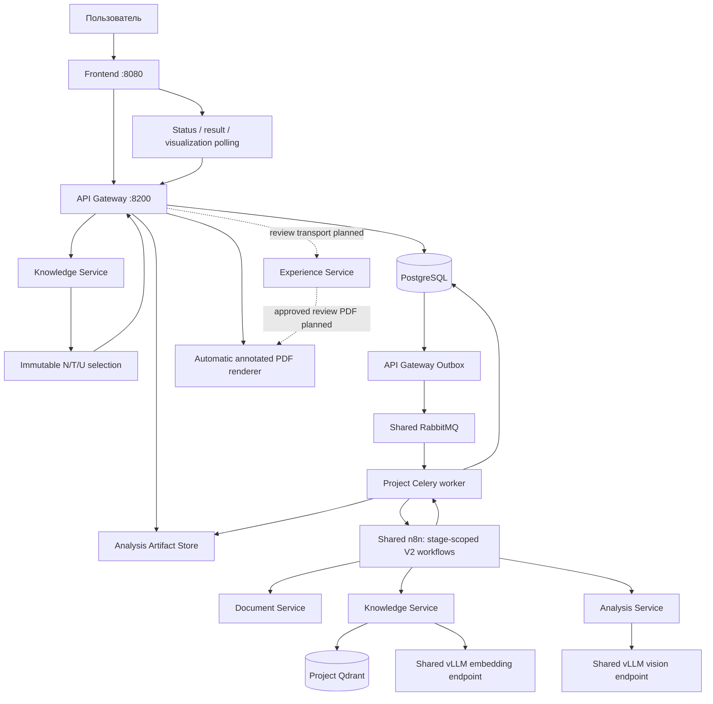

Точки и модели shared-inference задаются logical endpoints/переменными окружения, а не физическими ID модели в коде проекта. Пунктир обозначает ещё не подключённый runtime. Текущее создание Gold, review-контролы и текстовые карточки работают в браузере, а действующий `annotated-pdf` остаётся **автоматической исходной версией**.

## 2. Managed N/U catalog и индексация

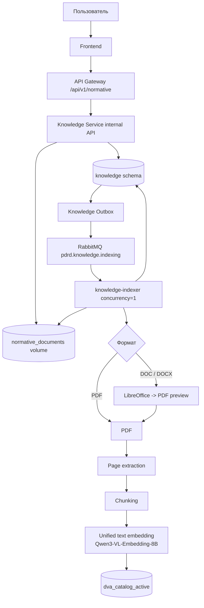

`N` и `U` используют один physical vector space, но semantic role определяется PostgreSQL `catalog_area` до vector search.

## 3. Техническое задание

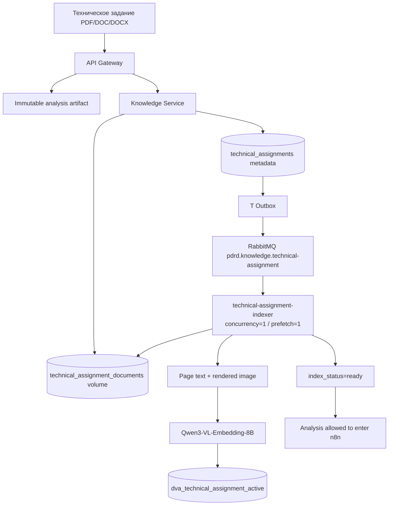

ТЗ индексируется до запуска n8n. Analysis job не начинает orchestration, пока связанный T-index не перешёл в `READY`.

## 4. Анализ одного листа с N/T/U

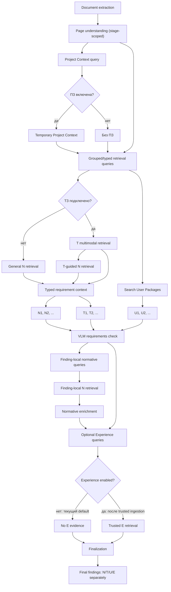

`E` в `.env.example` отключён: наличие в workflow шага Experience не означает работающую доверенную базу. Промежуточные гипотезы не удаляются, но не становятся подтверждёнными замечаниями без дополнительной проверки.

## 5. GPU coordination

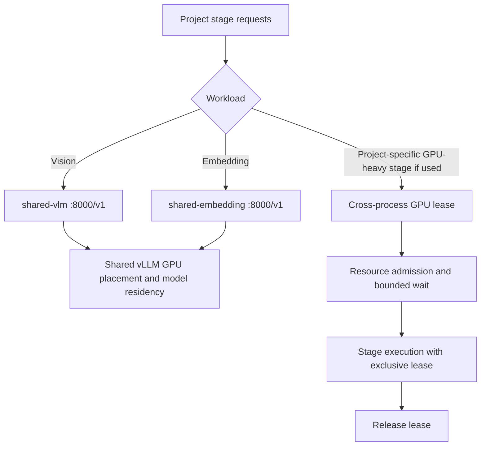

Shared runtimes управляют собственным размещением GPU и residency; приложение использует stable logical endpoints. Проектный lock `/var/lock/pdrd-gpu/gpu.lock` остаётся контрактом только для операций, действительно использующих project-side GPU lease; **его нельзя представлять как lock, который гарантированно управляет shared vLLM из другого стека**. Конкретные GPU/TP/DP/model IDs берутся из конфигурации shared infrastructure.

## 6. PostgreSQL — таблицы и связи

Один project PostgreSQL instance; сервисы владеют независимыми bounded contexts. У Experience собственная схема `experience` и отдельная таблица Alembic `experience.alembic_version_experience`, не изменяющая цепочки миграций Gateway/Knowledge. Миграцию Experience следует выполнять только после отдельной проверки подключения и backup; **наличие миграции в Git не означает, что она применена на рабочем сервере**.

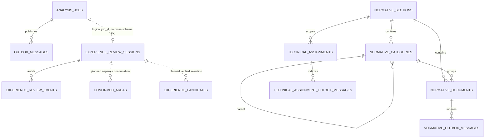

### API Gateway

`analysis_jobs` — lifecycle задания; `normative_snapshot` является immutable JSONB. Изменение frontend после запуска не модифицирует существующий job.

Snapshot содержит независимо:

```json
{
  "section_id": "<uuid>",
  "document_ids": ["<normative-uuid>"],
  "user_package_document_ids": ["<user-package-uuid>"],
  "system_prompt": "<exact resolved prompt>",
  "technical_assignment": {
    "technical_assignment_id": "<uuid>",
    "analysis_document_id": "<uuid>",
    "source_file": "ТЗ.pdf"
  }
}
```

`technical_assignment` отсутствует без ТЗ. `outbox_messages` — transactional outbox анализа, публикуемый только после SQL commit.

### Knowledge Service

- `knowledge.normative_sections` — разделы и system prompt;
- `knowledge.normative_categories` — дерево N/U (`parent_id`, `catalog_area`);
- `knowledge.normative_documents` — metadata, storage key, durable index statuses;
- `knowledge.normative_outbox_messages` — события N/U indexing;
- `knowledge.technical_assignments` — metadata и lifecycle T;
- `knowledge.technical_assignment_outbox_messages` — отдельная durable T queue;
- `alembic_version_knowledge` — собственная цепочка миграций.

### Experience Service

**Контракт текущего этапа:** `experience.review_sessions` хранит последний JSONB-снимок одного `job_id` с `revision` и `approved_revision`; `experience.review_events` хранит неизменяемую последовательность действий `(job_id, session_revision)` с before/after и автором. Каждая запись в транзакции проходит optimistic CAS по `expected_revision`. В `ReviewSession` хранятся также замечания без координат — для полного аудита и итогового **текстового** PDF. Отбор обучающих примеров — отдельная операция, **не** копия всей таблицы Review. Предложенные визуализацией области VLM переносятся как `proposed_regions` с источником и уверенностью; `issue_box` остаётся пустой до явного подтверждения. Старые JSONB-снимки без `proposed_regions` продолжают читаться.

**Следующие этапы:** подключение доверенного источника завершённого анализа к mapper, бизнес-маршруты HTTP, отдельные подтверждения областей, полноценные Experience records/crops, экспорт и индексация. Наличие миграции в Git не означает её применения на рабочем сервере.

## 7. Qdrant — stable aliases и physical collections

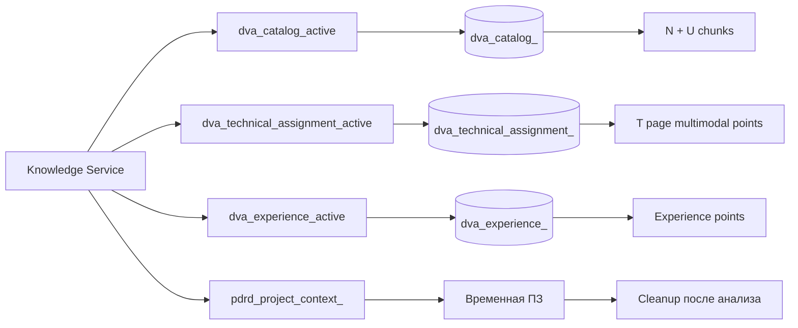

Stable aliases:

```text
dva_catalog_active
dva_technical_assignment_active
dva_experience_active
```

Physical collection name определяется fingerprint:

```text
fingerprint = sha256(model | dimension | schema_version)[:16]
```

Для текущей `.env.example` логической identity:

```text
PDRD_EMBEDDING_MODEL=shared-embedding
PDRD_EMBEDDING_DIMENSION=4096
PDRD_EMBEDDING_SCHEMA_VERSION=2
```

Физический checkpoint и hardware layout задаются shared-infrastructure; изменение логической identity или схемы векторов требует контролируемой миграции.

### Managed N/U payload

Для PDF point соответствует chunk физической страницы. Для DOC/DOCX сначала создаётся PDF-preview.

```json
{
  "document_id": "<uuid>",
  "section_id": "<uuid>",
  "category_id": "<uuid-or-null>",
  "source_sha256": "<sha256>",
  "source_file": "<original filename>",
  "page": 17,
  "chunk_index": 2,
  "text": "<fragment>"
}
```

`catalog_area` намеренно остаётся source of truth в PostgreSQL.

Перед vector search Knowledge Service:

1. получает IDs из immutable snapshot;
2. проверяет existence;
3. проверяет `section_id`;
4. проверяет `catalog_area`;
5. проверяет `index_status=ready`;
6. строит exact Qdrant filter по `document_id`.

### T payload

Один T point соответствует странице и содержит multimodal representation:

```json
{
  "source_type": "technical_assignment",
  "representation": "page_multimodal",
  "technical_assignment_id": "<uuid>",
  "analysis_document_id": "<uuid>",
  "section_id": "<uuid>",
  "source_file": "ТЗ.pdf",
  "source_sha256": "<sha256>",
  "page": 4,
  "pixel_width": 1240,
  "pixel_height": 1754,
  "normative_refs": [
    "СП 256.1325800.2016"
  ],
  "text": "<page text>"
}
```

### Experience payload

Текущий domain `ExperienceCandidate` описывает **подготовку записи**, но действующая E-коллекция пока не пополняется из Human Review. Планируемый payload после сохранения изображения и проверки прав:

```json
{
  "job_id": "<uuid>",
  "document_id": "<uuid>",
  "source_sha256": "<sha256>",
  "finding_id": "<stable source finding id>",
  "approved_revision": 4,
  "origin": "vlm",
  "tag": "edited",
  "decision": "rejected",
  "learning_use": "needs_adjudication",
  "page_number": 22,
  "issue_regions": [{"x_min": 100, "y_min": 150, "x_max": 300, "y_max": 380}],
  "original_text": "<original VLM interpretation>",
  "text": "<engineer correction>",
  "normative_basis": "<verified or explicitly unverified reference>",
  "crop_asset_id": "<object storage reference>",
  "embedding_text": "<selected trusted search text>"
}
```

`tag=edited` и `decision=rejected` показываются как **Edited · Bad**; они не становятся автоматически положительными/отрицательными обучающими примерами (`needs_adjudication`). `E` не нормативный basis. Pending и записи без подтверждённой области не индексируются. `KNOWLEDGE_SERVICE_SEARCH__EXPERIENCE_ENABLED=false` остаётся до завершения индексации и слепой оценки.

### Project Context

Временная collection Пояснительной записки конкретного analysis context:

```json
{
  "page": 12,
  "chunk_index": 1,
  "text": "<fragment>"
}
```

ПЗ — контекст проекта, а не нормативное доказательство.

## 8. Blue/green embedding migration

При смене:

```text
PDRD_EMBEDDING_MODEL
PDRD_EMBEDDING_DIMENSION
PDRD_EMBEDDING_SCHEMA_VERSION
```

меняется embedding fingerprint.

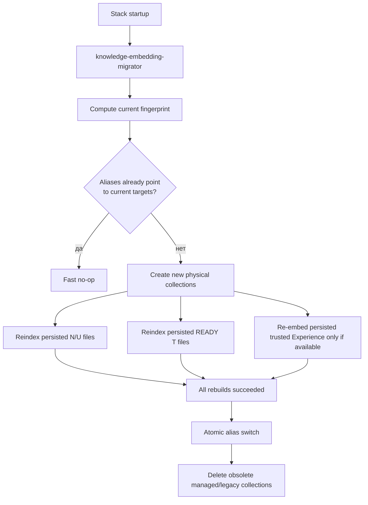

Source documents не восстанавливаются из старых vectors:

- N/U перечитываются из `normative_documents`;
- T перечитывается из `technical_assignment_documents`;
- metadata читаются из PostgreSQL;
- E после включения доверенного контура переэмбеддится только из сохранённых проверенных payload (в текущем режиме E выключен);
- временные Project Context создаются заново в конкретном analysis run.

Если rebuild падает до cutover:

- текущие aliases не переключаются;
- старый рабочий vector space остаётся доступным;
- незавершённые новые targets очищаются.

## 9. Физическое хранение

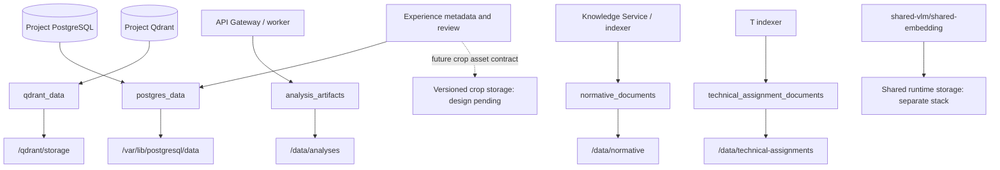

| Данные | Docker volume / owner | Путь |
|---|---|---|
| PostgreSQL (включая будущую `experience` schema) | `postgres_data` | `/var/lib/postgresql/data` |
| Qdrant | `qdrant_data` | `/qdrant/storage` |
| Analysis artifacts | `analysis_artifacts` | `/data/analyses` |
| Managed N/U files | `normative_documents` | `/data/normative` |
| T files | `technical_assignment_documents` | `/data/technical-assignments` |
| Shared vLLM/embedding weights | `shared-infrastructure` | Не является volume проекта |
| Experience image crops | отдельный versioned storage — план | Путь определяется на этапе storage adapter |

Не использовать `docker compose down -v` в обычном деплое: он уничтожает постоянные данные.

## 10. Группировка и локализация замечаний

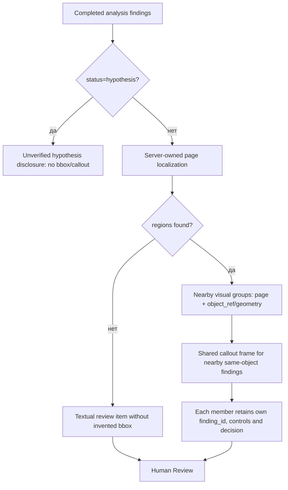

**Реализовано во frontend:** пространственная группировка влияет только на отображение; каждый `finding_id` остаётся независимым в review/DB. Hypothesis не создаёт ложную рамку. Группировка не объединяет доказательства, решения или оригинальные тексты в одну запись. Gold всегда имеет отдельный собственный `finding_id` и исходно выбранные пользователем две области.

## 11. Полный бизнес-процесс Experience Service

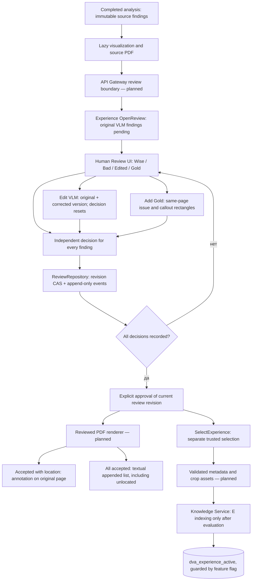

**Статусы внедрения:** локальный Human Review UI, демонстрационная страница Experience, domain `ReviewSession`, `SelectExperience`, PostgreSQL adapter/Alembic schema и HTTP bootstrap с health/readiness реализованы. Серверный mapper переносит визуальные области в `proposed_regions`, не подтверждая их автоматически. Бизнес-маршруты Review, сохранение подтверждений координат, crop, reviewed PDF и E indexing пока не подключены. Пунктир/слово `planned` означает архитектурный план, не существующую рабочую функциональность.

## 12. Подтверждение и исправление областей

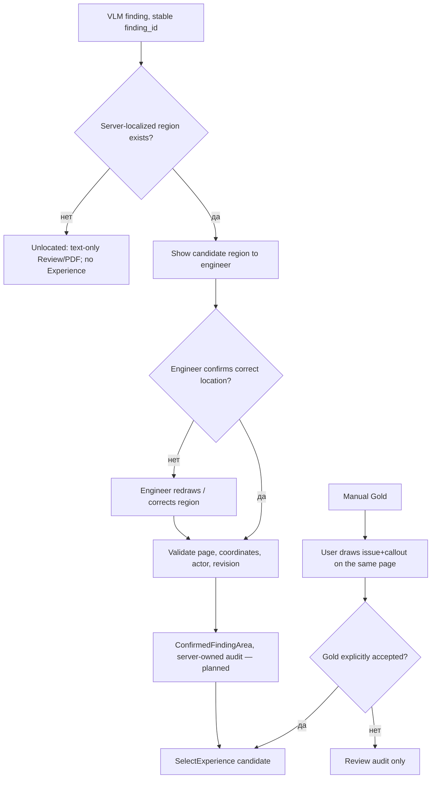

`status=located` от автоматического локализатора не равен подтверждению инженера. Mapper читает только серверные артефакты задания и сохраняет такую область как `proposed_regions`; отсутствие, неверная геометрия или неоднозначная локализация оставляют находку текстовой. Подтверждение проверяется отдельно от `decision=accepted`. Никаких выдуманных координат или перехода Gold на другой лист. Достоверная привязка подтверждения к актуальной редакции finding будет enforced в persistent confirmed-areas adapter.

## 13. Как будет происходить отбор, отсечение и классификация

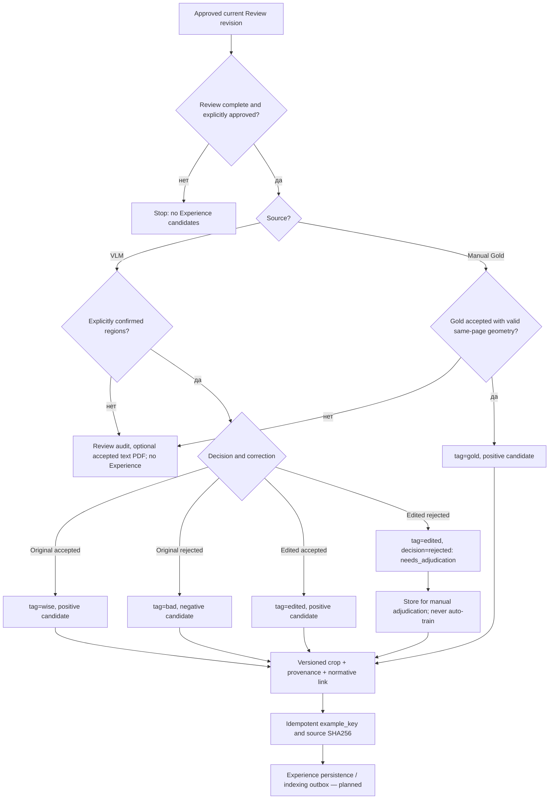

Замечание без подтверждённой области **может присутствовать в операционном Review и утверждённом текстовом PDF**, но **не** попадает в обучающую Experience DB независимо от принятия. Отредактированный VLM имеет `tag=edited`, даже при `decision=rejected`; отдельный `edited-bad` как значение поля не требуется.

## 14. Экспорт Reviewed PDF и обучение

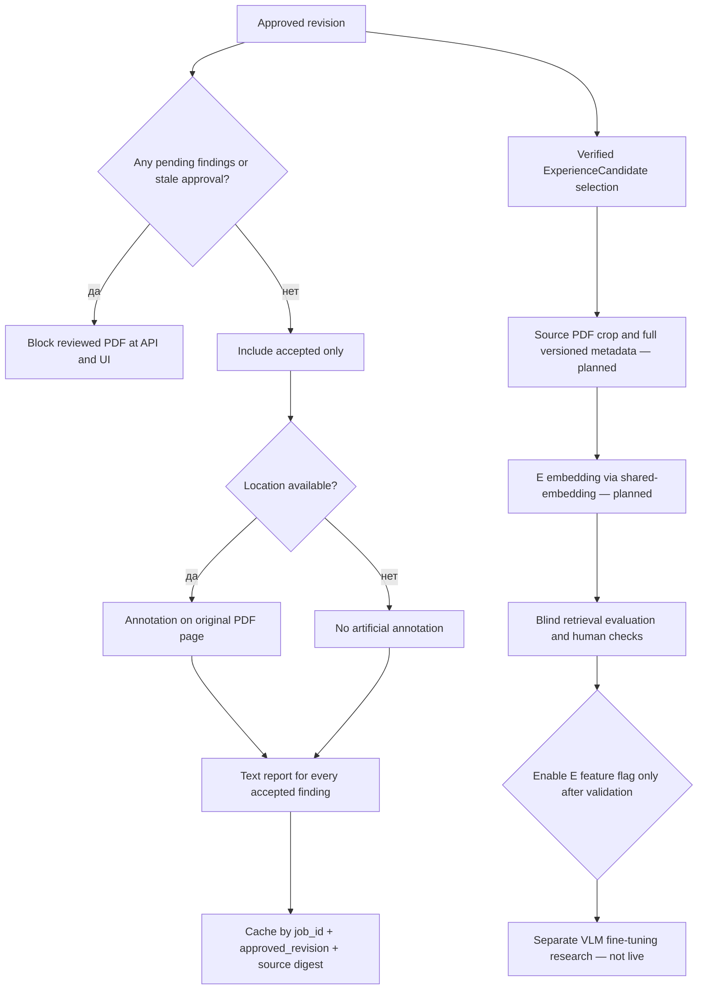

# Как работает retrieval

## N — normative retrieval

Snapshot содержит `document_ids`.

Knowledge Service допускает только документы:

- существующие;
- из выбранного section;
- `catalog_area=normative`;
- `index_status=ready`.

После этого Qdrant ищет только по exact IDs.

Найденные источники получают локальные IDs:

```text
N1, N2, N3, ...
```

## T — Technical Assignment retrieval

Если snapshot содержит `technical_assignment_id`, workflow вызывает:

```text
/internal/v1/search/technical-assignment-guided
```

Guided retrieval выполняет:

```text
query
  -> T multimodal search
  -> extract/use normative_refs and T context
  -> targeted N retrieval
  -> general N retrieval
  -> merge without changing source roles
```

Возвращаются отдельно:

```text
technical_assignment_sources
normative_sources
targeted_normative_sources
general_normative_sources
reference_resolutions
conflict_candidates
diagnostics
```

`conflict_candidates` — это T/N пары, которые Analysis Service должен оценить семантически, а не считать конфликтом только по строковому совпадению.

## U — User Package retrieval

Snapshot отдельно содержит `user_package_document_ids`.

Допускаются только документы:

- существующие;
- из того же section;
- `catalog_area=user_package`;
- `index_status=ready`.

Найденные источники получают IDs:

```text
U1, U2, U3, ...
```

## E — Experience retrieval

Контракт Experience search вызывается после requirement check по `experience_query`, но **в текущей конфигурации фактический поиск выключен** (`KNOWLEDGE_SERVICE_SEARCH__EXPERIENCE_ENABLED=false`). Включение только после сохранения подтверждённых crop/metadata, trusted E indexing и проверки качества. E никогда не становится нормативным basis.

# Формирование N/T/U JSON

## Retrieval JSON

Типы источников передаются независимо:

```json
{
  "normative_sources": [
    {
      "source_id": "N1",
      "point_id": "<qdrant-point>",
      "score": 0.86,
      "document_id": "<uuid>",
      "section_id": "<uuid>",
      "category_id": "<uuid-or-null>",
      "source_sha256": "<sha256>",
      "source_file": "СП 256.1325800.2016.pdf",
      "page": 17,
      "chunk_index": 2,
      "text": "<normative fragment>"
    }
  ],
  "technical_assignment_sources": [
    {
      "source_id": "T1",
      "point_id": "<qdrant-point>",
      "score": 0.83,
      "technical_assignment_id": "<uuid>",
      "analysis_document_id": "<uuid>",
      "section_id": "<uuid>",
      "source_sha256": "<sha256>",
      "source_file": "Техническое задание.pdf",
      "page": 4,
      "text": "<T requirement>",
      "normative_refs": [
        "СП 256.1325800.2016"
      ]
    }
  ],
  "user_package_sources": [
    {
      "source_id": "U1",
      "point_id": "<qdrant-point>",
      "score": 0.79,
      "document_id": "<uuid>",
      "section_id": "<uuid>",
      "category_id": "<uuid-or-null>",
      "source_sha256": "<sha256>",
      "source_file": "Требования заказчика.pdf",
      "page": 2,
      "chunk_index": 0,
      "text": "<user requirement>"
    }
  ]
}
```

`source_id` является typed local evidence ID текущего analysis context.

## FindingDraft

VLM получает отдельные N/T/U blocks и возвращает ссылки только на IDs из текущего retrieval context.

Пример T-backed finding:

```json
{
  "finding_id": "F1",
  "page": 3,
  "page_type": "scheme",
  "category": "customer_requirements",
  "severity": "warning",
  "status": "confirmed",
  "comment": "На листе отсутствует обозначение, требуемое техническим заданием.",
  "evidence": "На анализируемом листе обозначение не обнаружено.",
  "recommendation_draft": "Добавить обозначение в соответствии с ТЗ.",
  "confidence": 0.91,

  "normative_source_ids": [],
  "technical_assignment_source_ids": [
    "T1"
  ],
  "user_package_source_ids": [],

  "basis": "Требование технического задания.",
  "experience_query": "Проверка оформления обозначений"
}
```

Backend материализует IDs только через текущие retrieval candidates. Произвольный `N99/T99/U99`, которого не было в retrieval context, не должен превращаться в источник.

## Typed evidence materialization

```json
{
  "finding_id": "F1",
  "category": "customer_requirements",
  "basis_sources": [],
  "technical_assignment_basis_sources": [
    {
      "source_id": "T1",
      "technical_assignment_id": "<uuid>",
      "source_file": "Техническое задание.pdf",
      "page": 4,
      "text": "<T requirement>"
    }
  ],
  "user_package_basis_sources": []
}
```

## Finding-local normative enrichment

После первичного requirement check инженерное замечание не удаляется из-за отсутствия N.

Для каждого finding может выполняться отдельный targeted N retrieval:

```text
finding
  -> finding-local normative query
  -> N candidates
  -> semantic validation/finalization
```

Пример:

```text
T1
  -> упоминание/смысл СП 256
  -> targeted normative retrieval
  -> N4
```

После подтверждения:

```json
{
  "finding_id": "F1",
  "category": "normative_control",
  "basis_sources": [
    {
      "source_id": "N4",
      "source_file": "СП 256.1325800.2016.pdf",
      "page": 17,
      "text": "<validated normative fragment>"
    }
  ],
  "technical_assignment_basis_sources": [
    {
      "source_id": "T1",
      "source_file": "Техническое задание.pdf",
      "page": 4,
      "text": "<project requirement>"
    }
  ]
}
```

Здесь `T1` остаётся T-source, а нормативное утверждение подтверждает `N4`.

## FinalFinding

Финальный finding хранит источники раздельно:

```json
{
  "finding_id": "F1",
  "page": 3,
  "page_type": "scheme",
  "category": "normative_control",
  "severity": "warning",
  "status": "confirmed",
  "comment": "<finding>",
  "evidence": "<drawing evidence>",
  "recommendation": "<recommendation>",
  "confidence": 0.93,
  "basis": "<human-readable basis>",

  "basis_sources": [
    {
      "source_id": "N1"
    }
  ],
  "technical_assignment_basis_sources": [
    {
      "source_id": "T1"
    }
  ],
  "user_package_basis_sources": [
    {
      "source_id": "U1"
    }
  ],
  "experience_sources": [
    {
      "source_id": "E1"
    }
  ]
}
```

# Пояснительная записка

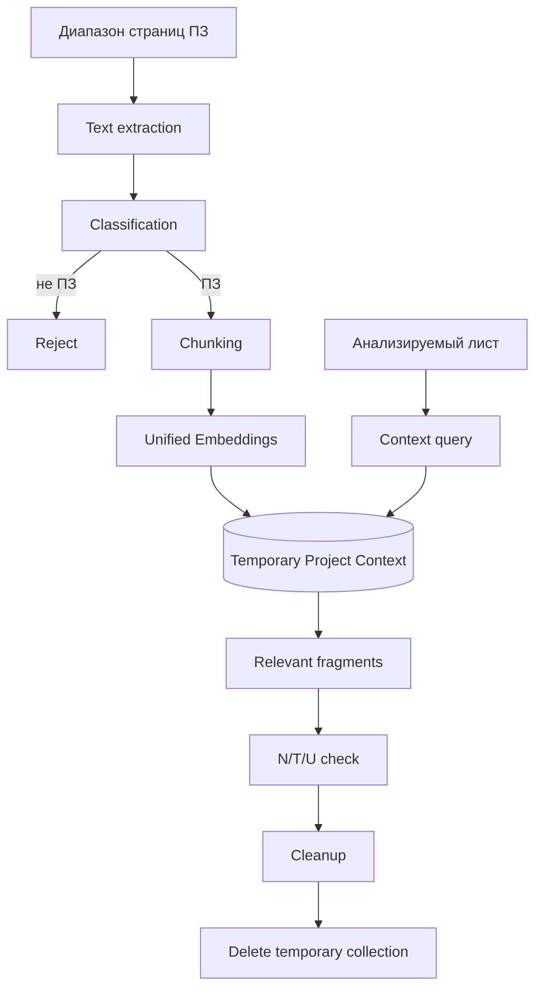

Project Context помогает понять проект, но не становится N/T/U evidence.

# Managed catalog

## Lifecycle N/U документа

```text
upload
  ↓
uploaded
  ↓
queued
  ↓
indexing
  ├──→ ready
  └──→ failed
```

Из `failed` документ можно повторно поставить в queue.

Удаление переводит document в `deleting`, затем удаляет:

1. Qdrant points по `document_id`;
2. original file;
3. Word PDF-preview;
4. SQL metadata.

## System prompt

Используются три уровня:

```text
NORMATIVE_SUPER_SYSTEM_PROMPT
        +
section.system_prompt
        +
transient working override / dynamic context
```

`NORMATIVE_SUPER_SYSTEM_PROMPT` хранится в коде.

`section.system_prompt` хранится в PostgreSQL.

Transient working prompt применяется к конкретному анализу без сохранения как новый system prompt.

# Пользовательские пакеты документов

Пакеты относятся к нормативному section, но имеют:

```text
catalog_area=user_package
```

Frontend позволяет:

- создать пакет/папку;
- создать вложенную папку;
- загрузить PDF/DOC/DOCX;
- автоматически поставить документ в indexing queue;
- открыть PDF или Word PDF-preview;
- перемещать документы;
- удалять документы/папки;
- выбирать отдельные READY документы;
- выбирать все READY package docs;
- очищать selection.

# Public API

## Analysis

```text
POST /api/v1/analyses
GET  /api/v1/analyses/{job_id}
GET  /api/v1/analyses/{job_id}/result
GET  /api/v1/analyses/{job_id}/progress
POST /api/v1/analyses/{job_id}/cancel
GET  /api/v1/analyses/{job_id}/visualization
GET  /api/v1/analyses/{job_id}/annotated-pdf  # automatic, not reviewed
```

Multipart analysis fields включают:

```text
pdf
cad
pages
use_explanatory_note
note_start_page
note_end_page
normative_section_id
normative_document_ids
user_package_document_ids
normative_prompt_override_enabled
normative_prompt_override
technical_assignment
```

Точная форма T upload определяется public analysis schema/frontend contract; внутри immutable snapshot сохраняется `technical_assignment_id`.

## Managed normative catalog

```text
GET    /api/v1/normative/sections
POST   /api/v1/normative/sections
GET    /api/v1/normative/sections/{section_id}
PATCH  /api/v1/normative/sections/{section_id}
DELETE /api/v1/normative/sections/{section_id}

GET    /api/v1/normative/sections/{section_id}/categories
POST   /api/v1/normative/sections/{section_id}/categories
GET    /api/v1/normative/categories/{category_id}
PATCH  /api/v1/normative/categories/{category_id}
DELETE /api/v1/normative/categories/{category_id}

GET    /api/v1/normative/sections/{section_id}/documents
POST   /api/v1/normative/sections/{section_id}/documents
GET    /api/v1/normative/documents/{document_id}
PATCH  /api/v1/normative/documents/{document_id}
DELETE /api/v1/normative/documents/{document_id}

POST   /api/v1/normative/documents/{document_id}/index
GET    /api/v1/normative/documents/{document_id}/content
```

## User packages

```text
GET    /api/v1/normative/sections/{section_id}/user-packages/categories
POST   /api/v1/normative/sections/{section_id}/user-packages/categories

GET    /api/v1/normative/user-packages/categories/{category_id}
PATCH  /api/v1/normative/user-packages/categories/{category_id}
DELETE /api/v1/normative/user-packages/categories/{category_id}

GET    /api/v1/normative/sections/{section_id}/user-packages/documents
POST   /api/v1/normative/sections/{section_id}/user-packages/documents

GET    /api/v1/normative/user-packages/documents/{document_id}
PATCH  /api/v1/normative/user-packages/documents/{document_id}
DELETE /api/v1/normative/user-packages/documents/{document_id}

POST   /api/v1/normative/user-packages/documents/{document_id}/index
GET    /api/v1/normative/user-packages/documents/{document_id}/content
```

## Technical Assignment content

Кликабельный T-source открывается через Gateway:

```text
GET /api/v1/normative/technical-assignments/{technical_assignment_id}/content
```

Browser не обращается к internal Knowledge API напрямую. HTTP endpoints Experience/Reviewed PDF появятся после подключения transport, identity и persistence; на текущей ветке **публичного Experience API ещё нет**.

# n8n workflows

Repository:

```text
n8n/workflows/
├── analysis-v2-pdf.json
├── analysis-v2-cad.json
└── analysis-v2-pdf-cad.json
```

В V2 PDF выполняются stage-scoped операции с последовательной обработкой страниц тяжёлых этапов; CAD/PDF+CAD сохраняют свои source-mode правила. Общий requirement path:

```text
Page understanding
  -> Build Normative Queries
  -> Search Requirements
       ├─ no T -> normative search
       └─ T    -> technical-assignment-guided search
  -> Normalize Requirement Search
  -> Search User Packages
  -> Check Norms
  -> Prepare Finding Normative Queries
  -> Search Finding Norms
  -> Search Experience (feature disabled until trusted E ingestion)
  -> Group/Finalize Findings
```

`Check Norms` получает typed sources отдельно:

```json
{
  "normative_sources": [],
  "technical_assignment_sources": [],
  "conflict_candidates": [],
  "user_package_sources": []
}
```

n8n не присваивает T/U нормативную роль. Он только переносит typed data между сервисами.

Transient HTTP errors на GPU-dependent retrieval nodes должны иметь bounded retry policy; основная resource-serialization логика остаётся в backend GPU coordinator, а не в workflow.

Workflow обновляются и публикуются вручную через n8n UI.

# Структура проекта

```text
PDRD-validation/
├── frontend/
│   ├── Dockerfile
│   ├── nginx.conf
│   └── src/
│       ├── index.html
│       ├── css/
│       └── js/
│           ├── app.js
│           ├── config.js
│           ├── components/
│           └── features/
│               ├── analysis/
│               ├── normative/
│               └── review/     # Wise/Bad/Edited/Gold + manual geometry/text list
│
├── services/
│   ├── api-gateway/
│   │   ├── alembic/
│   │   ├── src/pdrd_api_gateway/
│   │   └── tests/
│   ├── document-service/
│   ├── knowledge-service/
│   │   ├── alembic/
│   │   ├── src/pdrd_knowledge_service/
│   │   │   ├── application/
│   │   │   ├── domain/
│   │   │   └── infrastructure/
│   │   │       ├── database/
│   │   │       ├── embedding/
│   │   │       ├── messaging/
│   │   │       ├── migration/
│   │   │       └── vector_store/
│   │   └── tests/
│   ├── analysis-service/
│   │   ├── src/pdrd_analysis_service/
│   │   │   ├── application/ports/gpu.py
│   │   │   └── infrastructure/
│   │   │       ├── gpu_coordination.py
│   │   │       └── ollama.py
│   │   └── tests/
│   ├── multimodal-embedding-service/  # legacy/test code; not a Compose runtime
│   └── experience-service/
│       ├── alembic/             # Experience-only PostgreSQL revisions
│       ├── src/pdrd_experience_service/
│       │   ├── domain/          # ReviewSession, ExperienceCandidate
│       │   ├── application/     # open/change/select ports and use cases
│       │   └── infrastructure/  # PostgreSQL persistence (current stage)
│       └── tests/
│
├── n8n/
│   └── workflows/
│       ├── analysis-v2-pdf.json
│       ├── analysis-v2-cad.json
│       └── analysis-v2-pdf-cad.json
│
├── data/
│   └── knowledge/
│       └── experience/
│           └── cases/
│
├── ops/
├── scripts/
│   ├── build_experience_cases.py
│   ├── check-stack.sh
│   ├── kb_common.py
│   ├── kb_search.py
│   └── kb_sync.py
├── tests/
│   ├── architecture/
│   └── runtime/
│       └── test_gpu_coordination_runtime.py
├── .env.example
├── compose.yaml
├── pyproject.toml
├── requirements-dev.txt
└── README.md
```

# Конфигурация

`.env.example` — committed baseline и полный каталог ordinary runtime settings.

`.env` — sparse private override. В обычном deployment в нём достаточно секретов:

```dotenv
PDRD_POSTGRES_PASSWORD=replace-me
PDRD_RABBITMQ_PASSWORD=replace-me
```

`.env` не должен быть копией `.env.example`.

Единая embedding identity:

```dotenv
PDRD_EMBEDDING_MODEL=shared-embedding
PDRD_EMBEDDING_DIMENSION=4096
PDRD_EMBEDDING_SCHEMA_VERSION=2
```

Физическая модель и GPU topology управляются shared infrastructure; смена логической model identity, размерности или версии схемы требует контролируемого fingerprint cutover. `.env.example` содержит baseline, `.env` — sparse private overrides, и process/Compose env учитываются по согласованному приоритету.

Ключевые Knowledge defaults:

```text
storage.root_path = /data/normative
qdrant.normative_collection = dva_catalog_active
qdrant.multimodal_collection = dva_technical_assignment_active
qdrant.experience_collection = dva_experience_active
project_context.collection_prefix = pdrd_project_context
embedding.model = PDRD_EMBEDDING_MODEL
broker.queue_name = pdrd.knowledge.indexing
```

Ключевые runtime defaults:

```text
analysis VLM URL       = http://shared-vlm:8000/v1
analysis VLM alias     = shared-vlm
embedding URL          = http://shared-embedding:8000/v1
embedding alias        = shared-embedding
project GPU lease path = /var/lock/pdrd-gpu/gpu.lock (where applicable)
Experience E search    = disabled until trusted ingestion
```

# Запуск

Требуются Docker Engine и Docker Compose plugin.

Shared network `ai-shared` должна предоставлять RabbitMQ, n8n, `shared-vlm` и `shared-embedding`; их lifecycle независим от проекта. Физические checkpoint/model IDs и GPU layout настраиваются в `shared-infrastructure`, а проект использует logical aliases.

Безопасный штатный deploy следует выполнять штатным проектным скриптом после проверки текущей ветки/контейнеров и Compose: `bash scripts/up.sh`. Не перезапускайте shared stack и не удаляйте volume ради разработки Experience.

Важное ограничение: наличие SQLAlchemy adapter и Alembic migration ещё **не** означает, что Experience-service подключён к Compose/HTTP. Доступ к DB и миграция будут проверены отдельно; запуск миграции из README до настройки runtime запрещён.

При startup `knowledge-embedding-migrator` проверяет embedding fingerprint до старта Knowledge runtime.

Проверка:

```bash
bash scripts/check-stack.sh
```

Frontend:

```text
http://<server>:8080/
```

API Gateway Swagger:

```text
http://127.0.0.1:8200/docs
```

Knowledge Service Swagger:

```text
http://127.0.0.1:8401/docs
```

Обычная остановка:

```bash
docker compose down
```

Не использовать для обычного deploy:

```bash
docker compose down -v
```

# Тестирование

Windows quality gate:

```powershell
.\ops\check-quality.ps1 -Fix
```

Дополнительные проверки:

```powershell
python -m pip check
git diff --check
docker compose --profile test config --quiet
```

Docker quality:

```bash
docker compose --profile test build quality-tests
docker compose --profile test run --rm --no-deps quality-tests
```

Review domain/Experience selection и инфраструктурные тесты:

```powershell
.\.venv\Scripts\python.exe -m pytest services/experience-service/tests -q
cd frontend; node --test tests/*.test.js; cd ..
```

PostgreSQL integration Experience выполняется только на отдельной тестовой БД и только после Alembic upgrade с явными `PDRD_RUN_DATABASE_TESTS=1` и `EXPERIENCE_SERVICE_TEST_DATABASE_URL` (не на production DB).

Service integration:

```bash
docker compose --profile test build api-gateway-tests knowledge-service-tests
docker compose --profile test run --rm api-gateway-tests
docker compose --profile test run --rm knowledge-service-tests
```

GPU runtime coordination:

```bash
docker compose --profile gpu-runtime-test run --rm gpu-runtime-tests
```

Проверка stack:

```bash
bash scripts/check-stack.sh
```

# Backup и диагностика

Посмотреть volumes:

```bash
docker volume ls | grep -E 'postgres|qdrant|analysis|normative|technical|gpu'
```

Managed SQL documents:

```bash
docker compose exec -T postgres sh -lc '
psql \
  -U "$POSTGRES_USER" \
  -d "$POSTGRES_DB" \
  -P pager=off \
  -c "
SELECT catalog_area, index_status, count(*)
FROM knowledge.normative_documents
GROUP BY catalog_area, index_status
ORDER BY catalog_area, index_status;
"
'
```

Technical Assignments:

```bash
docker compose exec -T postgres sh -lc '
psql \
  -U "$POSTGRES_USER" \
  -d "$POSTGRES_DB" \
  -P pager=off \
  -c "
SELECT index_status, count(*)
FROM knowledge.technical_assignments
GROUP BY index_status
ORDER BY index_status;
"
'
```

Qdrant aliases:

```bash
curl -fsS http://127.0.0.1:6333/aliases | python3 -m json.tool
```

Embedding runtime:

```bash
curl -fsS http://127.0.0.1:8601/internal/v1/status | python3 -m json.tool
```

Shared runtime checks осуществляются через опубликованные health endpoints `shared-vlm` и `shared-embedding` в доверенной LAN/VPN. Их адреса, модельный alias и topology следует проверять по текущему `shared-infrastructure/docs/services.yaml`, а не по локальному Ollama `api/ps`.

# Текущий функциональный контур

В проекте реализованы:

- V2 PDF/CAD/PDF+CAD runtime;
- PDF + ПЗ и PDF+CAD + ПЗ;
- Gateway -> Outbox -> RabbitMQ -> Celery -> n8n;
- managed N/U catalog;
- Technical Assignment lifecycle и отдельный T-index;
- immutable T snapshot и READY barrier перед analysis;
- multimodal T retrieval;
- T-guided normative retrieval;
- N/T/U typed evidence;
- finding-local normative enrichment;
- Experience search contract присутствует в finalization; реально отключён флагом до проверенной записи Experience;
- shared vLLM vision и embedding logical endpoints, 4096-dimension vector contract;
- stable Qdrant aliases и model fingerprint;
- blue/green automatic reindex из durable sources;
- project-side GPU lease/admission where used; shared model residency управляется отдельным shared-runtime lifecycle;
- temporary Project Context cleanup;
- кликабельные N/T sources через API Gateway;
- frontend нормативного каталога, пользовательских пакетов и ТЗ;
- Human Review frontend: Wise/Bad/Edited/Gold, независимые решения сгруппированных findings, создание Gold с двумя областями и общим текстовым списком;
- доменная модель `ReviewSession`, журнал редакций, optimistic revisions, подтверждаемая геометрия и `SelectExperience` (пока только подготовка кандидатов);
- отдельная SQLAlchemy PostgreSQL persistence и Experience Alembic migration, HTTP bootstrap без бизнес-маршрутов, серверный mapper предложенных VLM-областей;
- автоматический PDF существует, reviewed PDF после Human Review пока заблокирован;
- unit/integration/architecture/runtime test layers.

**Следующие этапы Experience:** runtime identity/config и API Gateway integration; подтверждение/коррекция областей на сервере; отдельное durable хранилище Experience metadata и image crop; утверждённый PDF на исходных листах и в текстовом отчёте; trusted E indexing с последующей оценкой качества; отдельный эксперимент дообучения VLM.
