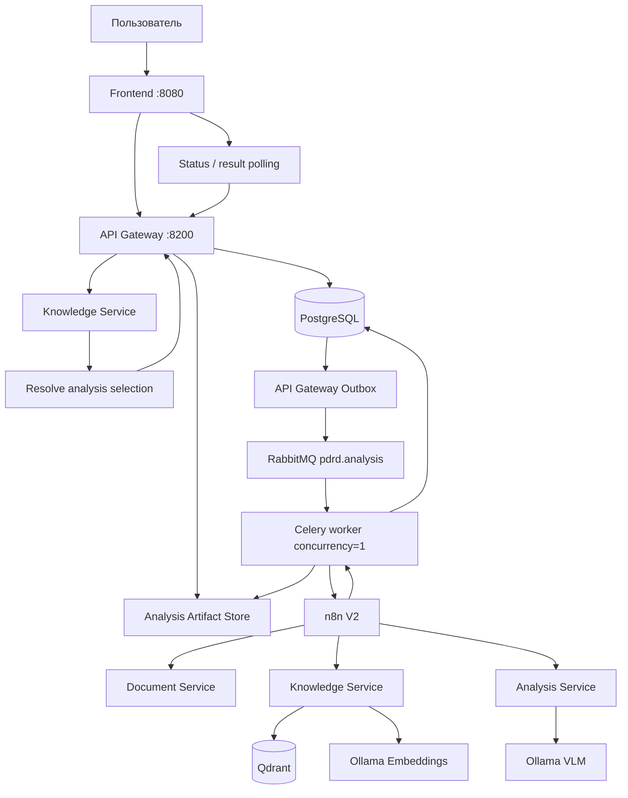
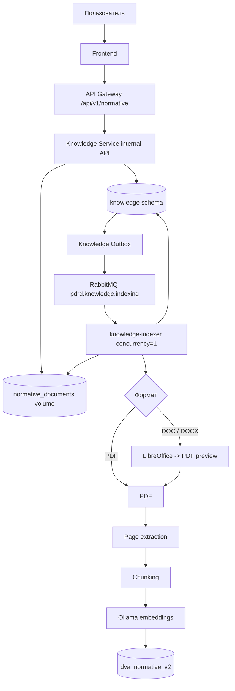
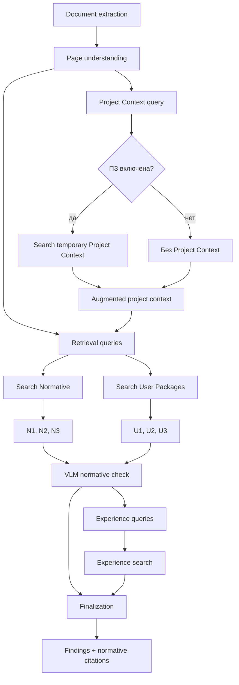
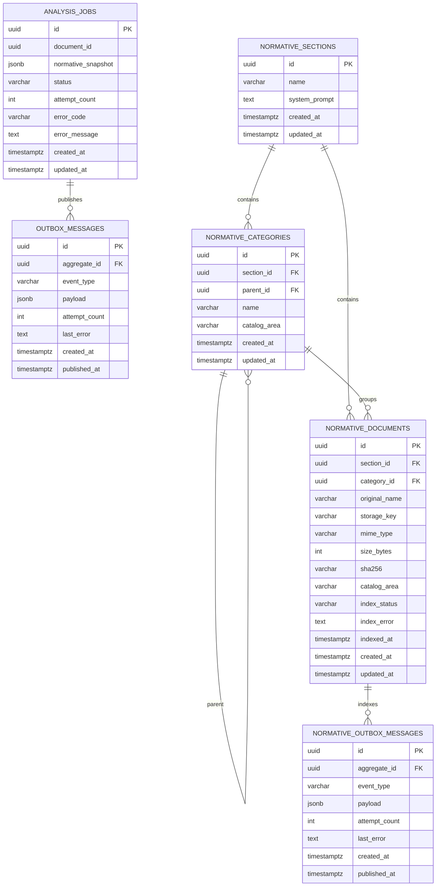
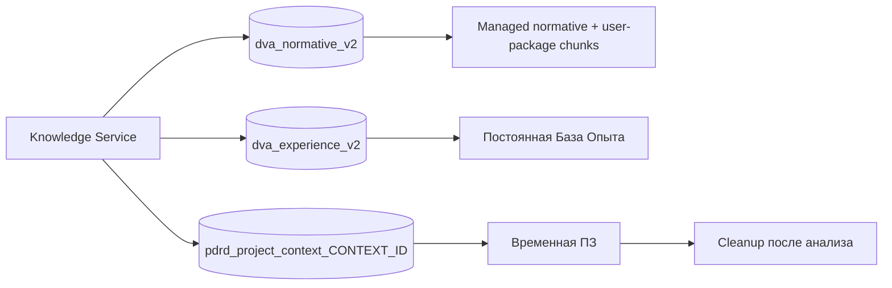
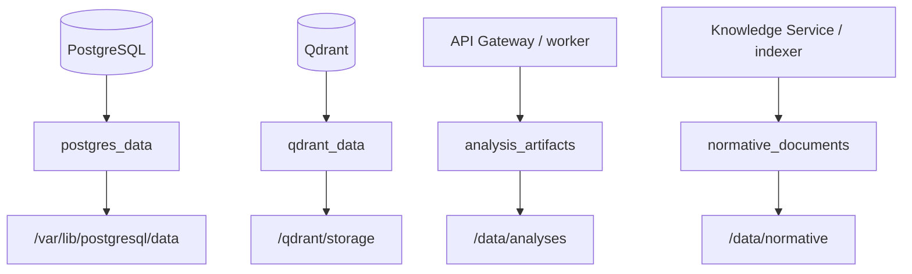
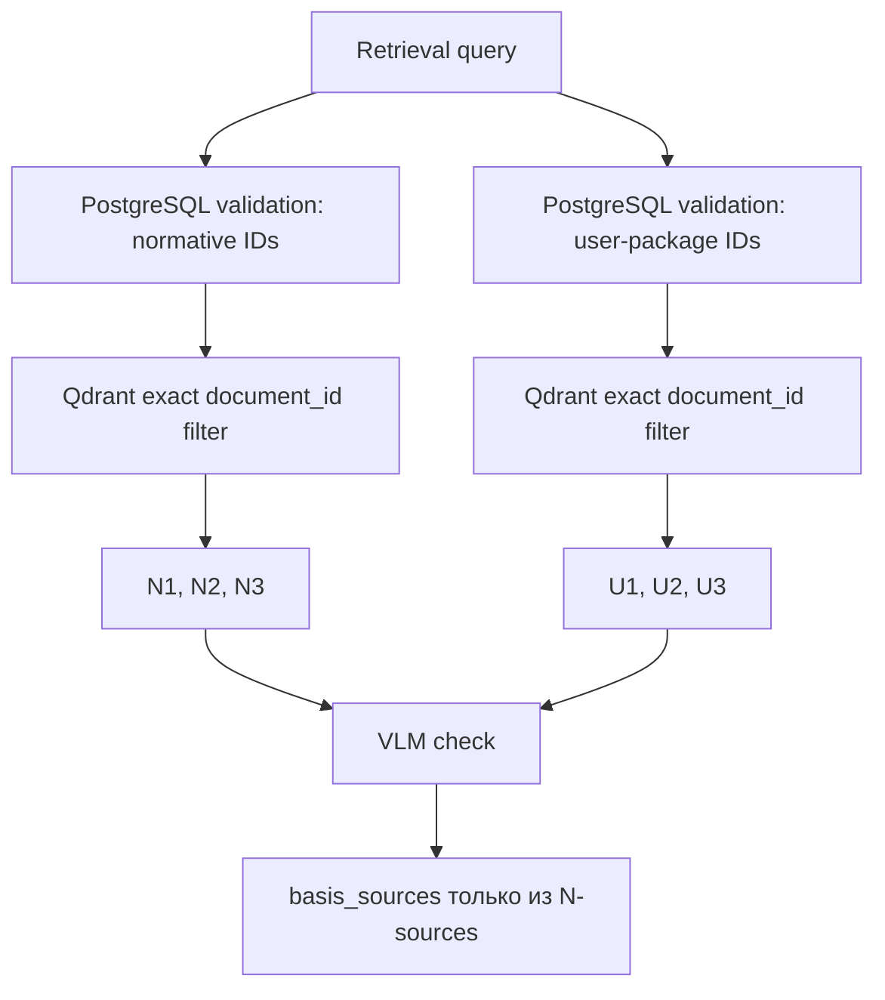
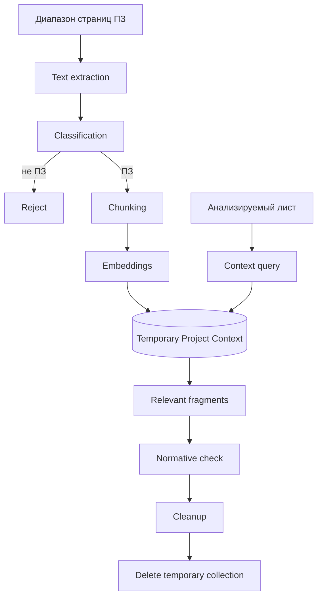
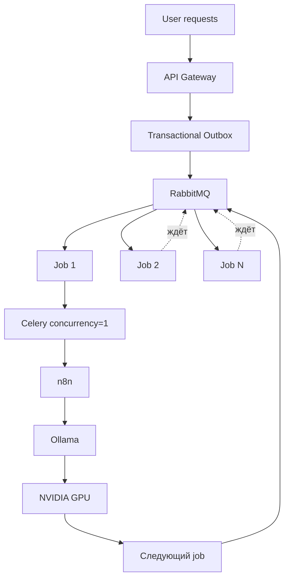

<!-- README.md -->

# PDRD Validation — Drawing Validation AI

PDRD Validation — локальный сервис проверки проектной и рабочей документации по нормативной базе, пользовательским пакетам документов, контексту проекта и Базе Опыта.

Пользователь загружает PDF, DXF/DWG или PDF вместе с соответствующим CAD-файлом. Система извлекает текст и геометрию, формирует машинный контекст листа, подбирает релевантные фрагменты, выполняет локальный VLM-анализ и возвращает структурированные замечания с кликабельными нормативными источниками.

Тяжёлые AI-задачи выполняются через RabbitMQ/Celery с `concurrency=1`, чтобы несколько пользовательских запросов не запускали параллельно несколько тяжёлых GPU-задач и не конкурировали за VRAM.

## Возможности

- PDF-only и multi-page PDF;
- DXF-only и DWG -> DXF normalization;
- PDF + CAD как два представления одного листа;
- контекст Пояснительной записки;
- временный semantic Project Context;
- managed нормативные разделы и вложенные папки;
- пользовательские пакеты документов внутри выбранного раздела;
- PDF/DOC/DOCX upload;
- Word -> PDF preview через LibreOffice;
- durable индексация через Transactional Outbox;
- scoped normative RAG по immutable snapshot;
- scoped retrieval выбранных пользовательских документов;
- отдельный system prompt нормативного раздела;
- transient working prompt;
- кликабельные нормативные источники;
- База Опыта;
- локальная VLM и embeddings через Ollama;
- n8n orchestration;
- frontend только через API Gateway;
- cleanup временного Project Context;
- unit, integration и architecture tests.

## Главный принцип разделения источников

В одном managed catalog существуют две области:

- `normative` — нормативная база;
- `user_package` — пользовательские документы проекта/заказчика.

Обе области используют:

- PostgreSQL metadata;
- один filesystem volume;
- один indexing pipeline;
- одну Qdrant collection `dva_normative_v2`.

Но при анализе они имеют **разные роли**.

Нормативы формируют `N1`, `N2`, ... и только они могут попасть в `normative_source_ids`, `basis_sources` и кликабельные нормативные ссылки.

Пользовательские документы формируют `U1`, `U2`, ... и используются только как дополнительный фактический контекст. Они не могут самостоятельно доказывать нарушение ГОСТ, СП, ПУЭ или другого нормативного документа.

# Технологии

| Слой | Технологии |
|---|---|
| Backend | Python 3.12, FastAPI, Pydantic |
| Persistence | PostgreSQL 16, SQLAlchemy AsyncIO, Alembic |
| Очередь | RabbitMQ, Celery |
| Orchestration | n8n |
| Vector DB | Qdrant |
| VLM | Ollama + `qwen3-vl:8b-instruct` |
| Embeddings | Ollama + `qwen3-embedding:4b` |
| PDF | PyMuPDF |
| Word | LibreOffice headless |
| CAD | ezdxf, LibreDWG |
| Frontend | HTML, CSS, JavaScript, nginx |
| Контейнеризация | Docker, Docker Compose |
| Тесты / style | pytest, Ruff |

# Архитектура

Bounded contexts:

- **API Gateway** — публичный API, job state, immutable analysis snapshot, Outbox, Celery и analysis artifacts.
- **Document Service** — PDF/CAD extraction, render, DWG -> DXF.
- **Knowledge Service** — managed catalog, PostgreSQL metadata, Qdrant, embeddings, Normative RAG, User Package RAG, Experience RAG и Project Context.
- **Analysis Service** — VLM page understanding, нормативная проверка и finalization.
- **n8n** — orchestration внутренних вызовов.
- **Frontend** — Browser -> API Gateway; прямого доступа к n8n и внутренним сервисам нет.

Shared infrastructure:

- Ollama;
- RabbitMQ;
- n8n.

Project infrastructure:

- PostgreSQL;
- Qdrant;
- application services;
- project Docker volumes.

Направление зависимостей backend:

```text
Transport
    ↓
Application
    ↓
Domain

Infrastructure ──implements──> Application ports
```

`Domain` и `Application` не зависят от FastAPI, SQLAlchemy, Celery, Qdrant, Ollama и HTTP adapters.

# Блок-схемы

## 1. Общий путь анализа



## 2. Managed catalog и индексация



## 3. Анализ одного листа



## 4. PostgreSQL — таблицы и связи

Один PostgreSQL instance используется API Gateway и Knowledge Service. Knowledge Service хранит свои таблицы в схеме `knowledge`.



### API Gateway

`analysis_jobs`

- lifecycle задания;
- `normative_snapshot` — immutable JSONB настроек на момент создания job;
- изменение UI, раздела, prompt или checkbox после запуска не изменяет уже созданный job.

Актуальный snapshot:

```json
{
  "section_id": "<uuid>",
  "document_ids": [
    "<normative-uuid>"
  ],
  "user_package_document_ids": [
    "<user-package-uuid>"
  ],
  "system_prompt": "<exact resolved prompt>"
}
```

`outbox_messages`

- transactional outbox анализа;
- dispatcher публикует событие в RabbitMQ только после SQL commit.

### Knowledge Service

`knowledge.normative_sections`

- разделы;
- сохранённый system prompt.

`knowledge.normative_categories`

- дерево папок;
- `parent_id` — вложенность;
- `catalog_area` — `normative` или `user_package`.

`knowledge.normative_documents`

- metadata PDF/DOC/DOCX;
- bytes хранятся в filesystem volume, а не PostgreSQL;
- `storage_key` указывает на physical file;
- `index_status`: `uploaded`, `queued`, `indexing`, `ready`, `failed`, `deleting`;
- `catalog_area` является source of truth для разделения нормативов и пользовательских пакетов.

`knowledge.normative_outbox_messages`

- durable события managed индексации;
- связаны с `normative_documents`.

Knowledge Service использует отдельную Alembic version table:

```text
alembic_version_knowledge
```

## 5. Qdrant — коллекции



### `dva_normative_v2`

Одна постоянная managed collection используется и для `normative`, и для `user_package`.

Для PDF point соответствует chunk физической страницы. Для DOC/DOCX сначала создаётся PDF-preview, поэтому `page` относится к browser-viewable PDF.

Payload:

```json
{
  "document_id": "<uuid>",
  "section_id": "<uuid>",
  "category_id": "<uuid-or-null>",
  "source_sha256": "<sha256>",
  "source_file": "<original filename>",
  "page": 17,
  "chunk_index": 2,
  "text": "<fragment>"
}
```

`catalog_area` намеренно не дублируется в Qdrant payload. Source of truth для `normative` / `user_package` — PostgreSQL.

Перед vector search Knowledge Service:

1. получает выбранные IDs;
2. проверяет их в PostgreSQL;
3. проверяет `section_id`;
4. проверяет `catalog_area`;
5. проверяет `index_status=ready`;
6. только после этого строит Qdrant filter по exact `document_id`.

Это не позволяет подставить UUID пользовательского документа в нормативный retrieval и наоборот.

### `dva_experience_v2`

Постоянная База Опыта.

Основной payload:

```json
{
  "project_id": "<project>",
  "issue_id": "<issue>",
  "issue_text": "<expert comment>",
  "category": "<category>",
  "status": "<status>",
  "verified_fixed": true,
  "before_page": 5,
  "after_page": 5,
  "before_context": "<before>",
  "after_context": "<after>",
  "text": "<embedding text>"
}
```

`scripts/kb_sync.py` работает только с legacy Базой Опыта. Managed normative/user-package catalog он не создаёт, не обновляет и не удаляет.

### `pdrd_project_context_CONTEXT_ID`

Временная collection Пояснительной записки конкретного analysis context.

Payload:

```json
{
  "page": 12,
  "chunk_index": 1,
  "text": "<fragment>"
}
```

Collection удаляется cleanup-механизмом после анализа. ПЗ — контекст проекта, а не нормативное доказательство.

## 6. Физическое хранение

В Mermaid пути заключены в кавычки. Без кавычек конструкция вида `NODE[/var/lib/... ]` воспринимается Mermaid как специальная shape syntax и GitHub выдаёт `Lexical error`.



| Данные | Docker volume | Путь в container |
|---|---|---|
| PostgreSQL | `postgres_data` | `/var/lib/postgresql/data` |
| Qdrant | `qdrant_data` | `/qdrant/storage` |
| Analysis artifacts | `analysis_artifacts` | `/data/analyses` |
| Managed normative + package files | `normative_documents` | `/data/normative` |

Фактическое Docker volume name зависит от Compose project name. Проверять нужно через Docker, а не предполагать имя:

```bash
docker compose ps -q knowledge-service \
  | xargs docker inspect \
  --format '{{range .Mounts}}{{println .Name "->" .Destination}}{{end}}'
```

На ранее проверенном deployment Compose создал volume вида:

```text
pdrd-validation-ai_normative_documents
```

но на другом хосте/Compose project prefix может отличаться.

### Реальное расположение managed документов

PDF:

```text
/data/normative/<section_id>/<document_id>.pdf
```

DOC:

```text
/data/normative/<section_id>/<document_id>.doc
```

DOCX:

```text
/data/normative/<section_id>/<document_id>.docx
```

Word PDF-preview:

```text
/data/normative/<section_id>/<document_id>.doc.preview.pdf
/data/normative/<section_id>/<document_id>.docx.preview.pdf
```

`storage_key` хранится в `knowledge.normative_documents`.

Каталог:

```text
data/knowledge/normative/source/
```

удалён и больше не является source of truth.

Repository source Базы Опыта остаётся здесь:

```text
data/knowledge/experience/cases/
```

## 7. Как работает поиск

Для каждого анализируемого листа Analysis Service сначала формирует нейтральные retrieval queries по фактам листа. Если включена ПЗ, relevant Project Context помогает сформировать запрос, но не является нормативным доказательством.

Дальше одна и та же query идёт в два независимых retrieval:



### Нормативный поиск

Snapshot содержит `document_ids`.

Knowledge Service проверяет, что каждый UUID:

- существует;
- находится в выбранном section;
- имеет `catalog_area=normative`;
- имеет `index_status=ready`.

После этого Qdrant ищет только внутри этих exact `document_id`.

### Пользовательский поиск

Snapshot отдельно содержит `user_package_document_ids`.

Knowledge Service проверяет, что каждый UUID:

- существует;
- находится в том же section;
- имеет `catalog_area=user_package`;
- имеет `index_status=ready`.

После этого Qdrant ищет только внутри выбранных package IDs.

### Что видит модель

В VLM prompt источники передаются двумя разными блоками:

```text
USER PACKAGE SOURCES:
U1 ...
U2 ...

NORMATIVE SOURCES:
N1 ...
N2 ...
```

Super-system prompt запрещает:

- считать `U*` нормативными документами;
- возвращать `U*` в `normative_source_ids`;
- использовать пользовательский документ вместо нормативного основания;
- придумывать нормативные документы или пункты из памяти модели.

JSON Schema для нормативной проверки получает допустимые source IDs только из реальных `N*`, найденных текущим normative retrieval.

Итоговые `basis_sources` строятся только из `normative_sources`.

### От чего это защищает

Архитектура защищает от следующих классов ошибок:

1. **Смешивание нормативов и требований заказчика.** Фраза из пользовательского PDF не превращается в ГОСТ/СП/ПУЭ.
2. **Подмена UUID.** UUID `user_package` нельзя использовать через normative scope, а normative UUID — через package scope.
3. **Изменение выбора после старта.** Worker использует immutable snapshot job.
4. **Поиск по случайным документам раздела.** Qdrant получает exact list `document_id`, а не просто имя папки или глобальную collection.
5. **Неиндексированные документы.** Документ допускается в analysis snapshot/search только в `READY`.
6. **Попадание package chunks в unscoped production normative search.** Production Knowledge Service сначала получает READY normative IDs из PostgreSQL и фильтрует Qdrant по ним.
7. **Prompt injection из файлов.** PAGE TEXT, Project Context, USER PACKAGE SOURCES и NORMATIVE SOURCES объявлены данными, а не инструкциями.
8. **Галлюцинация нормативной ссылки.** Модель может сослаться только на реальные `N*`, переданные в JSON Schema.
9. **Смешивание Базы Опыта с нормой.** Experience используется для формулировок/finalization, но не становится нормативным basis.

## 8. Пояснительная записка



## 9. GPU-safe очередь



Backpressure находится в RabbitMQ: количество HTTP-запросов не равно числу одновременно выполняющихся GPU inference.

# Managed catalog

## Lifecycle документа

```text
upload
  ↓
uploaded
  ↓
queued
  ↓
indexing
  ├──→ ready
  └──→ failed
```

Из `failed` документ можно повторно поставить в queue.

Удаление переводит document в `deleting`, затем удаляет:

1. Qdrant points по `document_id`;
2. original file;
3. Word PDF-preview, если он существует;
4. SQL metadata.

## System prompt

Используются три уровня:

```text
NORMATIVE_SUPER_SYSTEM_PROMPT
        +
section.system_prompt
        +
transient working override / dynamic context
```

`NORMATIVE_SUPER_SYSTEM_PROMPT` хранится только в коде.

`section.system_prompt` хранится в PostgreSQL.

Transient working prompt может применяться к конкретному анализу без сохранения как новый system prompt.

# Пользовательские пакеты документов

Пакеты относятся к текущему нормативному разделу, но имеют `catalog_area=user_package`.

Frontend позволяет:

- создать пакет;
- создать вложенную папку;
- загрузить PDF/DOC/DOCX;
- автоматически поставить документ в indexing queue;
- открыть PDF или Word PDF-preview;
- перемещать документы drag&drop;
- удалять документы/папки;
- выбрать отдельные READY документы checkbox;
- выбрать все READY package docs компактной кнопкой;
- очистить package selection.

Нормативные checkbox сейчас скрыты через `.is-hidden`, а READY нормативы автоматически входят в selection. Это оставляет возможность позже открыть ручное нормативное администрирование без переделки модели состояния.

# Public API

## Analysis

```text
POST /api/v1/analyses
GET  /api/v1/analyses/{job_id}
GET  /api/v1/analyses/{job_id}/result
```

Multipart analysis fields:

```text
pdf
cad
pages
use_explanatory_note
note_start_page
note_end_page
normative_section_id
normative_document_ids
user_package_document_ids
normative_prompt_override_enabled
normative_prompt_override
```

`normative_document_ids` и `user_package_document_ids` передаются как JSON arrays UUID.

## Managed normative catalog

```text
GET    /api/v1/normative/sections
POST   /api/v1/normative/sections
GET    /api/v1/normative/sections/{section_id}
PATCH  /api/v1/normative/sections/{section_id}
DELETE /api/v1/normative/sections/{section_id}

GET    /api/v1/normative/sections/{section_id}/categories
POST   /api/v1/normative/sections/{section_id}/categories
GET    /api/v1/normative/categories/{category_id}
PATCH  /api/v1/normative/categories/{category_id}
DELETE /api/v1/normative/categories/{category_id}

GET    /api/v1/normative/sections/{section_id}/documents
POST   /api/v1/normative/sections/{section_id}/documents
GET    /api/v1/normative/documents/{document_id}
PATCH  /api/v1/normative/documents/{document_id}
DELETE /api/v1/normative/documents/{document_id}

POST   /api/v1/normative/documents/{document_id}/index
GET    /api/v1/normative/documents/{document_id}/content
```

## User packages

```text
GET    /api/v1/normative/sections/{section_id}/user-packages/categories
POST   /api/v1/normative/sections/{section_id}/user-packages/categories

GET    /api/v1/normative/user-packages/categories/{category_id}
PATCH  /api/v1/normative/user-packages/categories/{category_id}
DELETE /api/v1/normative/user-packages/categories/{category_id}

GET    /api/v1/normative/sections/{section_id}/user-packages/documents
POST   /api/v1/normative/sections/{section_id}/user-packages/documents

GET    /api/v1/normative/user-packages/documents/{document_id}
PATCH  /api/v1/normative/user-packages/documents/{document_id}
DELETE /api/v1/normative/user-packages/documents/{document_id}

POST   /api/v1/normative/user-packages/documents/{document_id}/index
GET    /api/v1/normative/user-packages/documents/{document_id}/content
```

Browser использует только API Gateway. Internal Knowledge API не является frontend contract.

# n8n workflows

Repository:

```text
n8n/workflows/
├── analysis-v2-pdf.json
├── analysis-v2-cad.json
└── analysis-v2-pdf-cad.json
```

Во всех трёх workflow retrieval path:

```text
Build Normative Queries
  -> Search Normative
  -> Search User Packages
  -> Check Norms
```

`Search User Packages` получает:

```json
{
  "queries": ["..."],
  "section_id": "<snapshot section>",
  "document_ids": ["<selected user package ids>"]
}
```

`Check Norms` получает отдельно:

```json
{
  "normative_sources": [],
  "user_package_sources": []
}
```

n8n workflow обновляются и публикуются **вручную через UI**. CLI import/update для workflow в этом проекте не используется.

# Структура проекта

```text
PDRD-validation/
├── frontend/
│   ├── Dockerfile
│   ├── nginx.conf
│   └── src/
│       ├── index.html
│       ├── css/
│       │   ├── global.css
│       │   ├── main.css
│       │   ├── variables.css
│       │   └── blocks/
│       │       ├── analysis-result.css
│       │       ├── card.css
│       │       ├── form.css
│       │       ├── modal.css
│       │       ├── normative-sidebar.css
│       │       └── report.css
│       └── js/
│           ├── app.js
│           ├── config.js
│           ├── components/
│           └── features/
│               ├── analysis/
│               └── normative/
│                   ├── api.js
│                   ├── catalog.js
│                   ├── prompt.js
│                   └── user_packages.js
│
├── services/
│   ├── api-gateway/
│   │   ├── alembic/
│   │   ├── src/pdrd_api_gateway/
│   │   └── tests/
│   ├── document-service/
│   ├── knowledge-service/
│   │   ├── alembic/
│   │   ├── src/pdrd_knowledge_service/
│   │   └── tests/
│   └── analysis-service/
│
├── n8n/
│   └── workflows/
│       ├── analysis-v2-pdf.json
│       ├── analysis-v2-cad.json
│       └── analysis-v2-pdf-cad.json
│
├── data/
│   └── knowledge/
│       └── experience/
│           └── cases/
│
├── ops/
├── scripts/
│   ├── build_experience_cases.py
│   ├── check-stack.sh
│   ├── kb_common.py
│   ├── kb_search.py
│   └── kb_sync.py
├── tests/
│   └── architecture/
├── .env.example
├── compose.yaml
├── pyproject.toml
├── requirements-dev.txt
└── README.md
```

# Конфигурация

Создать `.env`:

```bash
cp .env.example .env
```

Минимальные deployment secrets:

```dotenv
PDRD_POSTGRES_PASSWORD=replace-me
PDRD_RABBITMQ_PASSWORD=replace-me
```

Секреты не коммитить.

Ключевые Knowledge defaults:

```text
storage.root_path = /data/normative
qdrant.normative_collection = dva_normative_v2
qdrant.experience_collection = dva_experience_v2
project_context.collection_prefix = pdrd_project_context
embedding.model = qwen3-embedding:4b
broker.queue_name = pdrd.knowledge.indexing
```

Ключевые API Gateway defaults:

```text
storage.root_path = /data/analyses
broker.queue_name = pdrd.analysis
Knowledge Service = http://pdrd-knowledge-service:8401
n8n = http://n8n:5678
```

# Запуск

Требуются Docker Engine и Docker Compose plugin.

Shared network `ai-shared` должна содержать:

- RabbitMQ;
- n8n;
- Ollama.

Ollama models:

```text
qwen3-vl:8b-instruct
qwen3-embedding:4b
```

Запуск:

```bash
docker compose up -d \
  --build \
  --force-recreate \
  --remove-orphans \
  --wait \
  --wait-timeout 180
```

Проверка:

```bash
bash scripts/check-stack.sh
```

Frontend:

```text
http://<server>:8080/
```

API Gateway Swagger:

```text
http://127.0.0.1:8200/docs
```

Knowledge Service Swagger:

```text
http://127.0.0.1:8401/docs
```

Обычная остановка:

```bash
docker compose down
```

Она не удаляет persistent volumes.

Команда:

```bash
docker compose down -v
```

удаляет persistent PostgreSQL/Qdrant/application volumes и managed documents. Для обычного deploy/restart её использовать нельзя.

# Тестирование

Windows quality gate:

```powershell
.\ops\check-quality.ps1 -Fix
```

Дополнительные проверки:

```powershell
python -m pip check
git diff --check
docker compose --profile test config --quiet
```

Docker quality:

```bash
docker compose --profile test build quality-tests
docker compose --profile test run --rm quality-tests
```

Service integration:

```bash
docker compose --profile test build api-gateway-tests knowledge-service-tests
docker compose --profile test run --rm api-gateway-tests
docker compose --profile test run --rm knowledge-service-tests
```

Runtime:

```bash
bash scripts/check-stack.sh
```

# Backup и диагностика

Не использовать `docker compose down -v` как обычный способ обновления.

Посмотреть volumes:

```bash
docker volume ls | grep -E 'postgres|qdrant|analysis|normative'
```

Посмотреть mounts Knowledge Service:

```bash
docker compose exec -T knowledge-service \
  sh -lc 'find /data/normative -maxdepth 3 -type f -printf "%P\n" | sort | head -n 50'
```

Количество managed SQL документов:

```bash
docker compose exec -T postgres sh -lc '
psql \
  -U "$POSTGRES_USER" \
  -d "$POSTGRES_DB" \
  -P pager=off \
  -c "
SELECT catalog_area, index_status, count(*)
FROM knowledge.normative_documents
GROUP BY catalog_area, index_status
ORDER BY catalog_area, index_status;
"
'
```

Qdrant point count:

```bash
curl -fsS \
  -X POST \
  http://127.0.0.1:6333/collections/dva_normative_v2/points/count \
  -H 'Content-Type: application/json' \
  -d '{"exact":true}' \
  | python3 -m json.tool
```

# Текущий статус

Подтверждены:

- V2 runtime;
- PDF-only / multi-page;
- CAD-only;
- PDF + CAD;
- PDF + ПЗ;
- PDF + CAD + ПЗ;
- Gateway -> Outbox -> RabbitMQ -> Celery -> n8n;
- temporary Project Context cleanup;
- managed нормативные разделы;
- nested folders;
- PDF/DOC/DOCX normative upload;
- пользовательские package/folder CRUD;
- PDF/DOC/DOCX user-package upload;
- LibreOffice Word -> PDF normalization;
- durable managed indexing;
- `catalog_area=normative|user_package`;
- scoped normative retrieval;
- scoped user-package retrieval;
- immutable snapshot с двумя независимыми списками IDs;
- system prompt раздела;
- transient prompt override;
- защита `N*` vs `U*`;
- clickable normative citations;
- managed deletion из Qdrant + filesystem + PostgreSQL;
- frontend нормативного каталога и пользовательских пакетов.

Следующая отдельная функциональная область — ТЗ. Сейчас блок ТЗ в frontend намеренно disabled и не участвует в analysis pipeline.
