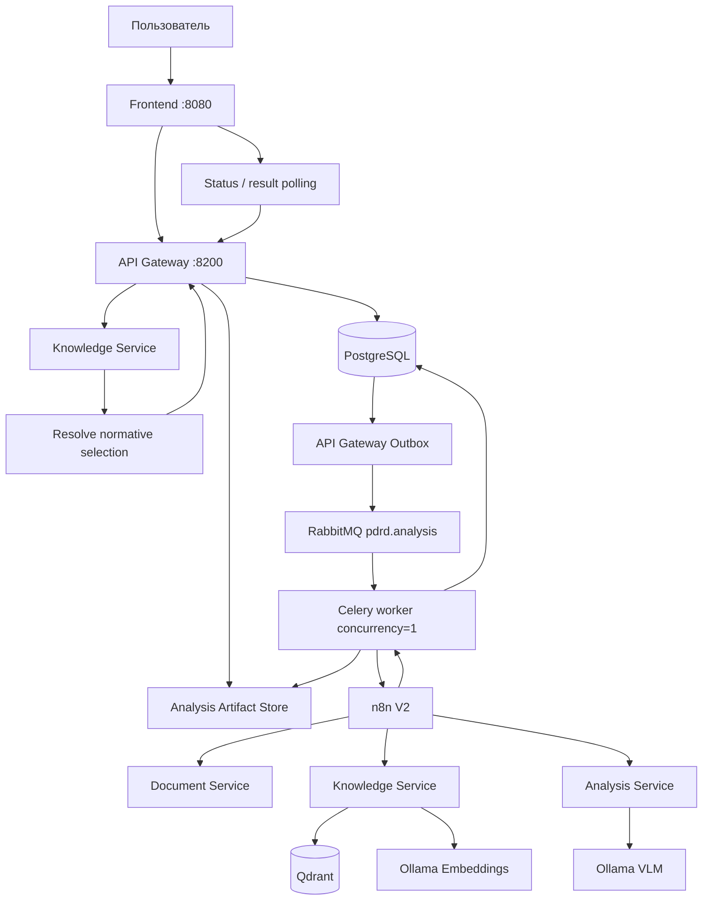
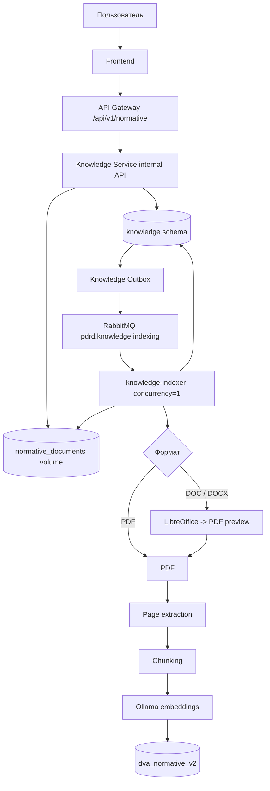
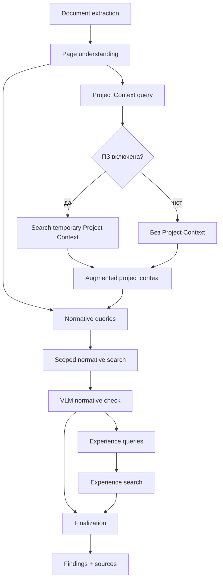
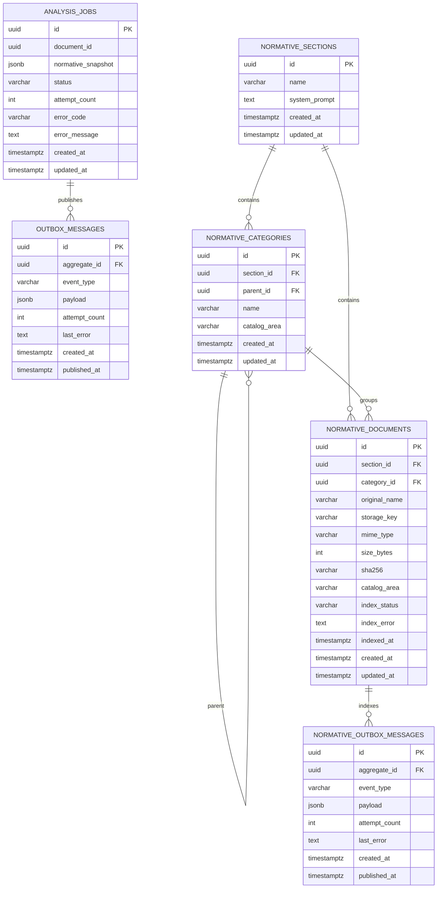
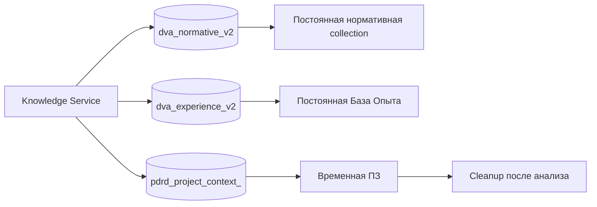
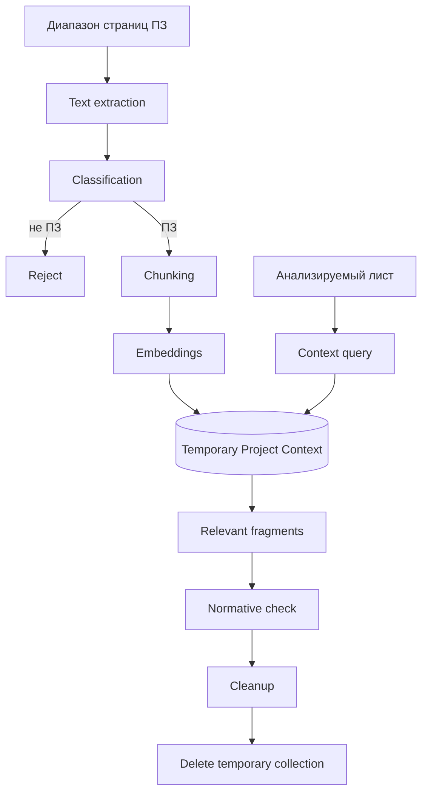
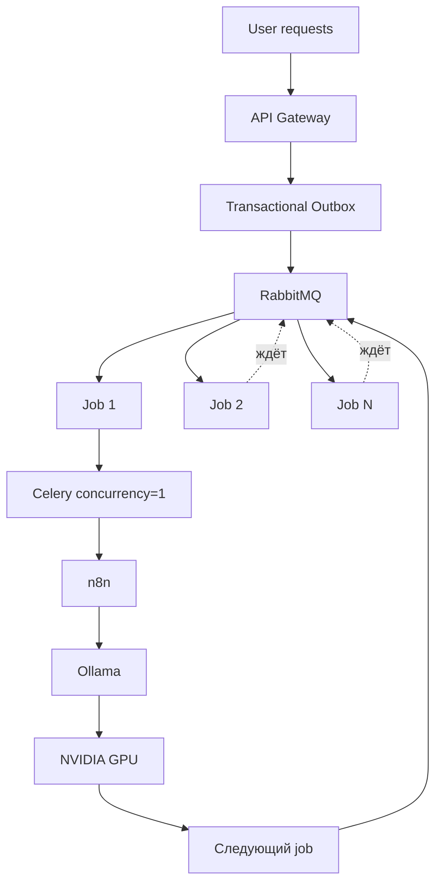

<!-- README.md -->
# PDRD Validation — Drawing Validation AI

PDRD Validation — локальный сервис проверки проектной и рабочей документации по нормативной базе, контексту проекта и Базе Опыта.

Пользователь загружает PDF, DXF/DWG или PDF вместе с CAD-файлом. Сервис извлекает текст и геометрию, формирует машинный контекст листа, выполняет локальный VLM-анализ, подбирает нормативные фрагменты из Qdrant и возвращает структурированные замечания с источниками.

Нормативная база управляется через приложение: разделы, вложенные папки, PDF/DOC/DOCX, system prompt раздела, автоматическая индексация и удаление. Git-репозиторий больше не является хранилищем нормативных файлов.

Тяжёлые AI-задачи выполняются через RabbitMQ/Celery с `concurrency=1`, чтобы несколько пользовательских запросов не запускали параллельно несколько тяжёлых GPU-задач и не конкурировали за VRAM.

## Возможности

- PDF-only и multi-page PDF;
- DXF-only и DWG -> DXF normalization;
- PDF + CAD как два представления одного листа;
- контекст Пояснительной записки;
- временный semantic Project Context;
- managed нормативные разделы и вложенные папки;
- загрузка PDF, DOC и DOCX;
- Word -> PDF preview через LibreOffice;
- durable нормативная индексация;
- scoped normative RAG по immutable snapshot задания;
- отдельный system prompt нормативного раздела;
- transient working prompt;
- кликабельные нормативные источники;
- База Опыта;
- локальная VLM и embeddings через Ollama;
- Transactional Outbox для анализа и нормативной индексации;
- n8n orchestration;
- frontend только через API Gateway;
- cleanup временного Project Context;
- unit, integration и architecture tests.

## Пользовательские пакеты документов

В Knowledge Service введены две области документов внутри одного раздела:

- `normative` — нормативная база;
- `user_package` — пользовательские пакеты.

Существующие документы после migration относятся к `normative`.

На текущем этапе `user_package` поддержан на уровне domain/persistence-модели. Отдельный HTTP API, frontend CRUD и включение выбранных package-документов в analysis snapshot подключаются следующим этапом.

## Технологии

| Слой | Технологии |
|---|---|
| Backend | Python 3.12, FastAPI, Pydantic |
| Persistence | PostgreSQL 16, SQLAlchemy AsyncIO, Alembic |
| Очередь | RabbitMQ, Celery |
| Orchestration | n8n |
| Vector DB | Qdrant |
| VLM | Ollama + `qwen3-vl:8b-instruct` |
| Embeddings | Ollama + `qwen3-embedding:4b` |
| PDF | PyMuPDF |
| Word | LibreOffice headless |
| CAD | ezdxf, LibreDWG |
| Frontend | HTML, CSS, JavaScript, nginx |
| Контейнеризация | Docker, Docker Compose |
| Тесты / style | pytest, Ruff |

# Архитектура

Bounded contexts:

- **API Gateway** — публичный API, job state, immutable normative snapshot, Outbox, Celery и analysis artifacts.
- **Document Service** — PDF/CAD extraction, render, DWG -> DXF.
- **Knowledge Service** — managed catalog, Qdrant, embeddings, Normative RAG, Experience RAG, Project Context.
- **Analysis Service** — VLM page understanding, normative check и finalization.
- **n8n** — orchestration внутренних вызовов.
- **Frontend** — Browser -> API Gateway; прямого доступа к n8n и внутренним сервисам нет.

Shared infrastructure:

- Ollama;
- RabbitMQ;
- n8n.

Project infrastructure:

- PostgreSQL;
- Qdrant;
- application services;
- project Docker volumes.

Направление зависимостей backend:

```text
Transport
    ↓
Application
    ↓
Domain

Infrastructure ──implements──> Application ports
```

`Domain` и `Application` не зависят от FastAPI, SQLAlchemy, Celery, Qdrant, Ollama и HTTP adapters.

# Блок-схемы

## 1. Общий путь анализа



## 2. Managed нормативная база



## 3. Анализ одного листа



## 4. PostgreSQL — таблицы и связи

Один PostgreSQL instance используется API Gateway и Knowledge Service. Knowledge Service хранит свои таблицы в схеме `knowledge`.



### API Gateway

`analysis_jobs`

- lifecycle задания;
- `normative_snapshot` — immutable JSONB нормативных настроек на момент создания задания;
- изменение раздела, списка документов или prompt после запуска не изменяет snapshot существующего job.

`outbox_messages`

- transactional outbox анализа;
- dispatcher публикует событие в RabbitMQ только после SQL commit.

### Knowledge Service

`knowledge.normative_sections`

- разделы;
- сохранённый system prompt.

`knowledge.normative_categories`

- дерево папок;
- `parent_id` — вложенность;
- `catalog_area` — `normative` или `user_package`.

`knowledge.normative_documents`

- metadata PDF/DOC/DOCX;
- bytes хранятся в filesystem volume, а не в PostgreSQL;
- `storage_key` указывает на physical file;
- `index_status`: `uploaded`, `queued`, `indexing`, `ready`, `failed`, `deleting`;
- `catalog_area` отделяет нормативную базу от пользовательских пакетов.

`knowledge.normative_outbox_messages`

- durable события нормативной индексации;
- связаны с `normative_documents`.

Knowledge Service использует отдельную Alembic version table:

```text
alembic_version_knowledge
```

## 5. Qdrant — коллекции



### `dva_normative_v2`

Постоянная managed normative collection.

Для PDF point соответствует chunk физической страницы. Для DOC/DOCX сначала создаётся PDF-preview, поэтому `page` относится к browser-viewable PDF.

Payload:

```json
{
  "document_id": "<uuid>",
  "section_id": "<uuid>",
  "category_id": "<uuid-or-null>",
  "source_sha256": "<sha256>",
  "source_file": "<original filename>",
  "page": 17,
  "chunk_index": 2,
  "text": "<normative fragment>"
}
```

Managed search ограничивается `section_id` и точным набором `document_id`, сохранённым в immutable job snapshot.

### `dva_experience_v2`

Постоянная База Опыта.

Основной payload:

```json
{
  "project_id": "<project>",
  "issue_id": "<issue>",
  "issue_text": "<expert comment>",
  "category": "<category>",
  "status": "<status>",
  "verified_fixed": true,
  "before_page": 5,
  "after_page": 5,
  "before_context": "<before>",
  "after_context": "<after>",
  "text": "<embedding text>"
}
```

`scripts/kb_sync.py` работает только с этой legacy Базой Опыта. Нормативную базу скрипт не создаёт, не обновляет и не удаляет.

### `pdrd_project_context_<context_id>`

Временная collection Пояснительной записки конкретного analysis context.

Payload:

```json
{
  "page": 12,
  "chunk_index": 1,
  "text": "<fragment>"
}
```

Collection удаляется cleanup-механизмом после анализа. ПЗ — контекст проекта, а не нормативное доказательство.

## 6. Физическое хранение

```mermaid
flowchart TD
    PG[(PostgreSQL)] --> PGV[postgres_data]
    QD[(Qdrant)] --> QDV[qdrant_data]
    GW[API Gateway / worker] --> AV[analysis_artifacts]
    KS[Knowledge Service / indexer] --> NV[normative_documents]

    PGV --> PGP[/var/lib/postgresql/data]
    QDV --> QDP[/qdrant/storage]
    AV --> AP[/data/analyses]
    NV --> NP[/data/normative]
```

| Данные | Docker volume | Путь |
|---|---|---|
| PostgreSQL | `postgres_data` | `/var/lib/postgresql/data` |
| Qdrant | `qdrant_data` | `/qdrant/storage` |
| Analysis artifacts | `analysis_artifacts` | `/data/analyses` |
| Managed normative files | `normative_documents` | `/data/normative` |

### Реальное расположение managed документов

PDF:

```text
/data/normative/<section_id>/<document_id>.pdf
```

DOC:

```text
/data/normative/<section_id>/<document_id>.doc
```

DOCX:

```text
/data/normative/<section_id>/<document_id>.docx
```

Word PDF-preview:

```text
/data/normative/<section_id>/<document_id>.doc.preview.pdf
/data/normative/<section_id>/<document_id>.docx.preview.pdf
```

`storage_key` хранится в `knowledge.normative_documents`.

Каталог `data/knowledge/normative/source/` удалён и больше не является source of truth. Новые нормативные документы загружаются через managed frontend/API.

Repository source Базы Опыта остаётся здесь:

```text
data/knowledge/experience/cases/
```

## 7. Пояснительная записка



## 8. GPU-safe очередь



Backpressure находится в RabbitMQ: количество HTTP-запросов не равно числу одновременно выполняющихся GPU inference.

# Managed нормативная база

## Lifecycle документа

```text
upload
  ↓
uploaded
  ↓
queued
  ↓
indexing
  ├──→ ready
  └──→ failed
```

Из `failed` документ можно повторно поставить в queue.

Удаление переводит document в `deleting`, затем удаляет:

1. Qdrant points по `document_id`;
2. original file;
3. Word PDF-preview, если он существует;
4. SQL metadata.

## System prompt

Используются три уровня:

```text
NORMATIVE_SUPER_SYSTEM_PROMPT
        +
section.system_prompt
        +
transient working override / dynamic context
```

`NORMATIVE_SUPER_SYSTEM_PROMPT` хранится только в коде.

`section.system_prompt` хранится в PostgreSQL.

Transient working prompt может применяться к конкретному анализу без сохранения как новый system prompt.

## Immutable snapshot

При создании job API Gateway сохраняет resolved нормативную конфигурацию:

```json
{
  "section_id": "<uuid>",
  "document_ids": [
    "<uuid>"
  ],
  "system_prompt": "<exact resolved prompt>"
}
```

Worker и n8n работают с snapshot, а не перечитывают изменившиеся настройки UI.

# Legacy utilities

Нормативный runtime:

```text
Browser
  -> API Gateway
  -> Knowledge Service
  -> PostgreSQL + managed storage
  -> Knowledge Outbox
  -> RabbitMQ
  -> knowledge-indexer
  -> Qdrant
```

`scripts/kb_sync.py` сохранён только для текущего legacy workflow Базы Опыта. Его запуск не изменяет managed normative collection.

# Структура проекта

```text
PDRD-validation/
├── frontend/
│   ├── Dockerfile
│   ├── nginx.conf
│   └── src/
│       ├── index.html
│       ├── css/
│       │   ├── global.css
│       │   ├── main.css
│       │   ├── variables.css
│       │   └── blocks/
│       │       ├── analysis-result.css
│       │       ├── card.css
│       │       ├── form.css
│       │       ├── modal.css
│       │       ├── normative-sidebar.css
│       │       └── report.css
│       └── js/
│           ├── app.js
│           ├── config.js
│           ├── components/
│           └── features/
│               ├── analysis/
│               └── normative/
│                   ├── api.js
│                   ├── catalog.js
│                   └── prompt.js
│
├── services/
│   ├── api-gateway/
│   │   ├── alembic/
│   │   ├── src/pdrd_api_gateway/
│   │   └── tests/
│   ├── document-service/
│   ├── knowledge-service/
│   │   ├── alembic/
│   │   ├── src/pdrd_knowledge_service/
│   │   └── tests/
│   └── analysis-service/
│
├── n8n/
│   └── workflows/
│       ├── analysis-v2-pdf.json
│       ├── analysis-v2-cad.json
│       └── analysis-v2-pdf-cad.json
│
├── data/
│   └── knowledge/
│       └── experience/
│           └── cases/
│
├── ops/
├── scripts/
│   ├── build_experience_cases.py
│   ├── check-stack.sh
│   ├── kb_common.py
│   ├── kb_search.py
│   └── kb_sync.py
├── tests/
│   └── architecture/
├── .env.example
├── compose.yaml
├── pyproject.toml
├── requirements-dev.txt
└── README.md
```

# Конфигурация

Создать `.env`:

```bash
cp .env.example .env
```

Минимальные deployment secrets:

```dotenv
PDRD_POSTGRES_PASSWORD=replace-me
PDRD_RABBITMQ_PASSWORD=replace-me
```

Секреты не коммитить.

Ключевые Knowledge defaults:

```text
storage.root_path = /data/normative
qdrant.normative_collection = dva_normative_v2
qdrant.experience_collection = dva_experience_v2
project_context.collection_prefix = pdrd_project_context
embedding.model = qwen3-embedding:4b
broker.queue_name = pdrd.knowledge.indexing
```

Ключевые API Gateway defaults:

```text
storage.root_path = /data/analyses
broker.queue_name = pdrd.analysis
Knowledge Service = http://pdrd-knowledge-service:8401
n8n = http://n8n:5678
```

# Запуск

Требуются Docker Engine и Docker Compose plugin.

Shared network `ai-shared` должна содержать:

- RabbitMQ;
- n8n;
- Ollama.

Ollama models:

```text
qwen3-vl:8b-instruct
qwen3-embedding:4b
```

Запуск:

```bash
docker compose up -d \
  --build \
  --force-recreate \
  --remove-orphans \
  --wait \
  --wait-timeout 180
```

Проверка:

```bash
bash scripts/check-stack.sh
```

Frontend:

```text
http://<server>:8080/
```

API Gateway Swagger:

```text
http://127.0.0.1:8200/docs
```

Knowledge Service Swagger:

```text
http://127.0.0.1:8401/docs
```

Обычная остановка:

```bash
docker compose down
```

Она не удаляет persistent volumes.

Команда:

```bash
docker compose down -v
```

удаляет PostgreSQL, Qdrant, analysis artifacts и managed normative files. Для обычного deploy/restart её использовать нельзя.

# Тестирование

Windows quality gate:

```powershell
.\ops\check-quality.ps1 -Fix
```

Дополнительные проверки:

```powershell
python -m pip check
git diff --check
docker compose --profile test config --quiet
```

Docker quality:

```bash
docker compose --profile test build quality-tests
docker compose --profile test run --rm quality-tests
```

Service integration:

```bash
docker compose --profile test build api-gateway-tests
docker compose --profile test run --rm api-gateway-tests

docker compose --profile test build knowledge-service-tests
docker compose --profile test run --rm knowledge-service-tests
```

Runtime:

```bash
bash scripts/check-stack.sh
```

# Публичный API

Analysis:

```text
POST /api/v1/analyses
GET  /api/v1/analyses/{job_id}
GET  /api/v1/analyses/{job_id}/result
```

Managed normative catalog:

```text
GET    /api/v1/normative/sections
POST   /api/v1/normative/sections
GET    /api/v1/normative/sections/{section_id}
PATCH  /api/v1/normative/sections/{section_id}
DELETE /api/v1/normative/sections/{section_id}

GET    /api/v1/normative/sections/{section_id}/categories
POST   /api/v1/normative/sections/{section_id}/categories
GET    /api/v1/normative/categories/{category_id}
PATCH  /api/v1/normative/categories/{category_id}
DELETE /api/v1/normative/categories/{category_id}

GET    /api/v1/normative/sections/{section_id}/documents
POST   /api/v1/normative/sections/{section_id}/documents
GET    /api/v1/normative/documents/{document_id}
PATCH  /api/v1/normative/documents/{document_id}
DELETE /api/v1/normative/documents/{document_id}

POST   /api/v1/normative/documents/{document_id}/index
GET    /api/v1/normative/documents/{document_id}/content
```

Browser использует только API Gateway. Internal Knowledge API не является frontend contract.

# Текущий статус

Подтверждены:

- V2 runtime;
- PDF-only / multi-page;
- CAD-only;
- PDF + CAD;
- PDF + ПЗ;
- PDF + CAD + ПЗ;
- Gateway -> Outbox -> RabbitMQ -> Celery -> n8n;
- temporary Project Context cleanup;
- managed нормативные разделы;
- nested folders;
- PDF/DOC/DOCX normative upload;
- LibreOffice Word -> PDF normalization;
- durable normative indexing;
- scoped normative retrieval;
- immutable normative snapshot;
- system prompt раздела;
- transient prompt override;
- clickable normative citations;
- managed deletion из Qdrant + filesystem + PostgreSQL;
- frontend нормативного каталога;
- foundation `catalog_area=normative|user_package`.

Следующий этап:

- internal/public API для `user_package`;
- folders/packages внутри текущего раздела;
- PDF/DOC/DOCX upload в пользовательские пакеты;
- видимые checkbox;
- SVG select-all / clear-all;
- immutable selection пользовательских документов;
- защита от смешивания `normative` и `user_package`.
