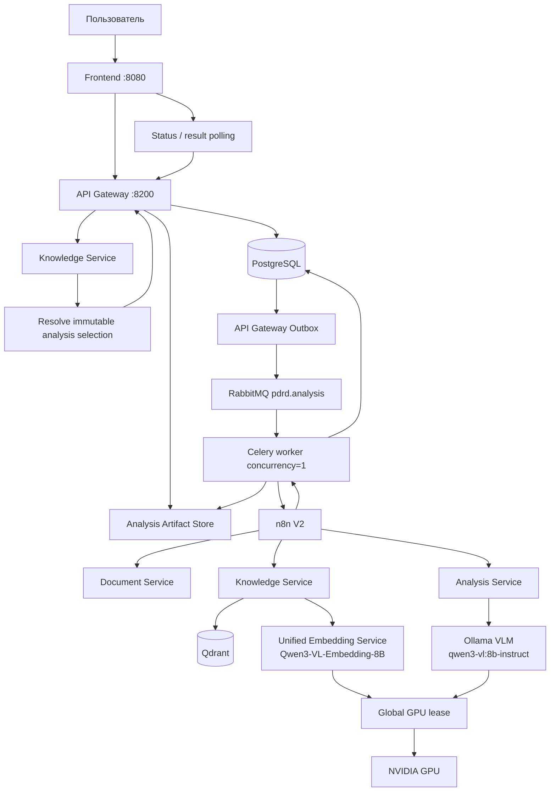
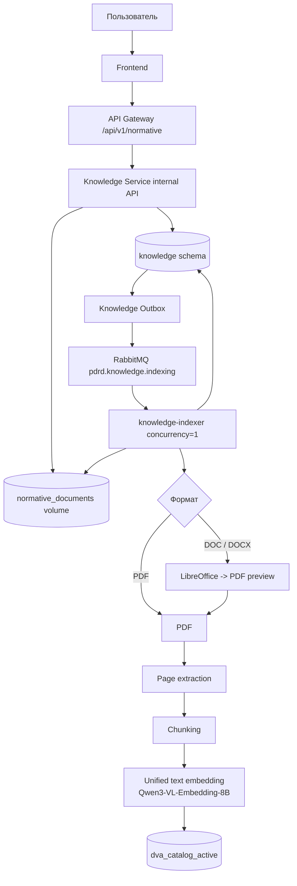
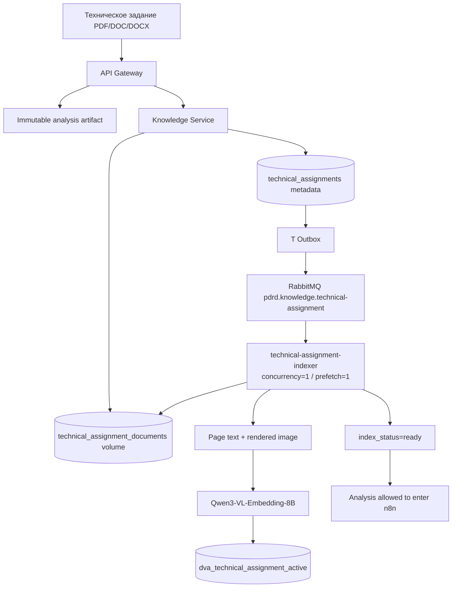
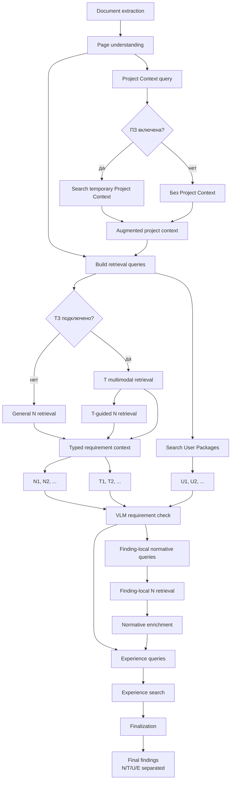
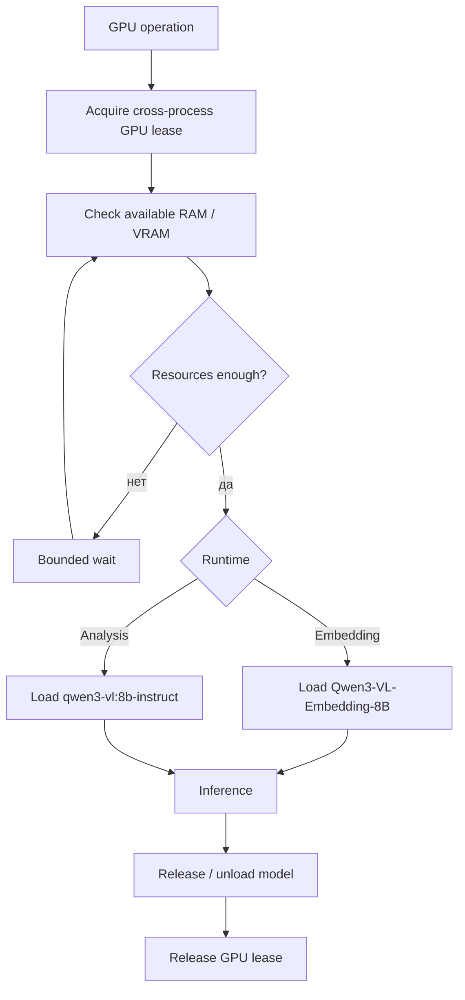
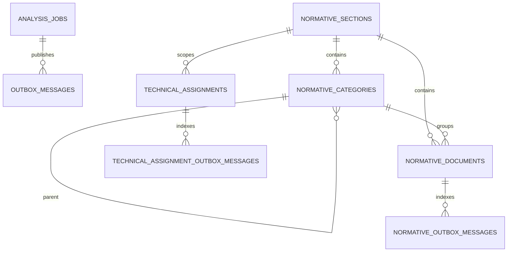
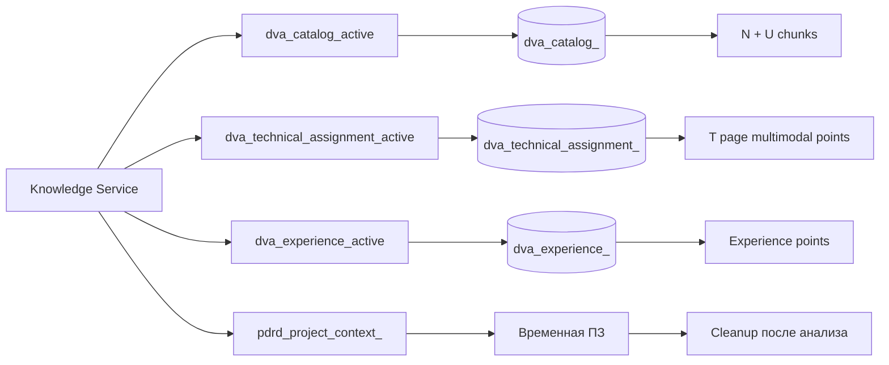
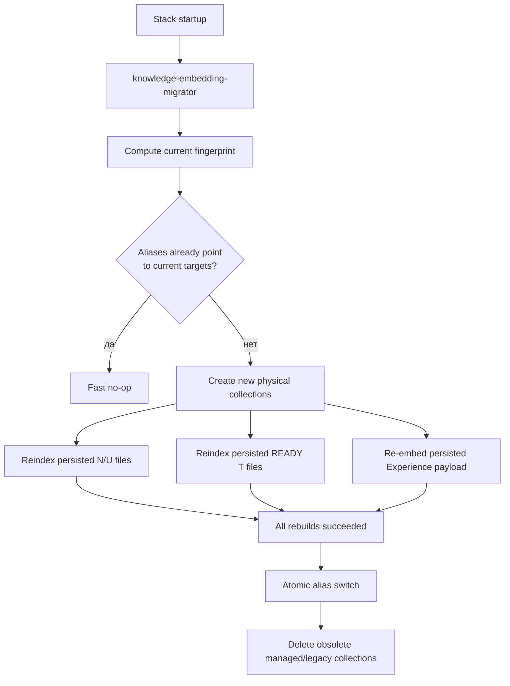
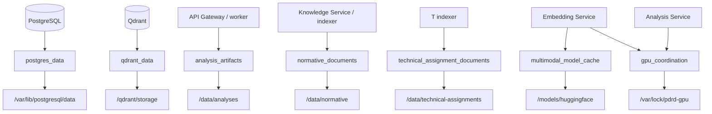
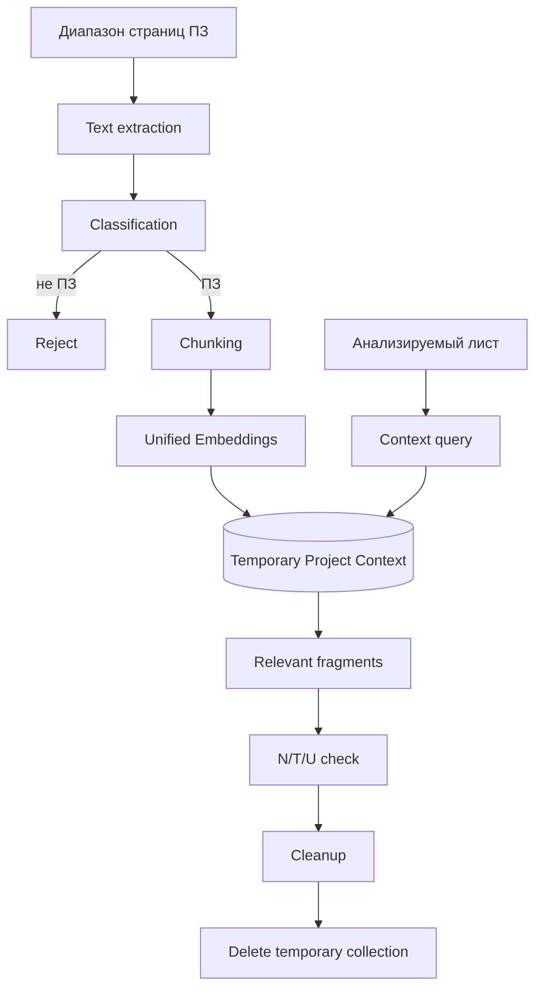

<!-- README.md -->

# PDRD Validation — Drawing Validation AI

PDRD Validation — локальный сервис проверки проектной и рабочей документации по нормативной базе, техническому заданию, пользовательским пакетам документов, контексту проекта и Базе Опыта.

Пользователь загружает PDF, DXF/DWG или PDF вместе с соответствующим CAD-файлом, при необходимости прикладывает Техническое задание и выбирает нормативный раздел/пользовательские документы. Система извлекает текст и геометрию, формирует машинный контекст листа, выполняет semantic retrieval по источникам разных типов, запускает локальный VLM-анализ и возвращает структурированные замечания с разделённой доказательной базой `N/T/U/E`.

Тяжёлые GPU-задачи выполняются с общим cross-process GPU lease. Analysis VLM и unified embedding runtime не должны одновременно загружать несовместимые тяжёлые модели в одну GPU без предварительной проверки VRAM.

## Возможности

- PDF-only и multi-page PDF;
- DXF-only и DWG -> DXF normalization;
- PDF + CAD как два представления одного листа;
- Техническое задание как отдельный project/customer source;
- multimodal indexing страниц ТЗ;
- T-guided нормативный retrieval;
- контекст Пояснительной записки;
- временный semantic Project Context;
- managed нормативные разделы и вложенные папки;
- пользовательские пакеты документов внутри выбранного раздела;
- PDF/DOC/DOCX upload;
- Word -> PDF preview через LibreOffice;
- durable индексация через Transactional Outbox;
- scoped normative RAG по immutable snapshot;
- scoped retrieval выбранных пользовательских документов;
- отдельный system prompt нормативного раздела;
- transient working prompt;
- кликабельные нормативные и T sources;
- База Опыта;
- единая embedding model для N/T/U/E/PZ;
- blue/green переиндексация Qdrant при смене embedding identity;
- cross-process GPU lease и RAM/VRAM admission;
- n8n orchestration;
- frontend только через API Gateway;
- cleanup временного Project Context;
- unit, integration, architecture и GPU runtime tests.

# Семантика источников N / T / U / E

Источники не объединяются в одну семантическую роль. Тип источника определяет, что именно он может доказывать.

| Префикс | Тип | Роль |
|---|---|---|
| `N1`, `N2`, ... | Normative | нормативная база: ГОСТ, СП, ПУЭ и другие нормативные требования |
| `T1`, `T2`, ... | Technical Assignment | требования ТЗ, заказчика и проекта |
| `U1`, `U2`, ... | User Package | пользовательские документы проекта/заказчика |
| `E1`, `E2`, ... | Experience | База Опыта, используемая при finalization/recommendation |

Главные правила:

- только `N` может подтверждать утверждение о нарушении нормативного документа;
- `T` является самостоятельным project/customer requirement и может подтверждать `customer_requirements`;
- `T` может содержать ссылки на нормативы и направлять targeted N retrieval, но не превращается в норматив;
- `U` является самостоятельным пользовательским/project source, но не нормативным доказательством;
- `E` используется только для опыта, finalization и рекомендаций;
- finding без N/T/U не удаляется автоматически: инженерное/визуальное замечание может остаться `needs_review`;
- `normative_control` без валидного `N` не должен сохраняться только на основании `T` или `U`.

Итоговые typed source arrays:

```text
basis_sources                       = N
technical_assignment_basis_sources  = T
user_package_basis_sources          = U
experience_sources                  = E
```

# Технологии

| Слой | Технологии |
|---|---|
| Backend | Python 3.12, FastAPI, Pydantic |
| Persistence | PostgreSQL 16, SQLAlchemy AsyncIO, Alembic |
| Очередь | RabbitMQ, Celery |
| Orchestration | n8n |
| Vector DB | Qdrant |
| VLM | Ollama + `qwen3-vl:8b-instruct` |
| Embeddings | dedicated service + `Qwen/Qwen3-VL-Embedding-8B` |
| Embedding dimension | `4096` |
| PDF | PyMuPDF |
| Word | LibreOffice headless |
| CAD | ezdxf, LibreDWG |
| Frontend | HTML, CSS, JavaScript, nginx |
| Контейнеризация | Docker, Docker Compose |
| Тесты / style | pytest, Ruff |

# Архитектура

Bounded contexts:

- **API Gateway** — публичный API, job state, immutable analysis snapshot, Outbox, Celery, analysis artifacts и public content proxy для managed sources.
- **Document Service** — PDF/CAD extraction, render, DWG -> DXF.
- **Knowledge Service** — managed catalog, ТЗ lifecycle, PostgreSQL metadata, Qdrant, N/T/U/E retrieval и Project Context.
- **Multimodal Embedding Service** — единый text/image/mixed embedding runtime `Qwen3-VL-Embedding-8B`.
- **Analysis Service** — VLM page understanding, requirement check, N/T/U policy и finalization.
- **n8n** — orchestration внутренних вызовов.
- **Frontend** — Browser -> API Gateway; прямого доступа к n8n и внутренним сервисам нет.

Shared infrastructure:

- Ollama;
- RabbitMQ;
- n8n.

Project infrastructure:

- PostgreSQL;
- Qdrant;
- Multimodal Embedding Service;
- application services;
- project Docker volumes;
- общий GPU coordination volume.

Направление зависимостей backend:

```text
Transport
    ↓
Application
    ↓
Domain

Infrastructure ──implements──> Application ports
```

`Domain` и `Application` не зависят от FastAPI, SQLAlchemy, Celery, Qdrant, Ollama и HTTP adapters.

# Блок-схемы

## 1. Общий путь анализа



## 2. Managed N/U catalog и индексация



`N` и `U` используют один physical vector space, но semantic role определяется PostgreSQL `catalog_area` до vector search.

## 3. Техническое задание



ТЗ индексируется до запуска n8n. Analysis job не начинает orchestration, пока связанный T-index не перешёл в `READY`.

## 4. Анализ одного листа с N/T/U



## 5. GPU coordination



Общий lock path:

```text
/var/lock/pdrd-gpu/gpu.lock
```

Analysis Service и Multimodal Embedding Service монтируют один `gpu_coordination` volume.

Порядок принципиален:

```text
acquire global lease
  -> check free resources
  -> load model
  -> inference
  -> unload/release model
  -> release lease
```

Обычный preflight `nvidia-smi` без lease не используется как механизм координации, потому что он оставляет TOCTOU race.

## 6. PostgreSQL — таблицы и связи

Один PostgreSQL instance используется API Gateway и Knowledge Service. Knowledge Service хранит свои таблицы в схеме `knowledge`.



### API Gateway

`analysis_jobs`

- lifecycle задания;
- `normative_snapshot` — immutable JSONB настроек на момент создания job;
- изменение UI, раздела, prompt, T или checkbox после запуска не изменяет уже созданный job.

Snapshot содержит независимо:

```json
{
  "section_id": "<uuid>",
  "document_ids": [
    "<normative-uuid>"
  ],
  "user_package_document_ids": [
    "<user-package-uuid>"
  ],
  "system_prompt": "<exact resolved prompt>",
  "technical_assignment": {
    "technical_assignment_id": "<uuid>",
    "analysis_document_id": "<uuid>",
    "source_file": "ТЗ.pdf"
  }
}
```

`technical_assignment` отсутствует, если ТЗ не подключено.

`outbox_messages`

- transactional outbox анализа;
- dispatcher публикует событие в RabbitMQ только после SQL commit.

### Knowledge Service

`knowledge.normative_sections`

- разделы;
- сохранённый system prompt.

`knowledge.normative_categories`

- дерево папок;
- `parent_id` — вложенность;
- `catalog_area` — `normative` или `user_package`.

`knowledge.normative_documents`

- metadata PDF/DOC/DOCX;
- bytes хранятся в filesystem volume;
- `storage_key` указывает на physical file;
- `index_status`: `uploaded`, `queued`, `indexing`, `ready`, `failed`, `deleting`;
- `catalog_area` является source of truth для разделения N и U.

`knowledge.normative_outbox_messages`

- durable события managed N/U indexing.

`knowledge.technical_assignments`

- metadata ТЗ конкретного analysis document;
- lifecycle T indexing;
- `index_status`: upload/index queue/indexing/ready/failed состояния.

`knowledge.technical_assignment_outbox_messages`

- отдельный durable outbox для T indexing;
- не смешивается с normative outbox.

Knowledge Service использует отдельную Alembic version table:

```text
alembic_version_knowledge
```

## 7. Qdrant — stable aliases и physical collections



Stable aliases:

```text
dva_catalog_active
dva_technical_assignment_active
dva_experience_active
```

Physical collection name определяется fingerprint:

```text
fingerprint = sha256(model | dimension | schema_version)[:16]
```

Для текущих default settings:

```text
PDRD_EMBEDDING_MODEL=Qwen/Qwen3-VL-Embedding-8B
PDRD_EMBEDDING_DIMENSION=4096
PDRD_EMBEDDING_SCHEMA_VERSION=1
```

### Managed N/U payload

Для PDF point соответствует chunk физической страницы. Для DOC/DOCX сначала создаётся PDF-preview.

```json
{
  "document_id": "<uuid>",
  "section_id": "<uuid>",
  "category_id": "<uuid-or-null>",
  "source_sha256": "<sha256>",
  "source_file": "<original filename>",
  "page": 17,
  "chunk_index": 2,
  "text": "<fragment>"
}
```

`catalog_area` намеренно остаётся source of truth в PostgreSQL.

Перед vector search Knowledge Service:

1. получает IDs из immutable snapshot;
2. проверяет existence;
3. проверяет `section_id`;
4. проверяет `catalog_area`;
5. проверяет `index_status=ready`;
6. строит exact Qdrant filter по `document_id`.

### T payload

Один T point соответствует странице и содержит multimodal representation:

```json
{
  "source_type": "technical_assignment",
  "representation": "page_multimodal",
  "technical_assignment_id": "<uuid>",
  "analysis_document_id": "<uuid>",
  "section_id": "<uuid>",
  "source_file": "ТЗ.pdf",
  "source_sha256": "<sha256>",
  "page": 4,
  "pixel_width": 1240,
  "pixel_height": 1754,
  "normative_refs": [
    "СП 256.1325800.2016"
  ],
  "text": "<page text>"
}
```

### Experience payload

```json
{
  "project_id": "<project>",
  "issue_id": "<issue>",
  "issue_text": "<expert comment>",
  "category": "<category>",
  "status": "<status>",
  "verified_fixed": true,
  "before_page": 5,
  "after_page": 5,
  "before_context": "<before>",
  "after_context": "<after>",
  "text": "<embedding text>"
}
```

### Project Context

Временная collection Пояснительной записки конкретного analysis context:

```json
{
  "page": 12,
  "chunk_index": 1,
  "text": "<fragment>"
}
```

ПЗ — контекст проекта, а не нормативное доказательство.

## 8. Blue/green embedding migration

При смене:

```text
PDRD_EMBEDDING_MODEL
PDRD_EMBEDDING_DIMENSION
PDRD_EMBEDDING_SCHEMA_VERSION
```

меняется embedding fingerprint.



Source documents не восстанавливаются из старых vectors:

- N/U перечитываются из `normative_documents`;
- T перечитывается из `technical_assignment_documents`;
- metadata читаются из PostgreSQL;
- E переэмбеддится из сохранённых payload;
- временные Project Context создаются заново в конкретном analysis run.

Если rebuild падает до cutover:

- текущие aliases не переключаются;
- старый рабочий vector space остаётся доступным;
- незавершённые новые targets очищаются.

## 9. Физическое хранение



| Данные | Docker volume | Путь |
|---|---|---|
| PostgreSQL | `postgres_data` | `/var/lib/postgresql/data` |
| Qdrant | `qdrant_data` | `/qdrant/storage` |
| Analysis artifacts | `analysis_artifacts` | `/data/analyses` |
| Managed N/U files | `normative_documents` | `/data/normative` |
| T files | `technical_assignment_documents` | `/data/technical-assignments` |
| HF embedding checkpoint cache | `multimodal_model_cache` | `/models/huggingface` |
| GPU lease | `gpu_coordination` | `/var/lock/pdrd-gpu` |

Обычный deploy/restart не должен использовать:

```bash
docker compose down -v
```

потому что `-v` удаляет persistent volumes.

# Как работает retrieval

## N — normative retrieval

Snapshot содержит `document_ids`.

Knowledge Service допускает только документы:

- существующие;
- из выбранного section;
- `catalog_area=normative`;
- `index_status=ready`.

После этого Qdrant ищет только по exact IDs.

Найденные источники получают локальные IDs:

```text
N1, N2, N3, ...
```

## T — Technical Assignment retrieval

Если snapshot содержит `technical_assignment_id`, workflow вызывает:

```text
/internal/v1/search/technical-assignment-guided
```

Guided retrieval выполняет:

```text
query
  -> T multimodal search
  -> extract/use normative_refs and T context
  -> targeted N retrieval
  -> general N retrieval
  -> merge without changing source roles
```

Возвращаются отдельно:

```text
technical_assignment_sources
normative_sources
targeted_normative_sources
general_normative_sources
reference_resolutions
conflict_candidates
diagnostics
```

`conflict_candidates` — это T/N пары, которые Analysis Service должен оценить семантически, а не считать конфликтом только по строковому совпадению.

## U — User Package retrieval

Snapshot отдельно содержит `user_package_document_ids`.

Допускаются только документы:

- существующие;
- из того же section;
- `catalog_area=user_package`;
- `index_status=ready`.

Найденные источники получают IDs:

```text
U1, U2, U3, ...
```

## E — Experience retrieval

Experience выполняется после requirement check по `experience_query` finding.

Experience source не становится нормативным basis.

# Формирование N/T/U JSON

## Retrieval JSON

Типы источников передаются независимо:

```json
{
  "normative_sources": [
    {
      "source_id": "N1",
      "point_id": "<qdrant-point>",
      "score": 0.86,
      "document_id": "<uuid>",
      "section_id": "<uuid>",
      "category_id": "<uuid-or-null>",
      "source_sha256": "<sha256>",
      "source_file": "СП 256.1325800.2016.pdf",
      "page": 17,
      "chunk_index": 2,
      "text": "<normative fragment>"
    }
  ],
  "technical_assignment_sources": [
    {
      "source_id": "T1",
      "point_id": "<qdrant-point>",
      "score": 0.83,
      "technical_assignment_id": "<uuid>",
      "analysis_document_id": "<uuid>",
      "section_id": "<uuid>",
      "source_sha256": "<sha256>",
      "source_file": "Техническое задание.pdf",
      "page": 4,
      "text": "<T requirement>",
      "normative_refs": [
        "СП 256.1325800.2016"
      ]
    }
  ],
  "user_package_sources": [
    {
      "source_id": "U1",
      "point_id": "<qdrant-point>",
      "score": 0.79,
      "document_id": "<uuid>",
      "section_id": "<uuid>",
      "category_id": "<uuid-or-null>",
      "source_sha256": "<sha256>",
      "source_file": "Требования заказчика.pdf",
      "page": 2,
      "chunk_index": 0,
      "text": "<user requirement>"
    }
  ]
}
```

`source_id` является typed local evidence ID текущего analysis context.

## FindingDraft

VLM получает отдельные N/T/U blocks и возвращает ссылки только на IDs из текущего retrieval context.

Пример T-backed finding:

```json
{
  "finding_id": "F1",
  "page": 3,
  "page_type": "scheme",
  "category": "customer_requirements",
  "severity": "warning",
  "status": "confirmed",
  "comment": "На листе отсутствует обозначение, требуемое техническим заданием.",
  "evidence": "На анализируемом листе обозначение не обнаружено.",
  "recommendation_draft": "Добавить обозначение в соответствии с ТЗ.",
  "confidence": 0.91,

  "normative_source_ids": [],
  "technical_assignment_source_ids": [
    "T1"
  ],
  "user_package_source_ids": [],

  "basis": "Требование технического задания.",
  "experience_query": "Проверка оформления обозначений"
}
```

Backend материализует IDs только через текущие retrieval candidates. Произвольный `N99/T99/U99`, которого не было в retrieval context, не должен превращаться в источник.

## Typed evidence materialization

```json
{
  "finding_id": "F1",
  "category": "customer_requirements",
  "basis_sources": [],
  "technical_assignment_basis_sources": [
    {
      "source_id": "T1",
      "technical_assignment_id": "<uuid>",
      "source_file": "Техническое задание.pdf",
      "page": 4,
      "text": "<T requirement>"
    }
  ],
  "user_package_basis_sources": []
}
```

## Finding-local normative enrichment

После первичного requirement check инженерное замечание не удаляется из-за отсутствия N.

Для каждого finding может выполняться отдельный targeted N retrieval:

```text
finding
  -> finding-local normative query
  -> N candidates
  -> semantic validation/finalization
```

Пример:

```text
T1
  -> упоминание/смысл СП 256
  -> targeted normative retrieval
  -> N4
```

После подтверждения:

```json
{
  "finding_id": "F1",
  "category": "normative_control",
  "basis_sources": [
    {
      "source_id": "N4",
      "source_file": "СП 256.1325800.2016.pdf",
      "page": 17,
      "text": "<validated normative fragment>"
    }
  ],
  "technical_assignment_basis_sources": [
    {
      "source_id": "T1",
      "source_file": "Техническое задание.pdf",
      "page": 4,
      "text": "<project requirement>"
    }
  ]
}
```

Здесь `T1` остаётся T-source, а нормативное утверждение подтверждает `N4`.

## FinalFinding

Финальный finding хранит источники раздельно:

```json
{
  "finding_id": "F1",
  "page": 3,
  "page_type": "scheme",
  "category": "normative_control",
  "severity": "warning",
  "status": "confirmed",
  "comment": "<finding>",
  "evidence": "<drawing evidence>",
  "recommendation": "<recommendation>",
  "confidence": 0.93,
  "basis": "<human-readable basis>",

  "basis_sources": [
    {
      "source_id": "N1"
    }
  ],
  "technical_assignment_basis_sources": [
    {
      "source_id": "T1"
    }
  ],
  "user_package_basis_sources": [
    {
      "source_id": "U1"
    }
  ],
  "experience_sources": [
    {
      "source_id": "E1"
    }
  ]
}
```

# Пояснительная записка



Project Context помогает понять проект, но не становится N/T/U evidence.

# Managed catalog

## Lifecycle N/U документа

```text
upload
  ↓
uploaded
  ↓
queued
  ↓
indexing
  ├──→ ready
  └──→ failed
```

Из `failed` документ можно повторно поставить в queue.

Удаление переводит document в `deleting`, затем удаляет:

1. Qdrant points по `document_id`;
2. original file;
3. Word PDF-preview;
4. SQL metadata.

## System prompt

Используются три уровня:

```text
NORMATIVE_SUPER_SYSTEM_PROMPT
        +
section.system_prompt
        +
transient working override / dynamic context
```

`NORMATIVE_SUPER_SYSTEM_PROMPT` хранится в коде.

`section.system_prompt` хранится в PostgreSQL.

Transient working prompt применяется к конкретному анализу без сохранения как новый system prompt.

# Пользовательские пакеты документов

Пакеты относятся к нормативному section, но имеют:

```text
catalog_area=user_package
```

Frontend позволяет:

- создать пакет/папку;
- создать вложенную папку;
- загрузить PDF/DOC/DOCX;
- автоматически поставить документ в indexing queue;
- открыть PDF или Word PDF-preview;
- перемещать документы;
- удалять документы/папки;
- выбирать отдельные READY документы;
- выбирать все READY package docs;
- очищать selection.

# Public API

## Analysis

```text
POST /api/v1/analyses
GET  /api/v1/analyses/{job_id}
GET  /api/v1/analyses/{job_id}/result
```

Multipart analysis fields включают:

```text
pdf
cad
pages
use_explanatory_note
note_start_page
note_end_page
normative_section_id
normative_document_ids
user_package_document_ids
normative_prompt_override_enabled
normative_prompt_override
technical_assignment
```

Точная форма T upload определяется public analysis schema/frontend contract; внутри immutable snapshot сохраняется `technical_assignment_id`.

## Managed normative catalog

```text
GET    /api/v1/normative/sections
POST   /api/v1/normative/sections
GET    /api/v1/normative/sections/{section_id}
PATCH  /api/v1/normative/sections/{section_id}
DELETE /api/v1/normative/sections/{section_id}

GET    /api/v1/normative/sections/{section_id}/categories
POST   /api/v1/normative/sections/{section_id}/categories
GET    /api/v1/normative/categories/{category_id}
PATCH  /api/v1/normative/categories/{category_id}
DELETE /api/v1/normative/categories/{category_id}

GET    /api/v1/normative/sections/{section_id}/documents
POST   /api/v1/normative/sections/{section_id}/documents
GET    /api/v1/normative/documents/{document_id}
PATCH  /api/v1/normative/documents/{document_id}
DELETE /api/v1/normative/documents/{document_id}

POST   /api/v1/normative/documents/{document_id}/index
GET    /api/v1/normative/documents/{document_id}/content
```

## User packages

```text
GET    /api/v1/normative/sections/{section_id}/user-packages/categories
POST   /api/v1/normative/sections/{section_id}/user-packages/categories

GET    /api/v1/normative/user-packages/categories/{category_id}
PATCH  /api/v1/normative/user-packages/categories/{category_id}
DELETE /api/v1/normative/user-packages/categories/{category_id}

GET    /api/v1/normative/sections/{section_id}/user-packages/documents
POST   /api/v1/normative/sections/{section_id}/user-packages/documents

GET    /api/v1/normative/user-packages/documents/{document_id}
PATCH  /api/v1/normative/user-packages/documents/{document_id}
DELETE /api/v1/normative/user-packages/documents/{document_id}

POST   /api/v1/normative/user-packages/documents/{document_id}/index
GET    /api/v1/normative/user-packages/documents/{document_id}/content
```

## Technical Assignment content

Кликабельный T-source открывается через Gateway:

```text
GET /api/v1/normative/technical-assignments/{technical_assignment_id}/content
```

Browser не обращается к internal Knowledge API напрямую.

# n8n workflows

Repository:

```text
n8n/workflows/
├── analysis-v2-pdf.json
├── analysis-v2-cad.json
└── analysis-v2-pdf-cad.json
```

Общий requirement path для всех source modes:

```text
Page understanding
  -> Build Normative Queries
  -> Search Requirements
       ├─ no T -> normative search
       └─ T    -> technical-assignment-guided search
  -> Normalize Requirement Search
  -> Search User Packages
  -> Check Norms
  -> Prepare Finding Normative Queries
  -> Search Finding Norms
  -> Search Experience
  -> Finalize Findings
```

`Check Norms` получает typed sources отдельно:

```json
{
  "normative_sources": [],
  "technical_assignment_sources": [],
  "conflict_candidates": [],
  "user_package_sources": []
}
```

n8n не присваивает T/U нормативную роль. Он только переносит typed data между сервисами.

Transient HTTP errors на GPU-dependent retrieval nodes должны иметь bounded retry policy; основная resource-serialization логика остаётся в backend GPU coordinator, а не в workflow.

Workflow обновляются и публикуются вручную через n8n UI.

# Структура проекта

```text
PDRD-validation/
├── frontend/
│   ├── Dockerfile
│   ├── nginx.conf
│   └── src/
│       ├── index.html
│       ├── css/
│       └── js/
│           ├── app.js
│           ├── config.js
│           ├── components/
│           └── features/
│               ├── analysis/
│               └── normative/
│
├── services/
│   ├── api-gateway/
│   │   ├── alembic/
│   │   ├── src/pdrd_api_gateway/
│   │   └── tests/
│   ├── document-service/
│   ├── knowledge-service/
│   │   ├── alembic/
│   │   ├── src/pdrd_knowledge_service/
│   │   │   ├── application/
│   │   │   ├── domain/
│   │   │   └── infrastructure/
│   │   │       ├── database/
│   │   │       ├── embedding/
│   │   │       ├── messaging/
│   │   │       ├── migration/
│   │   │       └── vector_store/
│   │   └── tests/
│   ├── analysis-service/
│   │   ├── src/pdrd_analysis_service/
│   │   │   ├── application/ports/gpu.py
│   │   │   └── infrastructure/
│   │   │       ├── gpu_coordination.py
│   │   │       └── ollama.py
│   │   └── tests/
│   └── multimodal-embedding-service/
│       ├── src/pdrd_multimodal_embedding_service/
│       │   ├── gpu_lease.py
│       │   ├── main.py
│       │   ├── runtime.py
│       │   └── settings.py
│       └── tests/
│
├── n8n/
│   └── workflows/
│       ├── analysis-v2-pdf.json
│       ├── analysis-v2-cad.json
│       └── analysis-v2-pdf-cad.json
│
├── data/
│   └── knowledge/
│       └── experience/
│           └── cases/
│
├── ops/
├── scripts/
│   ├── build_experience_cases.py
│   ├── check-stack.sh
│   ├── kb_common.py
│   ├── kb_search.py
│   └── kb_sync.py
├── tests/
│   ├── architecture/
│   └── runtime/
│       └── test_gpu_coordination_runtime.py
├── .env.example
├── compose.yaml
├── pyproject.toml
├── requirements-dev.txt
└── README.md
```

# Конфигурация

`.env.example` — committed baseline и полный каталог ordinary runtime settings.

`.env` — sparse private override. В обычном deployment в нём достаточно секретов:

```dotenv
PDRD_POSTGRES_PASSWORD=replace-me
PDRD_RABBITMQ_PASSWORD=replace-me
```

`.env` не должен быть копией `.env.example`.

Единая embedding identity:

```dotenv
PDRD_EMBEDDING_MODEL=Qwen/Qwen3-VL-Embedding-8B
PDRD_EMBEDDING_DIMENSION=4096
PDRD_EMBEDDING_SCHEMA_VERSION=1
```

Для замены embedding model меняются model/dimension в `.env.example`; business logic не содержит жёсткой привязки к названию модели.

Ключевые Knowledge defaults:

```text
storage.root_path = /data/normative
qdrant.normative_collection = dva_catalog_active
qdrant.multimodal_collection = dva_technical_assignment_active
qdrant.experience_collection = dva_experience_active
project_context.collection_prefix = pdrd_project_context
embedding.model = PDRD_EMBEDDING_MODEL
broker.queue_name = pdrd.knowledge.indexing
```

Ключевые GPU defaults:

```text
embedding min free RAM  = 20 GiB
embedding min free VRAM = 18 GiB
analysis VLM min VRAM   = 12 GiB
global lease            = /var/lock/pdrd-gpu/gpu.lock
analysis keep_alive      = 0s
```

# Запуск

Требуются Docker Engine и Docker Compose plugin.

Shared network `ai-shared` должна содержать:

- RabbitMQ;
- n8n;
- Ollama.

Ollama model для PDRD Analysis:

```text
qwen3-vl:8b-instruct
```

Embedding checkpoint загружается dedicated service через Hugging Face cache:

```text
Qwen/Qwen3-VL-Embedding-8B
```

Запуск:

```bash
docker compose up -d \
  --build \
  --force-recreate \
  --remove-orphans \
  --wait \
  --wait-timeout 180
```

При startup `knowledge-embedding-migrator` проверяет embedding fingerprint до старта Knowledge runtime.

Проверка:

```bash
bash scripts/check-stack.sh
```

Frontend:

```text
http://<server>:8080/
```

API Gateway Swagger:

```text
http://127.0.0.1:8200/docs
```

Knowledge Service Swagger:

```text
http://127.0.0.1:8401/docs
```

Обычная остановка:

```bash
docker compose down
```

Не использовать для обычного deploy:

```bash
docker compose down -v
```

# Тестирование

Windows quality gate:

```powershell
.\ops\check-quality.ps1 -Fix
```

Дополнительные проверки:

```powershell
python -m pip check
git diff --check
docker compose --profile test config --quiet
```

Docker quality:

```bash
docker compose --profile test build quality-tests
docker compose --profile test run --rm quality-tests
```

Service integration:

```bash
docker compose --profile test build api-gateway-tests knowledge-service-tests
docker compose --profile test run --rm api-gateway-tests
docker compose --profile test run --rm knowledge-service-tests
```

GPU runtime coordination:

```bash
docker compose --profile gpu-runtime-test run --rm gpu-runtime-tests
```

Проверка stack:

```bash
bash scripts/check-stack.sh
```

# Backup и диагностика

Посмотреть volumes:

```bash
docker volume ls | grep -E 'postgres|qdrant|analysis|normative|technical|gpu'
```

Managed SQL documents:

```bash
docker compose exec -T postgres sh -lc '
psql \
  -U "$POSTGRES_USER" \
  -d "$POSTGRES_DB" \
  -P pager=off \
  -c "
SELECT catalog_area, index_status, count(*)
FROM knowledge.normative_documents
GROUP BY catalog_area, index_status
ORDER BY catalog_area, index_status;
"
'
```

Technical Assignments:

```bash
docker compose exec -T postgres sh -lc '
psql \
  -U "$POSTGRES_USER" \
  -d "$POSTGRES_DB" \
  -P pager=off \
  -c "
SELECT index_status, count(*)
FROM knowledge.technical_assignments
GROUP BY index_status
ORDER BY index_status;
"
'
```

Qdrant aliases:

```bash
curl -fsS http://127.0.0.1:6333/aliases | python3 -m json.tool
```

Embedding runtime:

```bash
curl -fsS http://127.0.0.1:8601/internal/v1/status | python3 -m json.tool
```

Ollama residency:

```bash
curl -fsS http://127.0.0.1:11434/api/ps | python3 -m json.tool
```

# Текущий функциональный контур

В проекте реализованы:

- V2 PDF/CAD/PDF+CAD runtime;
- PDF + ПЗ и PDF+CAD + ПЗ;
- Gateway -> Outbox -> RabbitMQ -> Celery -> n8n;
- managed N/U catalog;
- Technical Assignment lifecycle и отдельный T-index;
- immutable T snapshot и READY barrier перед analysis;
- multimodal T retrieval;
- T-guided normative retrieval;
- N/T/U typed evidence;
- finding-local normative enrichment;
- Experience finalization;
- unified Qwen3-VL-Embedding-8B для N/T/U/E/PZ;
- stable Qdrant aliases и model fingerprint;
- blue/green automatic reindex из durable sources;
- global cross-process GPU lease;
- RAM/VRAM admission;
- explicit Analysis VLM unload;
- temporary Project Context cleanup;
- кликабельные N/T sources через API Gateway;
- frontend нормативного каталога, пользовательских пакетов и ТЗ;
- unit/integration/architecture/runtime test layers.
