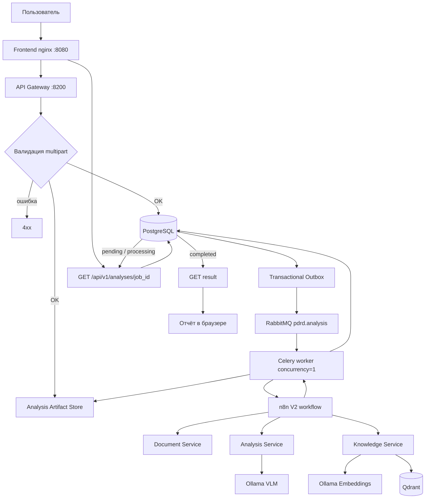
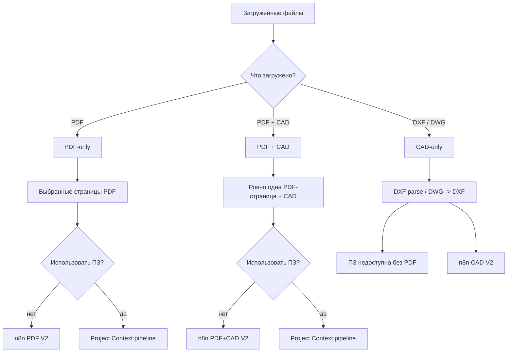
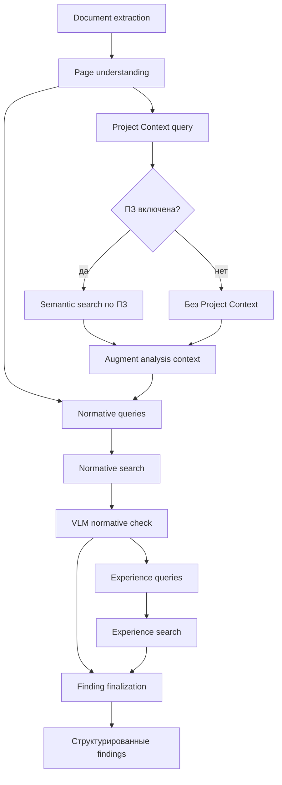
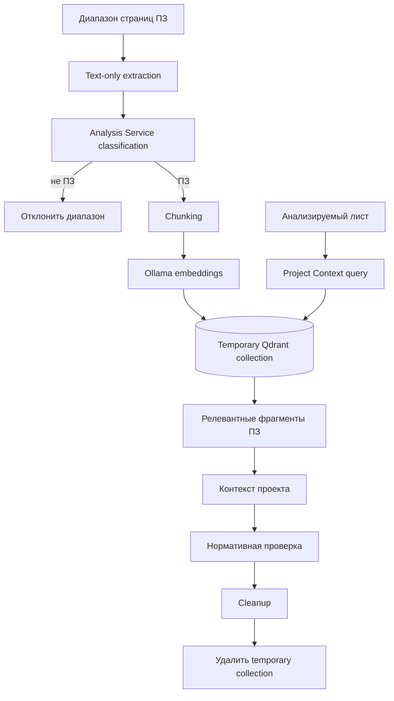
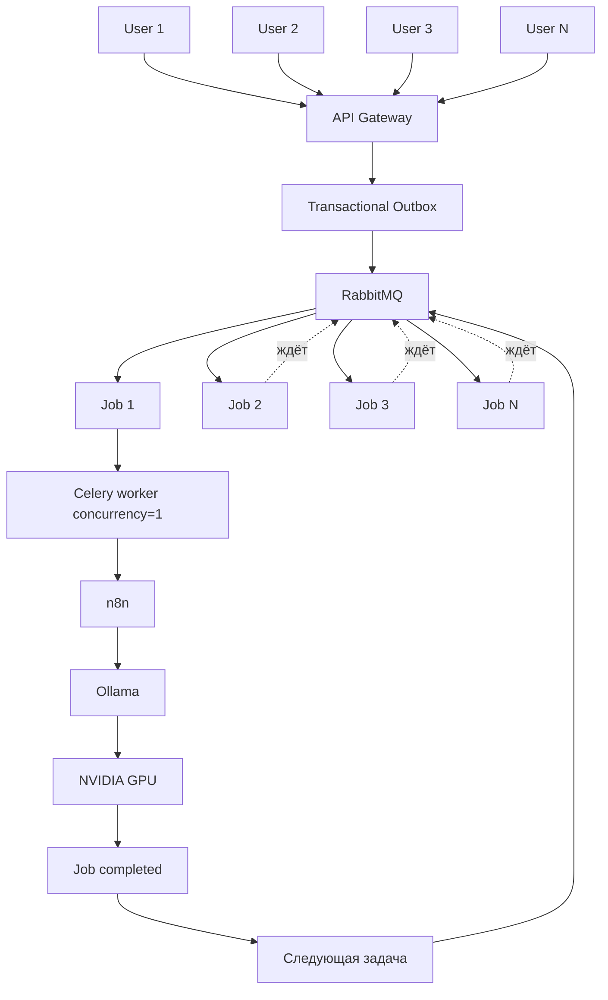
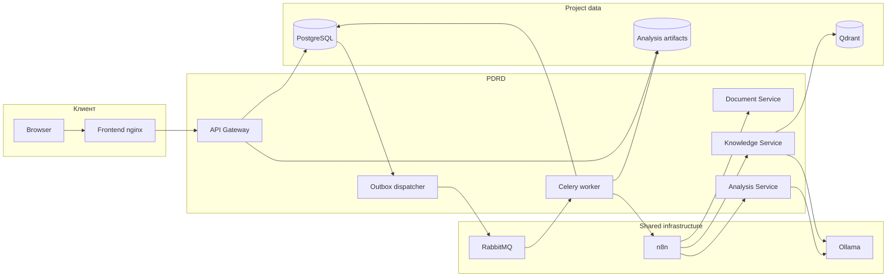

<!-- README.md -->
# PDRD Validation — Drawing Validation AI

PDRD Validation — локальный сервис проверки проектной и рабочей документации по нормативной базе и Базе Опыта.

Пользователь загружает PDF, DXF/DWG или PDF вместе с CAD-файлом. Сервис извлекает текст и геометрию документа, формирует машинный контекст листа, анализирует его локальной VLM, подбирает релевантные нормативные фрагменты из Qdrant и формирует структурированный список замечаний.

Дополнительно пользователь может указать диапазон страниц Пояснительной записки. Эти страницы проходят отдельную проверку, индексируются во временную Project Context collection и используются как контекст проекта при анализе выбранных листов. Пояснительная записка не заменяет нормативную базу: нормативное замечание должно подтверждаться источником из постоянной нормативной коллекции.

Тяжёлые AI-задачи выполняются асинхронно через RabbitMQ/Celery с `concurrency=1`, поэтому параллельные пользовательские запросы не запускают несколько тяжёлых GPU-задач одновременно и не конкурируют за VRAM.

## Возможности

- PDF-only анализ;
- анализ нескольких выбранных страниц PDF;
- DXF-only анализ;
- DWG -> DXF normalization;
- PDF + CAD как два представления одного листа;
- контекст Пояснительной записки;
- временный semantic Project Context по ПЗ;
- нормативный RAG;
- поиск по Базе Опыта;
- локальная VLM через Ollama;
- асинхронная GPU-safe очередь;
- Transactional Outbox;
- n8n orchestration;
- status/result API;
- frontend без прямого доступа к n8n;
- автоматический cleanup временного Project Context;
- unit, integration и architecture tests.

## Основные технологии

| Слой | Технологии |
|---|---|
| Backend | Python 3.12, FastAPI, Pydantic |
| API / jobs | FastAPI, SQLAlchemy AsyncIO, Alembic |
| DB | PostgreSQL 16 |
| Очередь | RabbitMQ, Celery |
| Workflow orchestration | n8n |
| Vector DB | Qdrant |
| VLM | Ollama + `qwen3-vl:8b-instruct` |
| Embeddings | Ollama + `qwen3-embedding:4b` |
| PDF | PyMuPDF |
| CAD | ezdxf, LibreDWG |
| Frontend | HTML, CSS, JavaScript, nginx |
| Контейнеризация | Docker, Docker Compose |
| Тесты | pytest |
| Code style | Ruff |

# Архитектура

Проект разделён на четыре backend bounded context и отдельный frontend.

- **API Gateway** — публичный API, PostgreSQL job state, Transactional Outbox, RabbitMQ/Celery и хранение файлов анализа.
- **Document Service** — PDF/CAD extraction, render и нормализация DWG -> DXF.
- **Knowledge Service** — embeddings, Qdrant, нормативный RAG, Experience RAG и временный Project Context.
- **Analysis Service** — VLM-анализ, понимание листа, формирование поисковых запросов, нормативная проверка и финализация findings.
- **n8n** — orchestration между внутренними сервисами.
- **Frontend** — только Browser -> API Gateway. Браузер не обращается напрямую к n8n или внутренним микросервисам.

Shared infrastructure:

- Ollama;
- RabbitMQ;
- n8n.

Project-specific infrastructure:

- PostgreSQL;
- Qdrant;
- API Gateway;
- Celery worker;
- Outbox dispatcher;
- Document Service;
- Knowledge Service;
- Analysis Service;
- Frontend.

# Блок-схемы

## 1. Общий путь запроса



## 2. Выбор режима анализа



## 3. Анализ одного листа



## 4. Контекст Пояснительной записки



ПЗ используется только как описание проектных решений. Она не является нормативным доказательством.

## 5. GPU-safe очередь



Backpressure находится в RabbitMQ: количество HTTP-запросов не равно количеству одновременно выполняющихся GPU inference.

## 6. Технологическая схема



# Структура проекта

```text
PDRD-validation/
├── frontend/
│   ├── Dockerfile
│   ├── nginx.conf
│   └── src/
│       ├── index.html
│       ├── css/
│       │   ├── variables.css
│       │   ├── global.css
│       │   ├── main.css
│       │   └── blocks/
│       │       ├── card.css
│       │       ├── form.css
│       │       ├── modal.css
│       │       └── report.css
│       └── js/
│           ├── app.js
│           ├── config.js
│           ├── components/
│           │   ├── modal.js
│           │   └── result.js
│           └── features/
│               └── analysis/
│                   ├── api.js
│                   ├── form.js
│                   ├── labels.js
│                   ├── polling.js
│                   └── report.js
│
├── services/
│   ├── api-gateway/
│   │   ├── alembic/
│   │   ├── src/pdrd_api_gateway/
│   │   │   ├── application/
│   │   │   ├── core/
│   │   │   ├── domain/
│   │   │   ├── infrastructure/
│   │   │   ├── transport/
│   │   │   └── main.py
│   │   └── tests/
│   │
│   ├── document-service/
│   │   ├── src/pdrd_document_service/
│   │   │   ├── application/
│   │   │   ├── core/
│   │   │   ├── domain/
│   │   │   ├── infrastructure/
│   │   │   ├── transport/
│   │   │   └── main.py
│   │   └── tests/
│   │
│   ├── knowledge-service/
│   │   ├── src/pdrd_knowledge_service/
│   │   │   ├── application/
│   │   │   ├── core/
│   │   │   ├── domain/
│   │   │   ├── infrastructure/
│   │   │   ├── transport/
│   │   │   └── main.py
│   │   └── tests/
│   │
│   └── analysis-service/
│       ├── src/pdrd_analysis_service/
│       │   ├── application/
│       │   ├── core/
│       │   ├── domain/
│       │   ├── infrastructure/
│       │   ├── transport/
│       │   └── main.py
│       └── tests/
│
├── n8n/
│   └── workflows/
│       ├── analysis-v2-pdf.json
│       ├── analysis-v2-cad.json
│       └── analysis-v2-pdf-cad.json
│
├── data/
│   └── knowledge/
│       ├── normative/
│       └── experience/
│
├── ops/
│   ├── Dockerfile.quality
│   └── check-quality.ps1
│
├── scripts/
│   ├── build_experience_cases.py
│   ├── check-stack.sh
│   ├── kb_common.py
│   ├── kb_search.py
│   └── kb_sync.py
│
├── tests/
│   └── architecture/
│
├── .env.example
├── compose.yaml
├── pyproject.toml
├── requirements-dev.txt
└── README.md
```

Backend-сервисы используют одинаковое направление зависимостей:

```text
Transport
    ↓
Application
    ↓
Domain

Infrastructure ──implements──> Application ports
```

`Domain` и `Application` не зависят от FastAPI, SQLAlchemy, Celery, Qdrant, Ollama или конкретных HTTP-клиентов.

# Конфигурация

Создать рабочий `.env`:

```bash
cp .env.example .env
```

Основные application defaults находятся в Pydantic Settings соответствующего сервиса. `.env` хранит deployment-specific параметры, которые действительно должны отличаться между окружениями: секреты, порты, имя Docker network и параметры project infrastructure. Это не дублирует все Pydantic defaults в Docker Compose.

## Обязательные секреты

В `.env` необходимо задать реальные значения минимум для:

```dotenv
PDRD_POSTGRES_PASSWORD=replace-me
PDRD_RABBITMQ_PASSWORD=replace-me
```

Секреты не коммитить.

Остальные application-настройки имеют project defaults в Pydantic Settings. Если конкретный параметр действительно потребуется менять между окружениями без изменения кода, он добавляется в Compose как явный deployment override, а не дублируется заранее.

# Запуск

## Требования

Project stack:

- Docker Engine;
- Docker Compose plugin.

Shared infrastructure должна быть уже запущена и доступна в Docker network `ai-shared`:

- RabbitMQ;
- n8n;
- Ollama.

В Ollama должны быть доступны:

```text
qwen3-vl:8b-instruct
qwen3-embedding:4b
```

## Запуск проекта

Из корня репозитория:

```bash
docker compose up -d --build --remove-orphans
```

Проверка всего stack:

```bash
bash scripts/check-stack.sh
```

Frontend:

```text
http://<server>:8080/
```

API Gateway Swagger:

```text
http://127.0.0.1:8200/docs
```

Остановка:

```bash
docker compose down
```

# Тестирование

## Быстрая проверка на Windows

```powershell
.\ops\check-quality.ps1 -Fix
```

Она выполняет Ruff, format check, pytest и architecture tests.

## Проверка в Docker

```bash
docker compose --profile test build quality-tests && \
docker compose --profile test run --rm quality-tests
```

## Runtime smoke

После запуска:

```bash
bash scripts/check-stack.sh
```

Скрипт проверяет:

- Docker / Docker Compose;
- project containers;
- Frontend;
- API Gateway;
- Document Service;
- Knowledge Service;
- Analysis Service;
- Qdrant;
- доступ API Gateway -> shared n8n.

# Публичный API

```text
POST /api/v1/analyses
GET  /api/v1/analyses/{job_id}
GET  /api/v1/analyses/{job_id}/result

GET  /health/live
GET  /health/ready
```

# Текущий статус

Stage 1 завершает перенос с legacy runtime на V2-архитектуру.

Подтверждены:

- PDF-only;
- multi-page PDF;
- CAD-only;
- PDF + CAD;
- PDF + ПЗ;
- PDF + CAD + ПЗ;
- валидация неправильного диапазона ПЗ;
- запрет CAD + ПЗ;
- Gateway -> Outbox -> RabbitMQ -> Celery -> n8n;
- temporary Qdrant Project Context cleanup;
- удаление legacy `pdf-service`.

Следующий этап — viewer/render/location:

- показ отрендеренного листа;
- выбор замечания;
- переход к соответствующей странице;
- normalized `bbox/location`;
- подсветка области замечания.
