<!-- README.md -->

# PDRD Validation — проверка чертежей с помощью ИИ

PDRD Validation — локальный сервис проверки проектной и рабочей документации по нормативной базе, техническому заданию, пользовательским пакетам документов, контексту проекта и Базе Опыта.

Пользователь загружает PDF, DXF/DWG или PDF вместе с соответствующим CAD-файлом, при необходимости прикладывает Техническое задание и выбирает нормативный раздел/пользовательские документы. Система извлекает текст и геометрию, формирует машинный контекст листа, выполняет semantic retrieval по источникам разных типов, запускает локальный VLM-анализ и возвращает структурированные замечания с разделённой доказательной базой `N/T/U/D/E`.

Открыть проект: **[https://pdrd.itcneoterm.local/](https://pdrd.itcneoterm.local/)**. Корпоративный вход и регистрация работают только через HTTPS.

Обычный PDF/CAD можно проверить без нормативного раздела — как гостю, так и авторизованному пользователю. Для нормативного поиска, промпта раздела и личных пакетов учитываются назначенные пользователю разделы и владелец документов.

Тяжёлые GPU-задачи выполняются с общим cross-process GPU lease. Analysis VLM и unified embedding runtime не должны одновременно загружать несовместимые тяжёлые модели в одну GPU без предварительной проверки VRAM.

## Возможности

- PDF-only и многостраничный PDF: до **200 анализируемых страниц**, включая выбор диапазона из большего документа;
- корпоративный вход через LDAPS, локальный суперпользователь и регистрация внешних пользователей с подтверждением email;
- личный кабинет, собственная история проверок и восстановление результата по `job_id` без повторного VLM-анализа;
- админка: роли, доступ к нескольким нормативным разделам, отдельные права Review и удаления нормативной базы;
- серверные сессии: 24 часа бездействия, максимум 30 дней от входа;
- автоматическая очистка исходников/визуализаций через 30 дней у владельца, гостевых анализов через 7 дней;
- DXF-only и DWG -> DXF normalization;
- PDF + CAD как два представления одного листа;
- Техническое задание как отдельный project/customer source;
- multimodal indexing страниц ТЗ;
- T-guided нормативный retrieval;
- контекст Пояснительной записки;
- временный semantic Project Context;
- managed нормативные разделы и вложенные папки;
- пользовательские пакеты документов внутри выбранного раздела;
- PDF/DOC/DOCX upload;
- Word -> PDF preview через LibreOffice;
- durable индексация через Transactional Outbox;
- scoped normative RAG по immutable snapshot;
- scoped retrieval выбранных пользовательских документов;
- отдельный system prompt нормативного раздела;
- transient working prompt;
- кликабельные нормативные и T sources;
- Human Review в браузере: Wise/Bad/Edited/Gold, выделение Gold на листе и синхронизация с текстовым списком;
- серверная доменная модель Human Review, утверждение ревизий и отбор подтверждённых областей для будущей Базы Опыта;
- итоговый PDF актуального утверждённого Human Review: принятые замечания, проверенные области VLM и жёлтый Gold на листе и в текстовом списке;
- постоянный каталог Базы Опыта: авторы из User Service, фильтры, причины отклонения, история правок, версии индекса и подготовка обучающих наборов; поиск E выключен до оценки качества;
- единая embedding model для N/T/U/D/E/PZ;
- blue/green переиндексация Qdrant при смене embedding identity;
- cross-process GPU lease и RAM/VRAM admission;
- n8n orchestration;
- frontend только через API Gateway;
- cleanup временного Project Context;
- unit, integration, architecture и GPU runtime tests.

# Семантика источников N / T / U / D / E

Источники не объединяются в одну семантическую роль. Тип источника определяет, что именно он может доказывать.

| Префикс | Тип | Роль |
|---|---|---|
| `N1`, `N2`, ... | Normative | нормативная база: ГОСТ, СП, ПУЭ и другие нормативные требования |
| `T1`, `T2`, ... | Technical Assignment | требования ТЗ, заказчика и проекта |
| `U1`, `U2`, ... | User Package | пользовательские документы проекта/заказчика |
| `D-p0007-f0001`, `D-p0010-c0` | Проверяемый PDF | связи страниц, проектные факты и внутренние противоречия, без нормативного статуса |
| `E1`, `E2`, ... | Experience | База Опыта, используемая при finalization/recommendation |

Главные правила:

- только `N` может подтверждать утверждение о нарушении нормативного документа;
- `T` является самостоятельным project/customer requirement и может подтверждать `customer_requirements`;
- `T` может содержать ссылки на нормативы и направлять targeted N retrieval, но не превращается в норматив;
- `U` является самостоятельным пользовательским/project source, но не нормативным доказательством;
- `E` является опытом, а не нормативным доказательством. Контракт retrieval существует, но `KNOWLEDGE_SERVICE_SEARCH__EXPERIENCE_ENABLED=false` до trusted ingestion и оценки качества;
- D сохраняется отдельным типом с физическими страницами и областями; источник не определяет правильное значение без авторитетного основания;
- finding без N/T/U/D не удаляется автоматически: инженерное/визуальное замечание может остаться `needs_review`;
- `normative_control` без валидного `N` не должен сохраняться только на основании `T` или `U`.

Итоговые typed source arrays:

```text
basis_sources                       = N
technical_assignment_basis_sources  = T
user_package_basis_sources          = U
document_context_basis_sources      = D
experience_sources                  = E
```

# Технологии

| Слой | Технологии |
|---|---|
| Backend | Python 3.12, FastAPI, Pydantic |
| Persistence | PostgreSQL 16, SQLAlchemy AsyncIO, Alembic |
| Очередь | RabbitMQ, Celery |
| Orchestration | n8n |
| Vector DB | Qdrant |
| VLM | shared vLLM OpenAI-compatible endpoint `http://shared-vlm:8000/v1`, logical model `shared-vlm` |
| Embeddings | shared vLLM endpoint `http://shared-embedding:8000/v1`, logical model `shared-embedding` |
| Embedding dimension | `4096` |
| PDF | PyMuPDF |
| Word | LibreOffice headless |
| CAD | ezdxf, LibreDWG |
| Frontend | HTML, CSS, JavaScript, nginx |
| Контейнеризация | Docker, Docker Compose |
| Тесты / style | pytest, Ruff |

# Архитектура

Сервисы разделяют ответственность и обращаются к данным соседнего сервиса через API.

| Микросервис | Ответственность | Собственное хранение | Профиль Compose |
|---|---|---|---|
| **API Gateway** | Публичный API, проверка прав/владельца, история, задания, неизменяемый снимок N/T/U, Outbox и артефакты | PostgreSQL `public.analysis_jobs`, `public.outbox_messages`; `/data/analyses` | Основной стек |
| **Document Service** | Проверка числа PDF-страниц, извлечение PDF/CAD, DWG → DXF, изображения, crop, автоматический и Reviewed PDF | Собственной БД нет; обрабатывает переданные файлы | Основной стек |
| **Knowledge Service** | Каталог N/U, промпты разделов, личные пакеты, lifecycle ТЗ, индексация, поиск и временный контекст проекта | PostgreSQL `knowledge`, Qdrant, `/data/normative`, `/data/technical-assignments` | Основной стек |
| **Analysis Service** | VLM-анализ листа, проверка требований, правила доказательной базы N/T/U/D/E, финализация | Собственной БД нет; технический VLM-кеш `/data/vlm-cache` | Основной стек |
| **User Service** | Профили, внешние идентичности, роли, назначения разделов, права Review/удаления и аудит | PostgreSQL `users`; без паролей | `identity` |
| **Auth Service** | Локальная/email-аутентификация, LDAPS, подтверждение email, серверные сессии, CSRF и ограничение попыток | PostgreSQL `auth`; хеши только собственных паролей и токенов | `auth` вместе с `identity` |
| **Admin Service** | Административный API: проверка сессии, роли, разделы и отдельные права пользователя | Собственной БД нет; API Auth/User/Knowledge | `auth` |
| **Experience Service** | Human Review, решения и аудит, подтверждённые области, каталог примеров, версии индекса и обучающих наборов | PostgreSQL `experience`; собственные PNG в `/data/experience/crops` | `review` |

Дополнительные процессы используют данные своего сервиса: Gateway worker/outbox, Knowledge outbox и индексаторы N/U/T/E. Они не создают отдельные базы. `experience-indexer` запускается профилем `experience-index`, который требует `review`. Контейнеры `user-migrate`, `auth-migrate`, `experience-migrate` выполняют независимые миграции.

**Frontend** — статические страницы и Nginx; браузер обращается только к API Gateway. `review-frontend` — дополнительный интерфейс на loopback `127.0.0.1:8081`, без собственной БД. Основной интерфейс доступен через корпоративный HTTPS-прокси. Прямого браузерного доступа к внутренним API, n8n, PostgreSQL и Qdrant нет.

**Shared infrastructure** имеет самостоятельный жизненный цикл в сети `ai-shared`: `shared-vlm`, `shared-embedding`, RabbitMQ и n8n. Проект не поднимает второй GPU runtime. Каталог `services/multimodal-embedding-service` сохранён как прежняя реализация для совместимости и тестов; в текущем Compose он не запускается. Вызовы идут в общий OpenAI-совместимый embedding endpoint.

**Инфраструктура проекта:** PostgreSQL с независимыми схемами `public`/`knowledge`/`users`/`auth`/`experience`, Qdrant и постоянные тома файлов. Сервисы не читают чужие схемы SQL напрямую; межсервисные UUID являются логическими ссылками, без внешних ключей между схемами.

Направление зависимостей backend:

```text
Transport
    ↓
Application
    ↓
Domain

Infrastructure ──implements──> Application ports
```

`Domain` и `Application` не зависят от FastAPI, SQLAlchemy, Celery, Qdrant, Ollama и HTTP adapters.

# Блок-схемы

## 1. Общий путь анализа

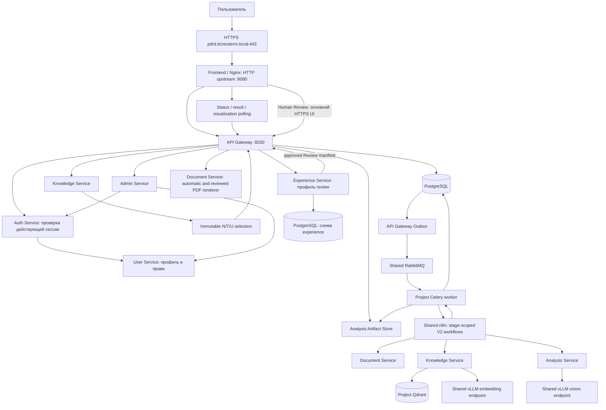
```mermaid
flowchart TD
    U["Пользователь"] --> TLS["HTTPS pdrd.itcneoterm.local:443"]
    TLS --> FE["Frontend / Nginx: HTTP upstream :8080"]
    FE --> GW["API Gateway :8200"]
    GW --> AUTH["Auth Service: проверка действующей сессии"]
    AUTH --> US["User Service: профиль и права"]
    GW --> ADMIN["Admin Service"]
    ADMIN --> US
    ADMIN --> AUTH
    GW --> FS["Analysis Artifact Store"]
    GW --> KS["Knowledge Service"]
    KS --> RESOLVE["Immutable N/T/U selection"]
    RESOLVE --> GW
    GW --> PG[("PostgreSQL")]
    PG --> O["API Gateway Outbox"]
    O --> RMQ["Shared RabbitMQ"]
    RMQ --> W["Project Celery worker"]
    W --> N8N["Shared n8n: stage-scoped V2 workflows"]
    N8N --> DS["Document Service"]
    N8N --> KS2["Knowledge Service"]
    N8N --> AS["Analysis Service"]
    KS2 --> QD[("Project Qdrant")]
    KS2 --> EMB["Shared vLLM embedding endpoint"]
    AS --> VLM["Shared vLLM vision endpoint"]
    N8N --> W
    W --> PG
    W --> FS
    FE --> POLL["Status / result / visualization polling"]
    POLL --> GW
    GW --> DS2["Document Service: automatic and reviewed PDF renderer"]
    FE -->|Human Review: основной HTTPS UI| GW
    GW --> EXP["Experience Service: профиль review"]
    EXP --> RP[("PostgreSQL: схема experience")]
    EXP -->|approved Review manifest| GW
```

Точки и модели shared-inference задаются logical endpoints/переменными окружения, а не физическими ID модели в коде проекта. Experience формирует утверждённую проекцию Review, Gateway передаёт её PDF-рендереру Document Service. Review сохраняется через Gateway на основном HTTPS-фронте. История читает существующее задание и результат, без повторного запуска n8n/VLM. Утверждение и скачивание PDF автоматически сохраняют подходящие примеры Experience. Действующий `annotated-pdf` остаётся **автоматической исходной версией**.

## 2. Managed N/U catalog и индексация

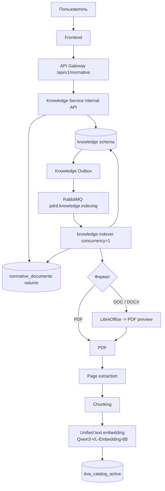
```mermaid
flowchart TD
    U["Пользователь"] --> FE["Frontend"]
    FE --> GW["API Gateway /api/v1/normative"]
    GW --> KS["Knowledge Service internal API"]

    KS --> PG[("knowledge schema")]
    KS --> STORE[("normative_documents volume")]

    PG --> OUTBOX["Knowledge Outbox"]
    OUTBOX --> RMQ["RabbitMQ pdrd.knowledge.indexing"]
    RMQ --> IDX["knowledge-indexer concurrency=1"]

    IDX --> STORE
    IDX --> TYPE{"Формат"}
    TYPE -->|PDF| PDF["PDF"]
    TYPE -->|DOC / DOCX| LO["LibreOffice -> PDF preview"]
    LO --> PDF

    PDF --> TEXT["Page extraction"]
    TEXT --> CHUNK["Chunking"]
    CHUNK --> EMB["Unified text embedding\nQwen3-VL-Embedding-8B"]
    EMB --> MANAGED[("dva_catalog_active")]

    IDX --> PG
```

`N` и `U` используют один physical vector space, но semantic role определяется PostgreSQL `catalog_area` до vector search.

## 3. Техническое задание

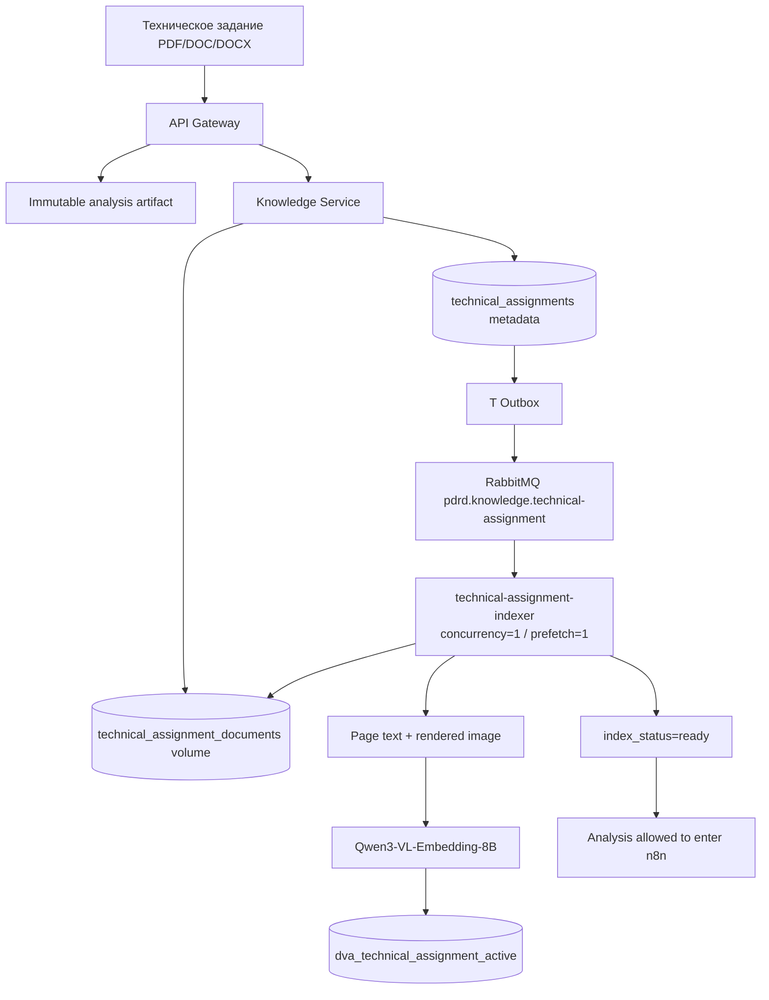
```mermaid
flowchart TD
    TFILE["Техническое задание PDF/DOC/DOCX"] --> GW["API Gateway"]
    GW --> ART["Immutable analysis artifact"]
    GW --> KS["Knowledge Service"]

    KS --> TPG[("technical_assignments metadata")]
    KS --> TSTORE[("technical_assignment_documents volume")]
    TPG --> TO["T Outbox"]
    TO --> RMQ["RabbitMQ pdrd.knowledge.technical-assignment"]
    RMQ --> TW["technical-assignment-indexer\nconcurrency=1 / prefetch=1"]

    TW --> TSTORE
    TW --> PAGE["Page text + rendered image"]
    PAGE --> EMB["Qwen3-VL-Embedding-8B"]
    EMB --> TQ[("dva_technical_assignment_active")]
    TW --> READY["index_status=ready"]

    READY --> ANALYSIS["Analysis allowed to enter n8n"]
```

ТЗ индексируется до запуска n8n. Analysis job не начинает orchestration, пока связанный T-index не перешёл в `READY`.

## 4. Анализ одного листа с N/T/U

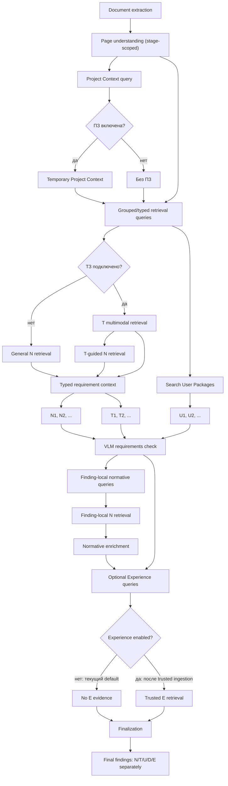
```mermaid
flowchart TD
    DOC["Document extraction"] --> FACTS["Page understanding (stage-scoped)"]
    FACTS --> PZQ["Project Context query"]
    PZQ --> PZ{"ПЗ включена?"}
    PZ -->|да| PZS["Temporary Project Context"]
    PZ -->|нет| EMPTY["Без ПЗ"]
    PZS --> Q["Grouped/typed retrieval queries"]
    EMPTY --> Q
    FACTS --> Q
    Q --> REQ{"ТЗ подключено?"}
    REQ -->|нет| NS["General N retrieval"]
    REQ -->|да| TS["T multimodal retrieval"]
    TS --> TN["T-guided N retrieval"]
    TN --> MERGE["Typed requirement context"]
    NS --> MERGE
    TS --> MERGE
    Q --> US["Search User Packages"]
    MERGE --> NCTX["N1, N2, ..."]
    MERGE --> TCTX["T1, T2, ..."]
    US --> UCTX["U1, U2, ..."]
    NCTX --> CHECK["VLM requirements check"]
    TCTX --> CHECK
    UCTX --> CHECK
    CHECK --> FQ["Finding-local normative queries"]
    FQ --> FN["Finding-local N retrieval"]
    FN --> FINALCTX["Normative enrichment"]
    CHECK --> EQ["Optional Experience queries"]
    FINALCTX --> EQ
    EQ --> ENABLED{"Experience enabled?"}
    ENABLED -->|нет: текущий default| EMPTY_E["No E evidence"]
    ENABLED -->|да: после trusted ingestion| ES["Trusted E retrieval"]
    EMPTY_E --> FINAL["Finalization"]
    ES --> FINAL
    FINAL --> RESULT["Final findings: N/T/U/D/E separately"]
```

`E` в `.env.example` отключён: наличие в workflow шага Experience не означает работающую доверенную базу. Промежуточные гипотезы не удаляются, но не становятся подтверждёнными замечаниями без дополнительной проверки.

### 4.1. Контекст всего PDF и межстраничная проверка

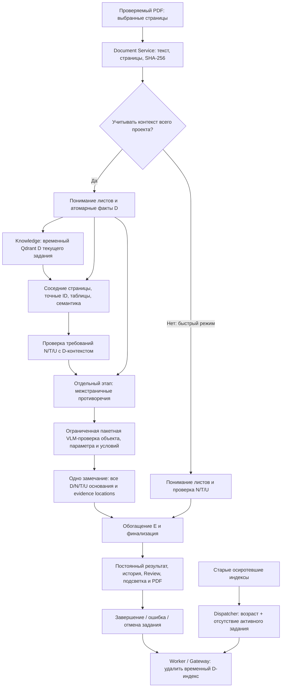
```mermaid
flowchart TD
    PDF["Проверяемый PDF: выбранные страницы"] --> EXTRACT["Document Service: текст, страницы, SHA-256"]
    EXTRACT --> MODE{"Учитывать контекст всего проекта?"}
    MODE -->|Нет: быстрый режим| LOCAL["Понимание листов и проверка N/T/U"]
    MODE -->|Да| UNDERSTAND["Понимание листов и атомарные факты D"]
    UNDERSTAND --> INDEX["Knowledge: временный Qdrant D текущего задания"]
    INDEX --> SEARCH["Соседние страницы, точные ID, таблицы, семантика"]
    UNDERSTAND --> SEARCH
    SEARCH --> PAGECHECK["Проверка требований N/T/U с D-контекстом"]
    PAGECHECK --> CROSS["Отдельный этап: межстраничные противоречия"]
    UNDERSTAND --> CROSS
    CROSS --> VALIDATE["Ограниченная пакетная VLM-проверка объекта, параметра и условий"]
    VALIDATE --> GROUP["Одно замечание: все D/N/T/U основания и evidence locations"]
    GROUP --> FINAL["Обогащение E и финализация"]
    LOCAL --> FINAL
    FINAL --> SAVE["Постоянный результат, история, Review, подсветка и PDF"]
    SAVE --> END["Завершение / ошибка / отмена задания"]
    END --> CLEAN["Worker / Gateway: удалить временный D-индекс"]
    ORPHAN["Старые осиротевшие индексы"] --> SWEEP["Dispatcher: возраст + отсутствие активного задания"]
    SWEEP --> CLEAN
```

Чекбокс находится под «Использовать пояснительную записку», по умолчанию выключен
и независимо управляет D в PDF-only. Подпись предупреждает об увеличении времени
примерно в 2,5 раза. D содержит факты проверяемых страниц одного PDF. Для сравнения
всего PDF в пределах 200 страниц оставьте поле диапазона пустым.

D не является нормативом и не выбирает правильное из противоречащих значений.
Для сопоставимой группы формируется один `finding_id`; решение Review общее,
а доказательства и отметки PDF относятся к своим физическим страницам.
`source_kinds` вычисляет сервер из сохранённых типизированных массивов;
бейджи допускают сочетания `[D] [N]`. Без оснований показывается «Инженерное».

Индекс D изолирован по заданию и очищается после его выполнения. Тексты,
источники и области сохраняются в результате, поэтому удаление индекса не мешает
истории, Review и PDF. Лимит доказательств VLM отделён от лимита сохранения.
Подробный контракт, очистка, ограничения и регрессии:
[Контекст документа](docs/document-context.md).

## 5. GPU coordination

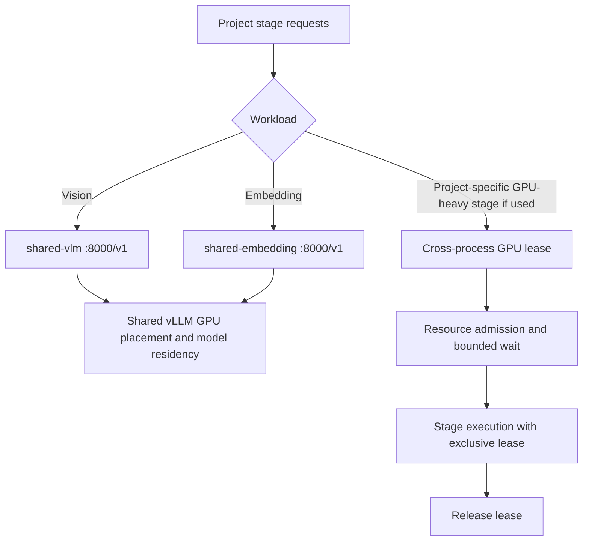
```mermaid
flowchart TD
    Q["Project stage requests"] --> SERVICE{"Workload"}
    SERVICE -->|Vision| V["shared-vlm :8000/v1"]
    SERVICE -->|Embedding| E["shared-embedding :8000/v1"]
    V --> CONFIG["Shared vLLM GPU placement and model residency"]
    E --> CONFIG
    SERVICE -->|Project-specific GPU-heavy stage if used| LEASE["Cross-process GPU lease"]
    LEASE --> WAIT["Resource admission and bounded wait"]
    WAIT --> WORK["Stage execution with exclusive lease"]
    WORK --> RELEASE["Release lease"]
```

Shared runtimes управляют собственным размещением GPU и residency; приложение использует stable logical endpoints. Проектный lock `/var/lock/pdrd-gpu/gpu.lock` остаётся контрактом только для операций, действительно использующих project-side GPU lease; **его нельзя представлять как lock, который гарантированно управляет shared vLLM из другого стека**. Конкретные GPU/TP/DP/model IDs берутся из конфигурации shared infrastructure.

## 6. Базы данных и связи каждого микросервиса

Один экземпляр PostgreSQL обслуживает независимые схемы. Внешние ключи действуют внутри схемы владельца. Межсервисные `user_id`, `owner_user_id`, `job_id`, `section_id` и UUID документов проверяются через API, а не через SQL JOIN чужих таблиц.

| Владелец | Схема | Таблица версии миграций |
|---|---|---|
| API Gateway | `public` | `public.alembic_version` |
| Knowledge Service | `knowledge` | `public.alembic_version_knowledge` |
| User Service | `users` | `users.alembic_version_users` |
| Auth Service | `auth` | `auth.alembic_version_auth` |
| Experience Service | `experience` | `experience.alembic_version_experience` |

Общая схема логических связей: пунктир обозначает ссылку по UUID/контракту API, **не внешний ключ PostgreSQL**.

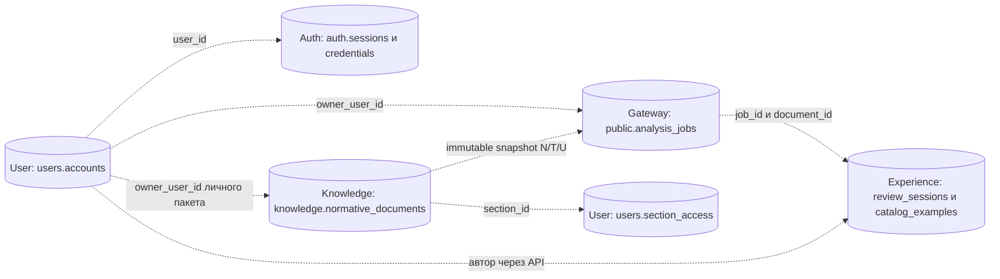
```mermaid
flowchart LR
    USERS[("User: users.accounts")] -. user_id .-> AUTH[("Auth: auth.sessions и credentials")]
    USERS -. owner_user_id .-> GW[("Gateway: public.analysis_jobs")]
    USERS -. owner_user_id личного пакета .-> KS[("Knowledge: knowledge.normative_documents")]
    KS -. section_id .-> ACCESS[("User: users.section_access")]
    KS -. immutable snapshot N/T/U .-> GW
    GW -. job_id и document_id .-> EXP[("Experience: review_sessions и catalog_examples")]
    USERS -. автор через API .-> EXP
```

### 6.1. API Gateway: задания, история и Outbox

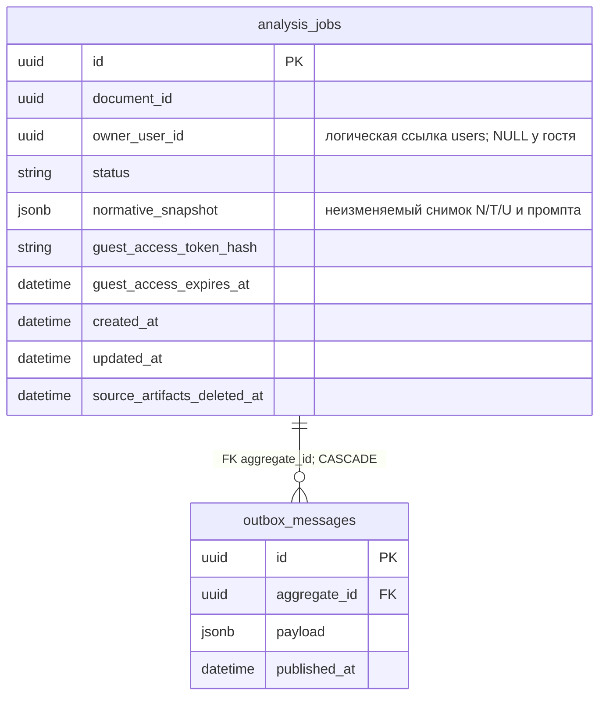
```mermaid
erDiagram
    analysis_jobs ||--o{ outbox_messages : "FK aggregate_id; CASCADE"
    analysis_jobs {
        uuid id PK
        uuid document_id
        uuid owner_user_id "логическая ссылка users; NULL у гостя"
        string status
        jsonb normative_snapshot "неизменяемый снимок N/T/U и промпта"
        string guest_access_token_hash
        datetime guest_access_expires_at
        datetime created_at
        datetime updated_at
        datetime source_artifacts_deleted_at
    }
    outbox_messages {
        uuid id PK
        uuid aggregate_id FK
        jsonb payload
        datetime published_at
    }
```

`analysis_jobs` хранит состояние задания; `outbox_messages` публикуется после SQL commit. История фильтруется по `owner_user_id` в PostgreSQL **до пагинации**. Строки без владельца не присваиваются новому пользователю. Файлы результата лежат отдельно в `/data/analyses/<document_id>`.

Snapshot содержит независимо:

```json
{
  "section_id": "<uuid>",
  "document_ids": ["<normative-uuid>"],
  "user_package_document_ids": ["<owned-user-package-uuid>"],
  "system_prompt": "<resolved-prompt>",
  "technical_assignment": {
    "technical_assignment_id": "<uuid>",
    "analysis_document_id": "<uuid>",
    "source_file": "ТЗ.pdf"
  }
}
```

`technical_assignment` отсутствует без ТЗ. Для обычного анализа без личных документов frontend **не отправляет** `user_package_document_ids`; пустой список на Gateway также означает отсутствие выбора и не вызывает `403`. Изменение каталога или формы после запуска не переписывает snapshot существующего задания.

### 6.2. Knowledge Service: разделы, N/U и ТЗ

Все таблицы следующей схемы находятся в `knowledge`. N и U разделены значением `catalog_area`; личные категории и документы U дополнительно имеют `owner_user_id`.

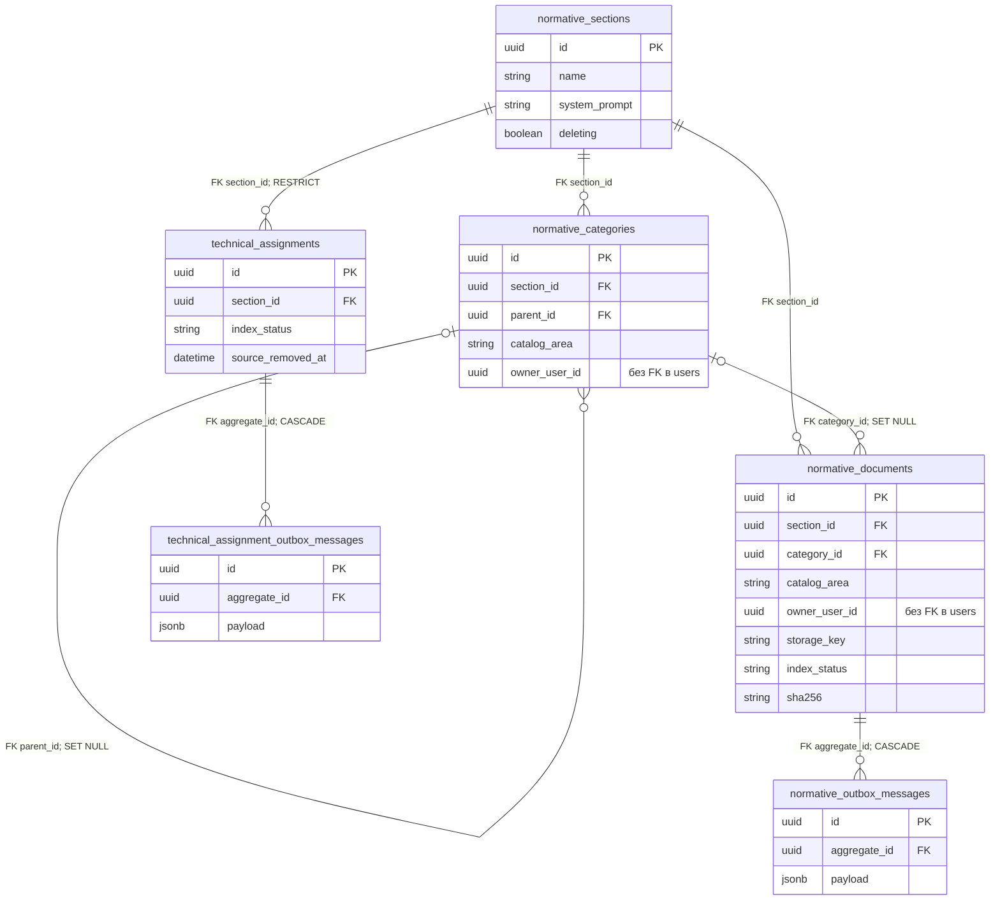
```mermaid
erDiagram
    normative_sections ||--o{ normative_categories : "FK section_id"
    normative_sections ||--o{ normative_documents : "FK section_id"
    normative_categories o|--o{ normative_categories : "FK parent_id; SET NULL"
    normative_categories o|--o{ normative_documents : "FK category_id; SET NULL"
    normative_documents ||--o{ normative_outbox_messages : "FK aggregate_id; CASCADE"
    normative_sections ||--o{ technical_assignments : "FK section_id; RESTRICT"
    technical_assignments ||--o{ technical_assignment_outbox_messages : "FK aggregate_id; CASCADE"
    normative_sections {
        uuid id PK
        string name
        string system_prompt
        boolean deleting
    }
    normative_categories {
        uuid id PK
        uuid section_id FK
        uuid parent_id FK
        string catalog_area
        uuid owner_user_id "без FK в users"
    }
    normative_documents {
        uuid id PK
        uuid section_id FK
        uuid category_id FK
        string catalog_area
        uuid owner_user_id "без FK в users"
        string storage_key
        string index_status
        string sha256
    }
    normative_outbox_messages {
        uuid id PK
        uuid aggregate_id FK
        jsonb payload
    }
    technical_assignments {
        uuid id PK
        uuid section_id FK
        string index_status
        datetime source_removed_at
    }
    technical_assignment_outbox_messages {
        uuid id PK
        uuid aggregate_id FK
        jsonb payload
    }
```

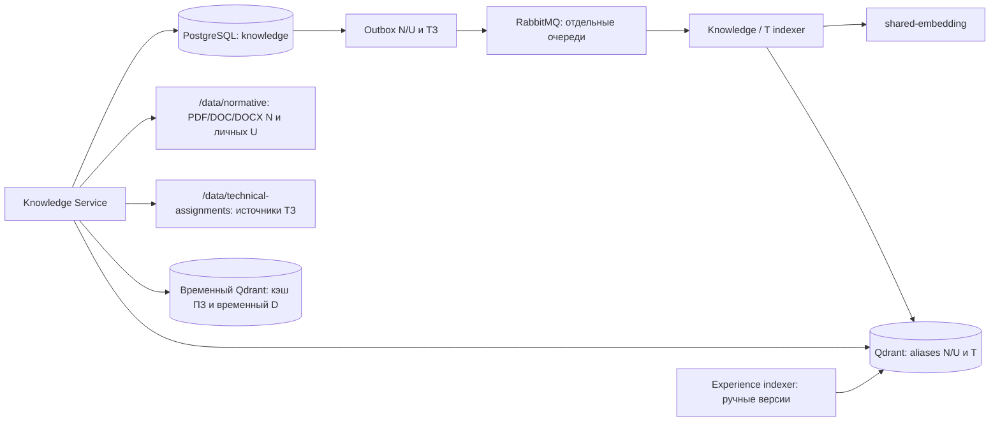
```mermaid
flowchart LR
    KS["Knowledge Service"] --> SQL[("PostgreSQL: knowledge")]
    KS --> NFILES["/data/normative: PDF/DOC/DOCX N и личных U"]
    KS --> TFILES["/data/technical-assignments: источники ТЗ"]
    SQL --> OUT["Outbox N/U и ТЗ"]
    OUT --> QUEUE["RabbitMQ: отдельные очереди"]
    QUEUE --> IDX["Knowledge / T indexer"]
    IDX --> EMB["shared-embedding"]
    IDX --> QD[("Qdrant: aliases N/U и T")]
    KS --> QD
    EIDX["Experience indexer: ручные версии"] --> QD
    KS --> TMP[("Временный Qdrant: кэш ПЗ и временный D")]
```

Gateway проверяет право на раздел и принадлежность выбранных U; Knowledge повторно ограничивает каталог/поиск допустимыми UUID и владельцем. Администратор не получает чужие личные пакеты автоматически. Разделы являются единым справочником: админка читает их из Knowledge, а User хранит назначения; отдельный справочник отделов для этой функции не создаётся.

Удаление нормативного документа или раздела — повторяемый сценарий Knowledge: отметка удаления, очистка связанных файлов/записей и точек Qdrant, затем завершение SQL-операции. Общие векторные коллекции и соседние документы не удаляются; служебные связи ТЗ учитываются до удаления раздела. Снимки уже выполненных анализов остаются историческими.

### 6.3. User Service: профили, роли и назначения разделов

Все таблицы находятся в `users`. Строка `accounts` содержит `authorization_version`, `review_access_enabled` и `normative_access_enabled`; любое административное изменение проверяет актуальную версию и полномочия автора. Пароли здесь отсутствуют.

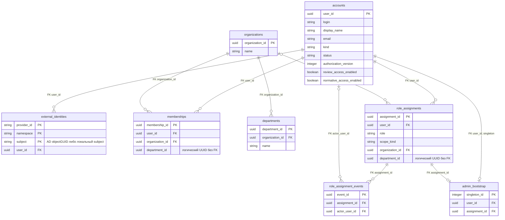
```mermaid
erDiagram
    accounts ||--o{ external_identities : "FK user_id"
    accounts ||--o{ memberships : "FK user_id"
    organizations ||--o{ departments : "FK organization_id"
    organizations ||--o{ memberships : "FK organization_id"
    accounts ||--o{ role_assignments : "FK user_id"
    organizations o|--o{ role_assignments : "FK organization_id"
    role_assignments ||--o{ role_assignment_events : "FK assignment_id"
    accounts o|--o{ role_assignment_events : "FK actor_user_id"
    accounts ||--o| admin_bootstrap : "FK user_id; singleton"
    role_assignments ||--o| admin_bootstrap : "FK assignment_id"
    accounts {
        uuid user_id PK
        string login
        string display_name
        string email
        string kind
        string status
        integer authorization_version
        boolean review_access_enabled
        boolean normative_access_enabled
    }
    external_identities {
        string provider_id PK
        string namespace PK
        string subject PK "AD objectGUID либо локальный subject"
        uuid user_id FK
    }
    memberships {
        uuid membership_id PK
        uuid user_id FK
        uuid organization_id FK
        uuid department_id "логический UUID без FK"
    }
    organizations {
        uuid organization_id PK
        string name
    }
    departments {
        uuid department_id PK
        uuid organization_id FK
        string name
    }
    role_assignments {
        uuid assignment_id PK
        uuid user_id FK
        string role
        string scope_kind
        uuid organization_id FK
        uuid department_id "логический UUID без FK"
    }
    role_assignment_events {
        uuid event_id PK
        uuid assignment_id FK
        uuid actor_user_id FK
    }
    admin_bootstrap {
        integer singleton_id PK
        uuid user_id FK
        uuid assignment_id FK
    }
```

Модель организаций/отделов сохраняется для совместимости старых назначений; новые назначения руководителя используют `scope.kind=sections` и несколько разделов Knowledge. `department_id` в членстве/ролях не объявлен SQL FK — схема отражает это явно.

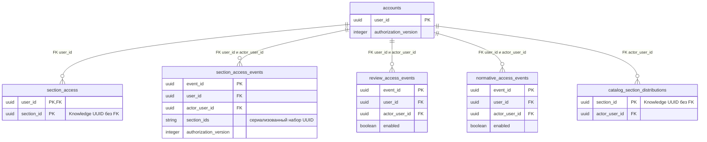
```mermaid
erDiagram
    accounts ||--o{ section_access : "FK user_id"
    accounts ||--o{ section_access_events : "FK user_id и actor_user_id"
    accounts ||--o{ review_access_events : "FK user_id и actor_user_id"
    accounts ||--o{ normative_access_events : "FK user_id и actor_user_id"
    accounts ||--o{ catalog_section_distributions : "FK actor_user_id"
    accounts {
        uuid user_id PK
        integer authorization_version
    }
    section_access {
        uuid user_id PK,FK
        uuid section_id PK "Knowledge UUID без FK"
    }
    section_access_events {
        uuid event_id PK
        uuid user_id FK
        uuid actor_user_id FK
        string section_ids "сериализованный набор UUID"
        integer authorization_version
    }
    review_access_events {
        uuid event_id PK
        uuid user_id FK
        uuid actor_user_id FK
        boolean enabled
    }
    normative_access_events {
        uuid event_id PK
        uuid user_id FK
        uuid actor_user_id FK
        boolean enabled
    }
    catalog_section_distributions {
        uuid section_id PK "Knowledge UUID без FK"
        uuid actor_user_id FK
    }
```

При первом успешном AD-входе или подтверждении внешнего email пользователь получает роль **Проектировщик** (`designer`), уровень `member` и все текущие разделы. Повторный вход не возвращает вручную снятые назначения. Новый раздел автоматически выдаётся всем активным проектировщикам и руководителям; `catalog_section_distributions` делает повтор выдачи безопасным. Администратор имеет все нормативные разделы по политике.

| Операция | Проектировщик | Руководитель | Администратор |
|---|---|---|---|
| Создать/переименовать нормативный раздел | Нет | Да | Да |
| Удалить нормативный документ/раздел | При отдельном разрешении | При отдельном разрешении | Да по умолчанию |
| Изменять Review, решения и сохранять замечания | При отдельном разрешении | Да автоматически | Да автоматически |
| Открыть Базу Опыта | Нет | Да | Да |
| Назначать роли, разделы и права другим пользователям | Нет | Нет | Да |

Галочка **«Доступ к изменению нормативного блока»** добавляет удаление и не снимает прежние права руководителя на создание/переименование. **«Доступ к ревью»** не отменяет проверку владельца/области конкретного анализа. Полномочия вычисляются сервером; скрытая кнопка в UI не является защитой API.

Подробности: [User Service](docs/identity-user-service.md), [разделы и авторы Experience](docs/identity-catalog-experience.md), [доступ к Review](docs/identity-review-access.md).

### 6.4. Auth Service: пароли собственных аккаунтов и сессии

Таблицы находятся в `auth`. Между ними нет SQL FK на пользователей: `user_id` связывается с User Service по API. Пунктир на схеме ниже обозначает эту логическую связь. `rate_limits` — самостоятельные счётчики по хешированному ключу.

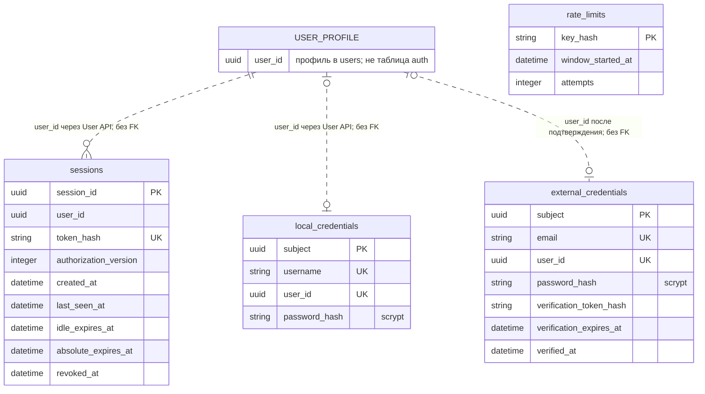
```mermaid
erDiagram
    USER_PROFILE ||..o{ sessions : "user_id через User API; без FK"
    USER_PROFILE o|..o| local_credentials : "user_id через User API; без FK"
    USER_PROFILE o|..o| external_credentials : "user_id после подтверждения; без FK"
    USER_PROFILE {
        uuid user_id "профиль в users; не таблица auth"
    }
    sessions {
        uuid session_id PK
        uuid user_id
        string token_hash UK
        integer authorization_version
        datetime created_at
        datetime last_seen_at
        datetime idle_expires_at
        datetime absolute_expires_at
        datetime revoked_at
    }
    local_credentials {
        uuid subject PK
        string username UK
        uuid user_id UK
        string password_hash "scrypt"
    }
    external_credentials {
        uuid subject PK
        string email UK
        uuid user_id UK
        string password_hash "scrypt"
        string verification_token_hash
        datetime verification_expires_at
        datetime verified_at
    }
    rate_limits {
        string key_hash PK
        datetime window_started_at
        integer attempts
    }
```

Auth сначала узнаёт профиль/источник входа в User Service: локальный пароль проверяется в `auth.local_credentials`, email-пароль — в `auth.external_credentials`, корпоративный — LDAPS bind в AD. После положительного AD-ответа профиль создаётся/обновляется идемпотентно по `(provider_id, namespace, objectGUID)`. Пароль AD не сохраняется **даже в виде хеша**; новая полная аутентификация всегда проверяет его в AD.

Сессия содержит только SHA-256 непрозрачного токена, метаданные и версию прав. Cookie — `Secure`, `HttpOnly`, `SameSite=Lax`; CSRF и точная проверка Origin обязательны. Обычные запросы продлевают `idle_expires_at` до 24 часов, но не дальше `created_at + 30 дней`. После 24 часов простоя или 30 дней от входа нужен пароль; для корпоративной записи — повторная проверка AD. Старые сессии не получают новый абсолютный срок задним числом.

Подробнее: [Auth Service](docs/identity-auth-service.md), [история и политика сессий](docs/analysis-history-and-session-policy.md).

### 6.5. Experience Service: Review, причины отказа, каталог и версии

Все таблицы находятся в `experience`. Review хранится как JSONB-снимок с `revision`/`approved_revision`; решения, предложенные области и причины отказа являются частью снимка. Изменения проходят CAS по `expected_revision`, журнал `experience.review_events` сохраняет автора и детали перехода. `ConfirmedFindingArea` имеет собственную ревизию и историю; область не придумывается при отсутствии координат.

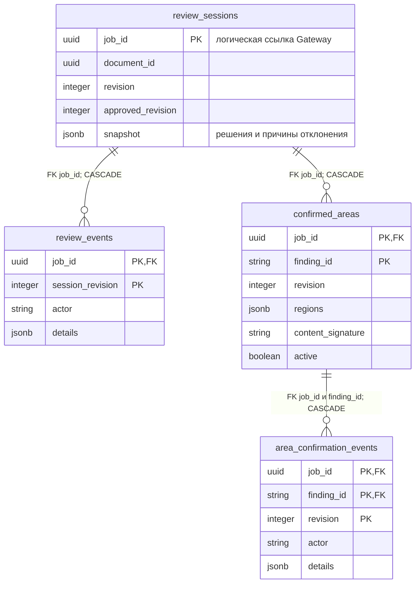
```mermaid
erDiagram
    review_sessions ||--o{ review_events : "FK job_id; CASCADE"
    review_sessions ||--o{ confirmed_areas : "FK job_id; CASCADE"
    confirmed_areas ||--o{ area_confirmation_events : "FK job_id и finding_id; CASCADE"
    review_sessions {
        uuid job_id PK "логическая ссылка Gateway"
        uuid document_id
        integer revision
        integer approved_revision
        jsonb snapshot "решения и причины отклонения"
    }
    review_events {
        uuid job_id PK,FK
        integer session_revision PK
        string actor
        jsonb details
    }
    confirmed_areas {
        uuid job_id PK,FK
        string finding_id PK
        integer revision
        jsonb regions
        string content_signature
        boolean active
    }
    area_confirmation_events {
        uuid job_id PK,FK
        string finding_id PK,FK
        integer revision PK
        string actor
        jsonb details
    }
```

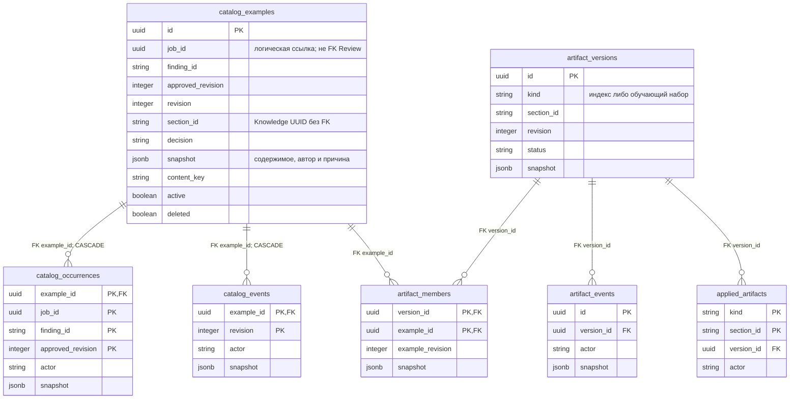
```mermaid
erDiagram
    catalog_examples ||--o{ catalog_occurrences : "FK example_id; CASCADE"
    catalog_examples ||--o{ catalog_events : "FK example_id; CASCADE"
    catalog_examples ||--o{ artifact_members : "FK example_id"
    artifact_versions ||--o{ artifact_members : "FK version_id"
    artifact_versions ||--o{ artifact_events : "FK version_id"
    artifact_versions ||--o{ applied_artifacts : "FK version_id"
    catalog_examples {
        uuid id PK
        uuid job_id "логическая ссылка; не FK Review"
        string finding_id
        integer approved_revision
        integer revision
        string section_id "Knowledge UUID без FK"
        string decision
        jsonb snapshot "содержимое, автор и причина"
        string content_key
        boolean active
        boolean deleted
    }
    catalog_occurrences {
        uuid example_id PK,FK
        uuid job_id PK
        string finding_id PK
        integer approved_revision PK
        string actor
        jsonb snapshot
    }
    catalog_events {
        uuid example_id PK,FK
        integer revision PK
        string actor
        jsonb snapshot
    }
    artifact_versions {
        uuid id PK
        string kind "индекс либо обучающий набор"
        string section_id
        integer revision
        string status
        jsonb snapshot
    }
    artifact_members {
        uuid version_id PK,FK
        uuid example_id PK,FK
        integer example_revision
        jsonb snapshot
    }
    artifact_events {
        uuid id PK
        uuid version_id FK
        string actor
        jsonb snapshot
    }
    applied_artifacts {
        string kind PK
        string section_id PK
        uuid version_id FK
        string actor
    }
```

Постоянный каталог Experience, crop, CRUD и экспорт примеров реализованы. Утверждение Review сохраняет подходящие примеры; изображения вырезает Document Service из проверенного оригинала через Gateway, а Experience хранит их в своём томе независимо от срока жизни оригинала. `catalog_occurrences` сохраняет повторные появления без размножения одинаковых примеров, `catalog_events` — историю правок. Автор отображается как логин, имя и фамилия, роль из User Service; доступна серверная фильтрация по автору. Прямого чтения схемы `users` из Experience нет.

При отклонении сохраняются `decision=rejected`, `reason_category` и комментарий:

| Значение | Причина в UI |
|---|---|
| `false_positive` | Замечание ошибочное |
| `duplicate` | Дублируется |
| `misunderstood_drawing` | Неверно определён объект |
| `wrong_location` | Неверно определено место |
| `wrong_normative_basis` | Неверно применён норматив |
| `not_applicable` | Требование неприменимо |
| `other` | Другая причина |

Причина и комментарий проходят через Review, аудит, каталог и экспорт обучающих данных. Исторические записи без причины остаются читаемыми. Rejected не включаются в Reviewed PDF; `Edited · Bad` требует разрешения `needs_adjudication` и выбора `negative_target=original|revised|both` перед использованием в обучении.

Ручные версии индекса и наборов фиксируют состав/ревизии примеров; подготовка набора не запускает обучение и не меняет веса VLM. Рабочий поиск E остаётся выключенным (`KNOWLEDGE_SERVICE_SEARCH__EXPERIENCE_ENABLED=false`) до отложенной оценки качества.

Документы: [каталог Experience](docs/experience-catalog.md), [версии](docs/experience-versions.md), [индексация](docs/experience-index.md), [причины отказа](docs/normative-access-rejection-feedback.md), [план обучения](docs/experience-roadmap.md).

### 6.6. Admin Service: данные через API, без собственной БД

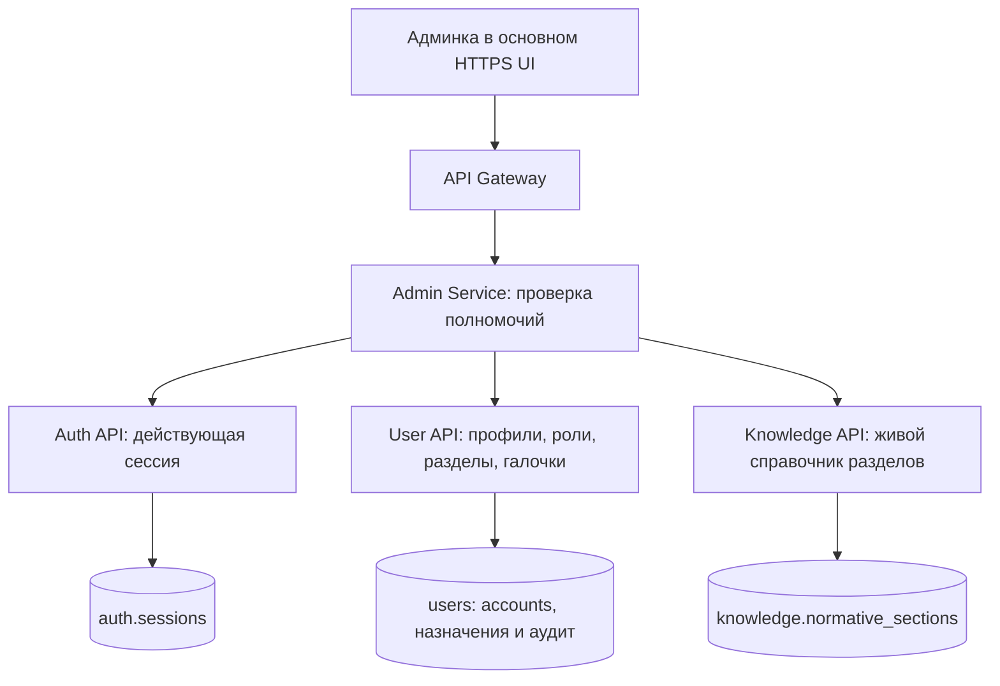
```mermaid
flowchart TD
    UI["Админка в основном HTTPS UI"] --> GW["API Gateway"]
    GW --> ADMIN["Admin Service: проверка полномочий"]
    ADMIN --> AUTH["Auth API: действующая сессия"]
    AUTH --> ADB[("auth.sessions")]
    ADMIN --> USER["User API: профили, роли, разделы, галочки"]
    USER --> UDB[("users: accounts, назначения и аудит")]
    ADMIN --> KNOW["Knowledge API: живой справочник разделов"]
    KNOW --> KDB[("knowledge.normative_sections")]
```

Admin не хранит таблиц и не пишет SQL соседних сервисов. Изменения и аудит фиксирует User Service после повторной проверки автора и `authorization_version`. Управление самим нормативным каталогом выполняется через Gateway → Knowledge с проверкой соответствующих permissions.

### 6.7. Document Service: файлы по запросу, без собственной БД

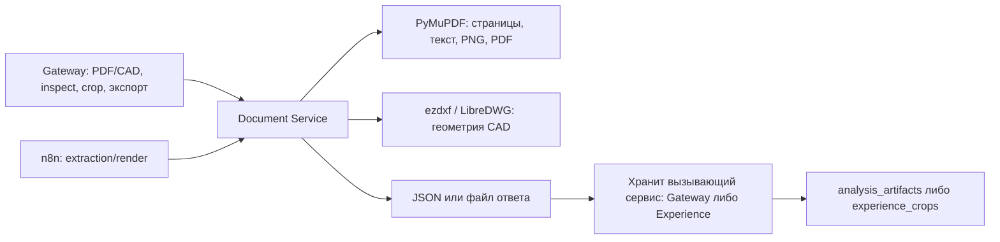
```mermaid
flowchart LR
    GW["Gateway: PDF/CAD, inspect, crop, экспорт"] --> DS["Document Service"]
    N8N["n8n: extraction/render"] --> DS
    DS --> PDF["PyMuPDF: страницы, текст, PNG, PDF"]
    DS --> CAD["ezdxf / LibreDWG: геометрия CAD"]
    DS --> RESPONSE["JSON или файл ответа"]
    RESPONSE --> OWNER["Хранит вызывающий сервис: Gateway либо Experience"]
    OWNER --> FILES["analysis_artifacts либо experience_crops"]
```

Document не владеет PostgreSQL/Qdrant и не создаёт связи таблиц. До создания задания `/internal/v1/pdf/inspect` проверяет количество выбранных страниц: максимум 200. Превышение даёт понятный `422`; большой PDF можно анализировать диапазонами. PDF+CAD остаётся анализом одного выбранного листа.

### 6.8. Analysis Service: VLM и технический кеш, без собственной БД

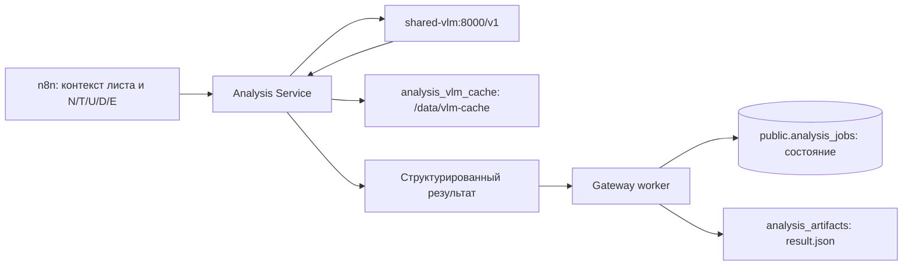
```mermaid
flowchart LR
    N8N["n8n: контекст листа и N/T/U/D/E"] --> AS["Analysis Service"]
    AS --> VLM["shared-vlm:8000/v1"]
    VLM --> AS
    AS --> CACHE["analysis_vlm_cache: /data/vlm-cache"]
    AS --> RESULT["Структурированный результат"]
    RESULT --> GW["Gateway worker"]
    GW --> SQL[("public.analysis_jobs: состояние")]
    GW --> JSON["analysis_artifacts: result.json"]
```

Analysis не владеет SQL-таблицами или Qdrant. Итог и история принадлежат Gateway; кеш VLM не является пользовательской историей. Лимит `MAX_STAGE_PAGES=200` согласован с Document Service.

### 6.9. Общий embedding runtime и прежний multimodal-embedding-service

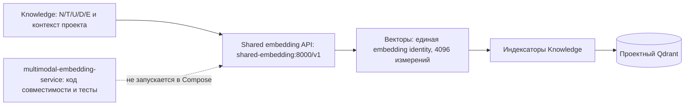
```mermaid
flowchart LR
    KS["Knowledge: N/T/U/D/E и контекст проекта"] --> EMB["Shared embedding API: shared-embedding:8000/v1"]
    EMB --> VEC["Векторы: единая embedding identity, 4096 измерений"]
    VEC --> IDX["Индексаторы Knowledge"]
    IDX --> QD[("Проектный Qdrant")]
    LEGACY["multimodal-embedding-service: код совместимости и тесты"] -. не запускается в Compose .-> EMB
```

Runtime не хранит прикладных таблиц проекта; Qdrant и метаданные индекса принадлежат Knowledge. Веса моделей и хранение shared runtime управляются отдельным стеком shared infrastructure.

## 7. Qdrant — stable aliases и physical collections

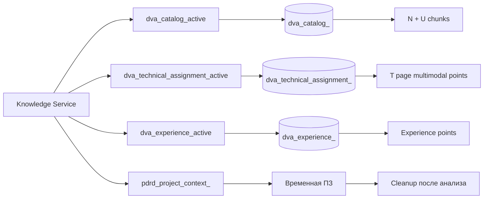
```mermaid
flowchart LR
    KS["Knowledge Service"] --> CA["dva_catalog_active"]
    KS --> TA["dva_technical_assignment_active"]
    KS --> EA["dva_experience_active"]
    KS --> P["pdrd_project_context_<context_id>"]

    CA --> CP[("dva_catalog_<fingerprint>")]
    TA --> TP[("dva_technical_assignment_<fingerprint>")]
    EA --> EP[("dva_experience_<fingerprint>")]

    CP --> NU["N + U chunks"]
    TP --> T["T page multimodal points"]
    EP --> E["Experience points"]

    P --> PP["Временная ПЗ"]
    PP --> CLEAN["Cleanup после анализа"]
```

Stable aliases:

```text
dva_catalog_active
dva_technical_assignment_active
dva_experience_active
```

Physical collection name определяется fingerprint:

```text
fingerprint = sha256(model | dimension | schema_version)[:16]
```

Для текущей `.env.example` логической identity:

```text
PDRD_EMBEDDING_MODEL=shared-embedding
PDRD_EMBEDDING_DIMENSION=4096
PDRD_EMBEDDING_SCHEMA_VERSION=2
```

Физический checkpoint и hardware layout задаются shared-infrastructure; изменение логической identity или схемы векторов требует контролируемой миграции.

### Managed N/U payload

Для PDF point соответствует chunk физической страницы. Для DOC/DOCX сначала создаётся PDF-preview.

```json
{
  "document_id": "<uuid>",
  "section_id": "<uuid>",
  "category_id": "<uuid-or-null>",
  "source_sha256": "<sha256>",
  "source_file": "<original filename>",
  "page": 17,
  "chunk_index": 2,
  "text": "<fragment>"
}
```

`catalog_area` намеренно остаётся source of truth в PostgreSQL.

Перед vector search Knowledge Service:

1. получает IDs из immutable snapshot;
2. проверяет existence;
3. проверяет `section_id`;
4. проверяет `catalog_area`;
5. проверяет `index_status=ready`;
6. строит exact Qdrant filter по `document_id`.

### T payload

Один T point соответствует странице и содержит multimodal representation:

```json
{
  "source_type": "technical_assignment",
  "representation": "page_multimodal",
  "technical_assignment_id": "<uuid>",
  "analysis_document_id": "<uuid>",
  "section_id": "<uuid>",
  "source_file": "ТЗ.pdf",
  "source_sha256": "<sha256>",
  "page": 4,
  "pixel_width": 1240,
  "pixel_height": 1754,
  "normative_refs": [
    "СП 256.1325800.2016"
  ],
  "text": "<page text>"
}
```

### Experience payload

Domain `ExperienceCandidate` описывает отбор из утверждённого Review. Примеры сохраняются в постоянный каталог; выбранные примеры индексируются отдельным worker в ручную версию E. Рабочий retrieval выключен до оценки качества. Состав данных примера после проверки прав и сохранения изображения:

```json
{
  "job_id": "<uuid>",
  "document_id": "<uuid>",
  "source_sha256": "<sha256>",
  "finding_id": "<stable source finding id>",
  "approved_revision": 4,
  "origin": "vlm",
  "tag": "edited",
  "decision": "rejected",
  "learning_use": "needs_adjudication",
  "page_number": 22,
  "issue_regions": [{"x_min": 100, "y_min": 150, "x_max": 300, "y_max": 380}],
  "original_text": "<original VLM interpretation>",
  "text": "<engineer correction>",
  "normative_basis": "<verified or explicitly unverified reference>",
  "crop_asset_id": "<object storage reference>",
  "embedding_text": "<selected trusted search text>"
}
```

`tag=edited` и `decision=rejected` показываются как **Edited · Bad**; они не становятся автоматически положительными/отрицательными обучающими примерами (`needs_adjudication`). `E` не нормативный basis. Pending и записи без подтверждённой области не индексируются. `KNOWLEDGE_SERVICE_SEARCH__EXPERIENCE_ENABLED=false` остаётся до слепой оценки и подключения проверенных рабочих версий.

### Project Context

Временная collection Пояснительной записки конкретного analysis context:

```json
{
  "page": 12,
  "chunk_index": 1,
  "text": "<fragment>"
}
```

ПЗ — контекст проекта, а не нормативное доказательство.

## 8. Blue/green embedding migration

При смене:

```text
PDRD_EMBEDDING_MODEL
PDRD_EMBEDDING_DIMENSION
PDRD_EMBEDDING_SCHEMA_VERSION
```

меняется embedding fingerprint.

```mermaid
flowchart TD
    START["Stack startup"] --> MIG["knowledge-embedding-migrator"]
    MIG --> ID["Compute current fingerprint"]
    ID --> SAME{"Aliases already point\nto current targets?"}

    SAME -->|да| NOOP["Fast no-op"]
    SAME -->|нет| CREATE["Create new physical collections"]

    CREATE --> NU["Reindex persisted N/U files"]
    CREATE --> T["Reindex persisted READY T files"]
    CREATE --> E["Re-embed persisted trusted Experience only if available"]

    NU --> CHECK["All rebuilds succeeded"]
    T --> CHECK
    E --> CHECK

    CHECK --> SWITCH["Atomic alias switch"]
    SWITCH --> CLEAN["Delete obsolete managed/legacy collections"]
```

Source documents не восстанавливаются из старых vectors:

- N/U перечитываются из `normative_documents`;
- T перечитывается из `technical_assignment_documents`;
- metadata читаются из PostgreSQL;
- E после включения доверенного контура переэмбеддится только из сохранённых проверенных payload (в текущем режиме E выключен);
- временные Project Context создаются заново в конкретном analysis run.

Если rebuild падает до cutover:

- текущие aliases не переключаются;
- старый рабочий vector space остаётся доступным;
- незавершённые новые targets очищаются.

## 9. Физическое хранение

```mermaid
flowchart TD
    PG[("PostgreSQL проекта")] --> PGV["postgres_data"]
    QD[("Project Qdrant")] --> QDV["qdrant_data"]
    GW["API Gateway / worker"] --> AV["analysis_artifacts"]
    KS["Knowledge Service / indexer"] --> NV["normative_documents"]
    TIDX["T indexer"] --> TV["technical_assignment_documents"]
    EX["Experience: каталог и Review"] --> PGV
    EX --> CROP["PNG по SHA-256: experience_crops"]
    CROP --> CP["/data/experience/crops"]
    USER["User Service"] --> PGV
    AUTH["Auth Service"] --> PGV
    AS["Analysis Service"] --> VC["analysis_vlm_cache: /data/vlm-cache"]
    EIDX["Experience indexer"] --> EQ["experience_index_quality: /data/experience-quality"]
    PGV --> PGP["/var/lib/postgresql/data"]
    QDV --> QDP["/qdrant/storage"]
    AV --> AP["/data/analyses"]
    NV --> NP["/data/normative"]
    TV --> TP["/data/technical-assignments"]
    VLM["shared-vlm/shared-embedding"] --> SHARED["Хранилище shared runtime: отдельный стек"]
```

| Данные | Docker volume / owner | Путь |
|---|---|---|
| PostgreSQL: `public`, `knowledge`, `users`, `auth`, `experience` | `postgres_data` | `/var/lib/postgresql/data` |
| Qdrant | `qdrant_data` | `/qdrant/storage` |
| Analysis artifacts | `analysis_artifacts` | `/data/analyses` |
| Managed N/U files | `normative_documents` | `/data/normative` |
| T files | `technical_assignment_documents` | `/data/technical-assignments` |
| Shared vLLM/embedding weights | `shared-infrastructure` | Не является volume проекта |
| Изображения примеров Experience | `experience_crops` | `/data/experience/crops/<sha256-prefix>/<sha256>.png` |
| Технический кеш VLM | `analysis_vlm_cache` | `/data/vlm-cache` |
| Отчёты проверки индекса Experience | `experience_index_quality` | `/data/experience-quality` |

Не использовать `docker compose down -v` в обычном деплое: он уничтожает постоянные данные.

## 10. Группировка и локализация замечаний

```mermaid
flowchart TD
    RAW["Completed analysis findings"] --> CLASS{"status=hypothesis?"}
    CLASS -->|да| H["Unverified hypothesis disclosure: no bbox/callout"]
    CLASS -->|нет| LOC["Server-owned page localization"]
    LOC --> HAS{"regions found?"}
    HAS -->|нет| TEXT["Textual review item without invented bbox"]
    HAS -->|да| GROUP["Nearby visual groups: page + object_ref/geometry"]
    GROUP --> SHARED["Shared callout frame for nearby same-object findings"]
    SHARED --> IDS["Each member retains own finding_id, controls and decision"]
    TEXT --> REVIEW["Human Review"]
    IDS --> REVIEW
```

**Реализовано во frontend:** пространственная группировка влияет только на отображение; каждый `finding_id` остаётся независимым в review/DB. Hypothesis не создаёт ложную рамку. Группировка не объединяет доказательства, решения или оригинальные тексты в одну запись. Gold всегда имеет отдельный собственный `finding_id` и исходно выбранные пользователем две области.

**Действия с Gold и VLM:** стороны и углы рамки/карточки растягиваются мышью, Escape отменяет жест. Изменение координат сбрасывает решение в `pending`. Красный крестик отклоняет запись и скрывает её рамку, линию и текст; кнопка над листом отменяет последнее действие. Отдельных кнопок изменения областей и удаления нет. В карточке нет скролла; полный ответ доступен в тултипе. История кнопки Undo живёт до открытия другого отчёта. На закрытом фронте решения, тексты и геометрия сохраняются сервером и восстанавливаются после перезагрузки. Undo создания Gold там записывает rejected, сохраняя аудит; в локальном режиме отменяет добавление. Автоматический PDF эти решения не применяет.

## 11. Полный бизнес-процесс Experience Service

```mermaid
flowchart TD
    A["Completed analysis: immutable source findings"] --> V["Lazy visualization and source PDF"]
    V --> GW["API Gateway: закрытый Review API"]
    GW --> OPEN["Experience OpenReview: original VLM findings pending"]
    OPEN --> UI["Human Review UI: Wise / Bad / Edited / Gold"]
    UI --> EDIT["Edit VLM: original + corrected version; decision resets"]
    UI --> MANUAL["Add Gold: same-page issue and callout rectangles"]
    UI --> DECIDE["Independent decision for every finding"]
    EDIT --> DECIDE
    MANUAL --> DECIDE
    DECIDE --> CAS["ReviewRepository: revision CAS + append-only events"]
    CAS --> ALL{"All decisions recorded?"}
    ALL -->|нет| UI
    ALL -->|да| APPROVE["Explicit approval of current review revision"]
    APPROVE --> PDF["Experience manifest → Gateway → Document Service: Reviewed PDF"]
    PDF --> PAGE["Accepted with location: annotation on original page"]
    PDF --> TEXT["All accepted: textual appended list, including unlocated"]
    APPROVE --> PICK["SelectExperience: separate trusted selection"]
    PICK --> STORE["PostgreSQL catalog + original PDF crops via Document Service"]
    STORE --> INDEX["Knowledge: закрытый feed и индексатор текста + crop"]
    INDEX --> QD[("Коллекция выбранной версии по identity embedding")]
```

**Статусы внедрения:** Human Review UI, `ReviewSession`, PostgreSQL/Alembic,
аудит областей, серверный Review API, Reviewed PDF и постоянный каталог реализованы.
Зелёная галочка атомарно принимает замечание и текущую сохранённую область;
отдельной кнопки подтверждения области нет. Основная страница читает реальные записи.
Логи `376308b` подтвердили Windows/Linux — 1170 passed, 34 skipped и настоящий индекс.
Текущее расширение добавляет компактный каталог, пакетное удаление, SHA-дедупликацию,
ручные версии по разделам нормативки и подготовку наборов дообучения.
Рабочий E выключен до оценки и подключения проверенных версий; обучение VLM ещё предстоит.
Контракты: [индекс](docs/experience-index.md), [версии](docs/experience-versions.md).

## 12. Подтверждение и исправление областей

```mermaid
flowchart TD
    F["VLM finding, stable finding_id"] --> S{"Server-localized region exists?"}
    S -->|нет| U["Unlocated: Review/PDF text; rejected in catalog without crop; no training"]
    S -->|да| C["Show candidate region to engineer"]
    C --> CONF{"Engineer confirms correct location?"}
    CONF -->|нет| FIX["Engineer redraws / corrects region"]
    FIX --> RECONF["Validate page, coordinates, actor, revision"]
    CONF -->|да| RECONF
    RECONF --> AREA["ConfirmedFindingArea: отдельный серверный аудит"]
    AREA --> PICK["SelectExperience candidate"]
    G["Manual Gold"] --> M["User draws issue+callout on the same page"]
    M --> A{"Gold explicitly accepted?"}
    A -->|нет| LOG["Review audit only"]
    A -->|да| PICK
```

`status=located` от локализатора не равен решению инженера. Mapper сохраняет
серверные области в `proposed_regions`; зелёная галочка принимает текущую
сохранённую область вместе с замечанием. PostgreSQL проверяет связь подтверждения
с актуальной редакцией finding. Отдельных кнопок подтверждения и запросов причины
правки области в UI нет. Крестик новую область не подтверждает. Bad без прежней
актуальной области виден в каталоге, но исключён из обучения. Сервер не придумывает
координаты; Gold остаётся на выбранном листе.

## 13. Как будет происходить отбор, отсечение и классификация

```mermaid
flowchart TD
    START["Approved current Review revision"] --> COMPLETE{"Review complete and explicitly approved?"}
    COMPLETE -->|нет| STOP["Stop: no Experience candidates"]
    COMPLETE -->|да| SOURCE{"Source?"}
    SOURCE -->|VLM| VA{"Explicitly confirmed regions?"}
    VA -->|нет| AUDIT["Review audit; accepted text PDF; rejected catalog without crop; no training"]
    VA -->|да| DEC{"Decision and correction"}
    SOURCE -->|Manual Gold| GA{"Gold accepted with valid same-page geometry?"}
    GA -->|нет| AUDIT
    GA -->|да| GOLD["tag=gold, positive candidate"]
    DEC -->|Original accepted| WISE["tag=wise, positive candidate"]
    DEC -->|Original rejected| BAD["tag=bad, negative candidate"]
    DEC -->|Edited accepted| EDIT["tag=edited, positive candidate"]
    DEC -->|Edited rejected| ADJ["tag=edited, decision=rejected: needs_adjudication"]
    WISE --> ASSET["Versioned crop + provenance + normative link"]
    BAD --> ASSET
    EDIT --> ASSET
    GOLD --> ASSET
    ADJ --> HOLD["Store for manual adjudication; never auto-train"]
    HOLD --> ASSET
    ASSET --> DEDUP["Idempotent example_key and source SHA256"]
    DEDUP --> STORE["Experience catalog: immutable source + audited curation"]
    STORE --> INDEX["Инженер выбирает раздел и состав; Knowledge строит ручную версию"]
```

Замечание без подтверждённой области может сохраняться в операционном Review и каталоге Experience; принятое включается в утверждённый текстовый PDF. Для обучающего набора требуется актуальная подтверждённая область, поэтому запись без неё в набор не попадает. Отредактированный VLM имеет `tag=edited`, даже при `decision=rejected`; отдельный `edited-bad` как значение поля не требуется.

В каталоге `edited + rejected` остаётся `needs_adjudication`, пока инженер
не задаст причину и `negative_target=original|revised|both`. Уточнение сохраняется
в аудите; редактирование выбранной исправленной формулировки требует нового уточнения.

## 14. Экспорт Reviewed PDF и обучение

```mermaid
flowchart TD
    REV["Approved revision"] --> LOCK{"Any pending findings or stale approval?"}
    LOCK -->|да| DENY["Block reviewed PDF at API and UI"]
    LOCK -->|нет| FILTER["Include accepted only"]
    FILTER --> PAGE{"Current confirmed VLM region or accepted Gold geometry?"}
    PAGE -->|да| DRAW["Annotation on original PDF page"]
    PAGE -->|нет| NO_BOX["No artificial annotation"]
    DRAW --> REPORT["Text report for every accepted finding"]
    NO_BOX --> REPORT
    REPORT --> CACHE["Separate cache: job + approved_revision + source SHA256 + confirmation digest + renderer version"]
    CACHE --> CHECK["Recheck manifest, access and original PDF before response"]
    CHECK --> CHANGED{"Changed during export?"}
    CHANGED -->|да| CONFLICT["409: reload current Review"]
    CHANGED -->|нет| DOWNLOAD["Download current Reviewed PDF"]
    REV --> SELECT["Verified ExperienceCandidate selection"]
    SELECT --> CROPS["Source PDF crop and full versioned metadata: Experience catalog"]
    CROPS --> INDEX["Knowledge: текст + crop через shared-embedding"]
    INDEX --> EVAL["Blind retrieval evaluation and human checks"]
    EVAL --> FLAG{"Enable E feature flag only after validation"}
    FLAG --> TRAIN["Separate VLM fine-tuning research — not live"]
```

Кнопка «Утвердить и скачать итоговый PDF после Human Review» блокируется при
нерассмотренных замечаниях и незавершённом сохранении. Принятые VLM без
подтверждённой области включаются только в полный текстовый список; Gold —
на лист и в список с одинаковым номером. Отклонённые замечания сохраняются
в операционном аудите, но исключаются из итогового PDF. Подтверждение/отзыв
области меняет ключ кеша независимо от ревизии Review.

## 15. Вход, профиль и серверная сессия

```mermaid
flowchart TD
    B["Браузер: https://pdrd.itcneoterm.local"] --> GW["Nginx → Gateway: доверенный proxy-заголовок"]
    GW --> CHECK["Auth: точный Origin, CSRF, лимит попыток"]
    CHECK --> LOOKUP["User API: профиль и источник аутентификации"]
    LOOKUP --> KIND{"Тип записи"}
    KIND -->|локальный| LOCAL["Auth: scrypt локального пароля"]
    KIND -->|внешний email| EMAIL["Auth: подтверждённый email и scrypt"]
    KIND -->|корпоративный или новый логин| AD["LDAPS: проверка пароля и objectGUID"]
    AD --> PROFILE["User: идемпотентный профиль AD"]
    PROFILE --> FIRST["Первый вход: designer и все текущие разделы"]
    FIRST --> SESSION["Auth: хеш токена и серверная сессия"]
    LOCAL --> SESSION
    EMAIL --> SESSION
    SESSION --> COOKIE["Secure / HttpOnly / SameSite=Lax cookie"]
    COOKIE --> REQUEST["Следующий запрос: сессия и актуальные права"]
    REQUEST --> TIME{"Простой менее 24 ч и возраст менее 30 дней?"}
    TIME -->|да| SLIDE["Продлить idle срок до минимума: сейчас + 24 ч, исходный предел 30 дней"]
    TIME -->|нет| LOGIN["Повторный полный вход"]
```

Неверный пароль не создаёт сессию. Внешняя регистрация подтверждает email до выдачи рабочих прав. Пароль AD используется только для текущего LDAPS-вызова; вместо повторной передачи пароля действующая сессия предъявляет непрозрачный токен.

## 16. История проверок и восстановление результата

```mermaid
flowchart TD
    UI["Личный кабинет / блок истории на главной"] --> GW["GET /api/v1/analyses/history"]
    GW --> AUTH["Auth и User: действующий владелец"]
    AUTH --> SQL[("analysis_jobs: WHERE owner_user_id, затем пагинация")]
    SQL --> SUMMARY["history.json: название, страницы, замечания"]
    SUMMARY --> REVIEW["Текущий статус Review без открытия новой редакции"]
    REVIEW --> LIST["Список собственных проверок"]
    LIST --> OPEN["Открыть ?job_id=..."]
    OPEN --> RESULT["Существующие статус и result.json"]
    RESULT --> EXPIRED{"Исходники уже очищены?"}
    EXPIRED -->|нет| FULL["Отчёт, визуализации, PDF и разрешённый Review"]
    EXPIRED -->|да| TEXT["Текстовый результат и сохранённый Review; пояснение о сроке хранения"]
```

История главной показывает последние пять проверок: под «Базой опыта», а у проектировщика — на её месте. Кабинет показывает собственную историю с пагинацией. Открытие не создаёт новый job и не запускает n8n/VLM. Итоговый Reviewed PDF требует актуальной утверждённой ревизии и права Review.

## 17. Очистка анализов по политике хранения

```mermaid
flowchart TD
    TIMER["api-gateway-outbox: старт и каждый час"] --> SQL[("Завершённые analysis_jobs: пакет до 100")]
    SQL --> LOCK["Повторная проверка владельца и состояния под блокировкой строки"]
    LOCK --> OWNER{"Есть owner_user_id?"}
    OWNER -->|да, прошло 30 дней| KEEP["Сохранить метаданные, request/result/history JSON"]
    KEEP --> REMOVE["Удалить PDF/CAD/ТЗ, visualization PNG и производные PDF"]
    OWNER -->|нет, прошло 7 дней| GUEST["Удалить каталог артефактов гостевого анализа"]
    REMOVE --> T["Knowledge retention API: проверить UUID/SHA256 и другие ссылки на ТЗ"]
    GUEST --> T
    T --> COMMIT["После успешной очистки: отметить владельца либо удалить гостевой job и Outbox"]
    T -->|сбой| RETRY["Повторить в следующем проходе"]
    REVIEW["Review / Experience и собственные crop"] -. сохраняются бессрочно .-> KEEP
```

Доступ по гостевой ссылке заканчивается через 24 часа независимо от времени фоновой очистки. Очистка не обрабатывает pending/queued/processing и не удаляет нормативную базу, личные пакеты или изображения Experience.

# Как работает retrieval

## N — normative retrieval

Snapshot содержит `document_ids`.

Knowledge Service допускает только документы:

- существующие;
- из выбранного section;
- `catalog_area=normative`;
- `index_status=ready`.

После этого Qdrant ищет только по exact IDs.

Найденные источники получают локальные IDs:

```text
N1, N2, N3, ...
```

## T — Technical Assignment retrieval

Если snapshot содержит `technical_assignment_id`, workflow вызывает:

```text
/internal/v1/search/technical-assignment-guided
```

Guided retrieval выполняет:

```text
query
  -> T multimodal search
  -> extract/use normative_refs and T context
  -> targeted N retrieval
  -> general N retrieval
  -> merge without changing source roles
```

Возвращаются отдельно:

```text
technical_assignment_sources
normative_sources
targeted_normative_sources
general_normative_sources
reference_resolutions
conflict_candidates
diagnostics
```

`conflict_candidates` — это T/N пары, которые Analysis Service должен оценить семантически, а не считать конфликтом только по строковому совпадению.

## U — User Package retrieval

Snapshot отдельно содержит `user_package_document_ids`.

Допускаются только документы:

- существующие;
- из того же section;
- `catalog_area=user_package`;
- `index_status=ready`.

Найденные источники получают IDs:

```text
U1, U2, U3, ...
```

## E — Experience retrieval

Контракт Experience search вызывается после requirement check по `experience_query`, но **в текущей конфигурации фактический поиск выключен** (`KNOWLEDGE_SERVICE_SEARCH__EXPERIENCE_ENABLED=false`). Включение только после сохранения подтверждённых crop/metadata, trusted E indexing и проверки качества. E никогда не становится нормативным basis.

Ручные версии индекса Human Review строятся отдельным процессом Knowledge.
Он получает актуальные примеры через закрытый HTTP Experience, векторизует текст
с PNG области и повторно проверяет редакцию перед записью/выдачей. Операторский
preview не включает E в обычный анализ. Отложенного размеченного набора пока нет;
полная приёмка требует парного эксперимента и совместимого отчёта качества.
Схема, критерии и развёртывание: [docs/experience-index.md](docs/experience-index.md).
Выбор состава, нормативных разделов и наборов дообучения:
[docs/experience-versions.md](docs/experience-versions.md).

# Формирование N/T/U JSON

## Retrieval JSON

Типы источников передаются независимо:

```json
{
  "normative_sources": [
    {
      "source_id": "N1",
      "point_id": "<qdrant-point>",
      "score": 0.86,
      "document_id": "<uuid>",
      "section_id": "<uuid>",
      "category_id": "<uuid-or-null>",
      "source_sha256": "<sha256>",
      "source_file": "СП 256.1325800.2016.pdf",
      "page": 17,
      "chunk_index": 2,
      "text": "<normative fragment>"
    }
  ],
  "technical_assignment_sources": [
    {
      "source_id": "T1",
      "point_id": "<qdrant-point>",
      "score": 0.83,
      "technical_assignment_id": "<uuid>",
      "analysis_document_id": "<uuid>",
      "section_id": "<uuid>",
      "source_sha256": "<sha256>",
      "source_file": "Техническое задание.pdf",
      "page": 4,
      "text": "<T requirement>",
      "normative_refs": [
        "СП 256.1325800.2016"
      ]
    }
  ],
  "user_package_sources": [
    {
      "source_id": "U1",
      "point_id": "<qdrant-point>",
      "score": 0.79,
      "document_id": "<uuid>",
      "section_id": "<uuid>",
      "category_id": "<uuid-or-null>",
      "source_sha256": "<sha256>",
      "source_file": "Требования заказчика.pdf",
      "page": 2,
      "chunk_index": 0,
      "text": "<user requirement>"
    }
  ]
}
```

`source_id` является typed local evidence ID текущего analysis context.

## FindingDraft

VLM получает отдельные N/T/U blocks и возвращает ссылки только на IDs из текущего retrieval context.

Пример T-backed finding:

```json
{
  "finding_id": "F1",
  "page": 3,
  "page_type": "scheme",
  "category": "customer_requirements",
  "severity": "warning",
  "status": "confirmed",
  "comment": "На листе отсутствует обозначение, требуемое техническим заданием.",
  "evidence": "На анализируемом листе обозначение не обнаружено.",
  "recommendation_draft": "Добавить обозначение в соответствии с ТЗ.",
  "confidence": 0.91,

  "normative_source_ids": [],
  "technical_assignment_source_ids": [
    "T1"
  ],
  "user_package_source_ids": [],

  "basis": "Требование технического задания.",
  "experience_query": "Проверка оформления обозначений"
}
```

Backend материализует IDs только через текущие retrieval candidates. Произвольный `N99/T99/U99`, которого не было в retrieval context, не должен превращаться в источник.

## Typed evidence materialization

```json
{
  "finding_id": "F1",
  "category": "customer_requirements",
  "basis_sources": [],
  "technical_assignment_basis_sources": [
    {
      "source_id": "T1",
      "technical_assignment_id": "<uuid>",
      "source_file": "Техническое задание.pdf",
      "page": 4,
      "text": "<T requirement>"
    }
  ],
  "user_package_basis_sources": []
}
```

## Finding-local normative enrichment

После первичного requirement check инженерное замечание не удаляется из-за отсутствия N.

Для каждого finding может выполняться отдельный targeted N retrieval:

```text
finding
  -> finding-local normative query
  -> N candidates
  -> semantic validation/finalization
```

Пример:

```text
T1
  -> упоминание/смысл СП 256
  -> targeted normative retrieval
  -> N4
```

После подтверждения:

```json
{
  "finding_id": "F1",
  "category": "normative_control",
  "basis_sources": [
    {
      "source_id": "N4",
      "source_file": "СП 256.1325800.2016.pdf",
      "page": 17,
      "text": "<validated normative fragment>"
    }
  ],
  "technical_assignment_basis_sources": [
    {
      "source_id": "T1",
      "source_file": "Техническое задание.pdf",
      "page": 4,
      "text": "<project requirement>"
    }
  ]
}
```

Здесь `T1` остаётся T-source, а нормативное утверждение подтверждает `N4`.

## FinalFinding

Финальный finding хранит источники раздельно:

```json
{
  "finding_id": "F1",
  "page": 3,
  "page_type": "scheme",
  "category": "normative_control",
  "severity": "warning",
  "status": "confirmed",
  "comment": "<finding>",
  "evidence": "<drawing evidence>",
  "recommendation": "<recommendation>",
  "confidence": 0.93,
  "basis": "<human-readable basis>",

  "basis_sources": [
    {
      "source_id": "N1"
    }
  ],
  "technical_assignment_basis_sources": [
    {
      "source_id": "T1"
    }
  ],
  "user_package_basis_sources": [
    {
      "source_id": "U1"
    }
  ],
  "experience_sources": [
    {
      "source_id": "E1"
    }
  ]
}
```

# Пояснительная записка

```mermaid
flowchart TD
    RANGE["Диапазон страниц ПЗ"] --> TEXT["Text extraction"]
    TEXT --> VALID["Classification"]
    VALID -->|не ПЗ| REJECT["Reject"]
    VALID -->|ПЗ| CHUNK["Chunking"]
    CHUNK --> EMB["Unified Embeddings"]
    EMB --> TEMP[("Temporary Project Context")]
    PAGE["Анализируемый лист"] --> QUERY["Context query"]
    QUERY --> TEMP
    TEMP --> SOURCES["Relevant fragments"]
    SOURCES --> CHECK["N/T/U check"]
    CHECK --> CLEAN["Cleanup"]
    CLEAN --> DELETE["Delete temporary collection"]
```

Project Context помогает понять проект, но не становится N/T/U evidence.

# Управляемый каталог

## Lifecycle N/U документа

```text
upload
  ↓
uploaded
  ↓
queued
  ↓
indexing
  ├──→ ready
  └──→ failed
```

Из `failed` документ можно повторно поставить в queue.

Удаление переводит document в `deleting`, затем удаляет:

1. Qdrant points по `document_id`;
2. original file;
3. Word PDF-preview;
4. SQL metadata.

## System prompt

Используются три уровня:

```text
NORMATIVE_SUPER_SYSTEM_PROMPT
        +
section.system_prompt
        +
transient working override / dynamic context
```

`NORMATIVE_SUPER_SYSTEM_PROMPT` хранится в коде.

`section.system_prompt` хранится в PostgreSQL.

Transient working prompt применяется к конкретному анализу без сохранения как новый system prompt.

# Пользовательские пакеты документов

Личные пакеты принадлежат авторизованному пользователю (`owner_user_id`) и связаны с назначенным ему нормативным разделом. Для категорий и документов используется:

```text
catalog_area=user_package
owner_user_id=<UUID текущего пользователя из проверенной сессии>
```

Gateway определяет владельца по сессии, проверяет область доступа и передаёт Knowledge только допустимые UUID. Поле владельца от браузера не принимается как доказательство прав. Гостю личные пакеты недоступны; чужие пакеты не открываются даже по известному UUID.

Frontend позволяет:

- создать пакет/папку;
- создать вложенную папку;
- загрузить PDF/DOC/DOCX;
- автоматически поставить документ в indexing queue;
- открыть PDF или Word PDF-preview;
- перемещать документы;
- удалять документы/папки;
- выбирать отдельные READY документы;
- выбирать все READY package docs;
- очищать selection.

# Публичный API

## Анализ

```text
POST /api/v1/analyses
GET  /api/v1/analyses/history                 # собственная история с пагинацией
GET  /api/v1/analyses/{job_id}
GET  /api/v1/analyses/{job_id}/result
GET  /api/v1/analyses/{job_id}/progress
POST /api/v1/analyses/{job_id}/cancel
GET  /api/v1/analyses/{job_id}/visualization
GET  /api/v1/analyses/{job_id}/annotated-pdf  # PDF с автоматическими замечаниями
POST /api/v1/analyses/{job_id}/reviewed-pdf  # закрытый Review frontend, JSON: expected_revision
```

Multipart analysis fields включают:

```text
pdf
cad
pages
use_explanatory_note
note_start_page
note_end_page
normative_section_id
normative_document_ids
user_package_document_ids
normative_prompt_override_enabled
normative_prompt_override
technical_assignment
```

Точная форма T upload определяется public analysis schema/frontend contract; внутри immutable snapshot сохраняется `technical_assignment_id`.

## Вход, личный кабинет и админка

```text
GET    /api/v1/auth/session
POST   /api/v1/auth/login
POST   /api/v1/auth/register
POST   /api/v1/auth/verify-email
POST   /api/v1/auth/logout
POST   /api/v1/auth/logout-all
GET    /api/v1/auth/sessions
DELETE /api/v1/auth/sessions/{session_id}
GET    /api/v1/users/me

GET    /api/v1/admin/users
GET    /api/v1/admin/users/section-catalog
GET    /api/v1/admin/users/{user_id}/section-access
GET    /api/v1/admin/users/{user_id}/roles
PATCH  /api/v1/admin/users/{user_id}/role
PATCH  /api/v1/admin/users/{user_id}/review-access
PATCH  /api/v1/admin/users/{user_id}/normative-access
```

Gateway проксирует только разрешённые действия. Изменения требуют действующей сессии, CSRF/Origin и соответствующих permissions; `authorization_version` защищает административные правки от перезаписи. Внутренний `/internal/v1/*` API сервисов не публикуется в браузер.

## Управляемый нормативный каталог

```text
GET    /api/v1/normative/sections
POST   /api/v1/normative/sections
GET    /api/v1/normative/sections/{section_id}
PATCH  /api/v1/normative/sections/{section_id}
DELETE /api/v1/normative/sections/{section_id}

GET    /api/v1/normative/sections/{section_id}/categories
POST   /api/v1/normative/sections/{section_id}/categories
GET    /api/v1/normative/categories/{category_id}
PATCH  /api/v1/normative/categories/{category_id}
DELETE /api/v1/normative/categories/{category_id}

GET    /api/v1/normative/sections/{section_id}/documents
POST   /api/v1/normative/sections/{section_id}/documents
GET    /api/v1/normative/documents/{document_id}
PATCH  /api/v1/normative/documents/{document_id}
DELETE /api/v1/normative/documents/{document_id}

POST   /api/v1/normative/documents/{document_id}/index
GET    /api/v1/normative/documents/{document_id}/content
```

## Личные пакеты

```text
GET    /api/v1/normative/sections/{section_id}/user-packages/categories
POST   /api/v1/normative/sections/{section_id}/user-packages/categories

GET    /api/v1/normative/user-packages/categories/{category_id}
PATCH  /api/v1/normative/user-packages/categories/{category_id}
DELETE /api/v1/normative/user-packages/categories/{category_id}

GET    /api/v1/normative/sections/{section_id}/user-packages/documents
POST   /api/v1/normative/sections/{section_id}/user-packages/documents

GET    /api/v1/normative/user-packages/documents/{document_id}
PATCH  /api/v1/normative/user-packages/documents/{document_id}
DELETE /api/v1/normative/user-packages/documents/{document_id}

POST   /api/v1/normative/user-packages/documents/{document_id}/index
GET    /api/v1/normative/user-packages/documents/{document_id}/content
```

## Просмотр ТЗ

Кликабельный T-source открывается через Gateway:

```text
GET /api/v1/normative/technical-assignments/{technical_assignment_id}/content
```

Browser не обращается к internal Knowledge/Experience API напрямую. Закрытый Review API доступен через Gateway на основном HTTPS-фронте с проверкой сессии, права Review и владельца/области; Reviewed PDF доступен только для текущей утверждённой редакции. Постоянный каталог Experience, crop, CRUD и экспорт примеров реализованы через закрытый Gateway API. Примеры с отозванным подтверждением или изменённым Review сохраняются для аудита, но становятся неактуальными и исключаются из пригодного для обучения набора.

# Рабочие процессы n8n

Repository:

```text
n8n/workflows/
├── analysis-v2-pdf.json
├── analysis-v2-cad.json
└── analysis-v2-pdf-cad.json
```

В V2 PDF выполняются stage-scoped операции с последовательной обработкой страниц тяжёлых этапов; CAD/PDF+CAD сохраняют свои source-mode правила. Общий requirement path:

```text
Page understanding
  -> Build Normative Queries
  -> Search Requirements
       ├─ no T -> normative search
       └─ T    -> technical-assignment-guided search
  -> Normalize Requirement Search
  -> Search User Packages
  -> Check Norms
  -> Prepare Finding Normative Queries
  -> Search Finding Norms
  -> Search Experience (выключен до оценки на отложенных документах)
  -> Group/Finalize Findings
```

`Check Norms` получает typed sources отдельно:

```json
{
  "normative_sources": [],
  "technical_assignment_sources": [],
  "conflict_candidates": [],
  "user_package_sources": []
}
```

n8n не присваивает T/U нормативную роль. Он только переносит typed data между сервисами.

Transient HTTP errors на GPU-dependent retrieval nodes должны иметь bounded retry policy; основная resource-serialization логика остаётся в backend GPU coordinator, а не в workflow.

Workflow обновляются и публикуются вручную через n8n UI.

# Политика хранения файлов и результатов

Основное хранилище анализа — **`/data/analyses/<document_id>`** в томе `analysis_artifacts`. Владелец определяется сохранённым `owner_user_id`, а не наличием cookie у читателя.

| Данные | Авторизованный анализ с владельцем | Гостевой анализ без владельца |
|---|---|---|
| Метаданные задания и неизменяемый снимок нормативов | Бессрочно | 7 дней |
| `request.json`, `result.json`, `history.json` | Бессрочно | 7 дней |
| Human Review и история изменений | Бессрочно | Новым гостям Review недоступен; ранее сохранённые данные не очищаются |
| Experience, примеры, версии и собственные crop PNG | Бессрочно | Ранее сохранённые записи Experience не затрагиваются |
| Исходные PDF/CAD/ТЗ (`pdf.bin`, `cad.bin`, `technical_assignment.bin`) | 30 дней | 7 дней |
| Визуализации PNG и кеши производных PDF, включая Reviewed PDF | 30 дней | 7 дней |
| Доступ по гостевой ссылке | Не используется | 24 часа |

Срок считается от `analysis_jobs.created_at` в UTC, включая точную границу 30/7 дней. Старые записи без `owner_user_id` считаются гостевыми. Незавершённые `pending`, `queued`, `processing` сохраняются независимо от возраста. Истечение гостевой ссылки проверяется API: хранение файла ещё шесть дней не продлевает доступ.

Очистка выполняется существующим `api-gateway-outbox` сразу при старте и затем раз в час, пакетами по 100; публикация очереди продолжает работать независимо. Под блокировкой строки повторно проверяются состояние и владелец. Сначала удаляются файлы, затем фиксируется `source_artifacts_deleted_at` либо удаляется гостевой job с каскадным Outbox. Частичный сбой оставляет задание для повторного прохода; удаление идемпотентно. Миграции добавляют отметки и **не удаляют файлы при применении**.

Копия ТЗ в `/data/technical-assignments` очищается через закрытый Knowledge API с отдельным `PDRD_RETENTION_INTERNAL_KEY`, проверкой UUID/SHA256 и ссылок других анализов. Активное или свежее задание сохраняет общий источник. У владельца сохраняются метаданные и индексированные требования ТЗ; у последнего гостевого задания без ссылок владельцев удаляются также метаданные и точки этого ТЗ. Общая коллекция Qdrant не удаляется. ТЗ, загруженное без созданного анализа, относится к отдельному процессу.

После 30 дней пользователь по-прежнему открывает историю, текст результата и существующий Human Review **без повторного VLM-анализа**. UI объясняет удаление исходников и скрывает PDF-кнопки; недоступный экспорт/источник ТЗ возвращает ожидаемый `410`. Создать новый Review или новые crop без исходного PDF нельзя. Каталог нормативов/личных пакетов и самостоятельное хранилище Experience не входят в автоматическую очистку анализов.

Технический VLM-кеш, отчёты качества индексов, архивы и резервные копии не являются артефактами анализа и регулируются отдельно. Эта политика описывает рабочие данные, не срок жизни backup. Подробности и тестовые сценарии: [docs/analysis-retention.md](docs/analysis-retention.md).

# Структура проекта

Показаны основные каталоги и действующие точки запуска; внутри backend сохраняется разделение `transport → application → domain`, адаптеры находятся в `infrastructure`.

```text
PDRD-validation/
├── frontend/
│   ├── Dockerfile
│   ├── nginx.conf                     # маршруты Gateway и серверные proxy-заголовки
│   ├── src/
│   │   ├── index.html                 # анализ, нормативы, пакеты, история и Review
│   │   ├── account.html               # профиль, сессии и история проверок
│   │   ├── admin.html                 # пользователи, роли, разделы и права
│   │   ├── experience.html            # каталог, индексные версии и обучающие наборы
│   │   ├── css/
│   │   └── js/
│   │       ├── app.js
│   │       ├── config.js
│   │       ├── components/
│   │       └── features/
│   │           ├── account/
│   │           ├── admin/
│   │           ├── analysis/
│   │           ├── auth/
│   │           ├── experience/
│   │           ├── normative/
│   │           ├── portal/
│   │           ├── review/
│   │           └── technical_assignment/
│   └── tests/                         # функциональные проверки интерфейса через Node
├── services/
│   ├── api-gateway/                   # public: задания, история, Outbox, очистка
│   ├── document-service/              # извлечение/рендеринг PDF/CAD; без SQL
│   ├── knowledge-service/             # knowledge: N/U/T, Qdrant и индексаторы
│   ├── analysis-service/              # VLM pipeline и кеш; без SQL
│   ├── user-service/                  # users: профили, роли, разделы и аудит
│   ├── auth-service/                  # auth: LDAPS, локальные пароли и сессии
│   ├── admin-service/                 # административные сценарии через API; без SQL
│   ├── experience-service/            # experience: Review, каталог и версии
│   └── multimodal-embedding-service/  # прежний код для совместимости и тестов
│       # у каждого сервиса: src/<пакет>/ и tests/
│       # у владельцев PostgreSQL: alembic/ и alembic.ini
├── n8n/workflows/
│   ├── analysis-v2-pdf.json
│   ├── analysis-v2-cad.json
│   └── analysis-v2-pdf-cad.json
├── data/knowledge/experience/cases/   # исходные наборы примеров
├── docs/                             # подробные контракты и приёмка подсистем
├── ops/
│   ├── certificates/                 # CA bundle AD и локальные файлы сертификатов
│   ├── check-quality.ps1             # общий Windows quality gate
│   ├── Dockerfile.quality
│   ├── compose.user-test.yaml         # изолированные PostgreSQL-проверки
│   ├── compose.auth-test.yaml
│   ├── compose.gateway-test.yaml
│   ├── compose.knowledge-test.yaml    # PostgreSQL и Qdrant проверки
│   └── compose.experience-test.yaml
├── scripts/
│   ├── up.sh                         # сборка, миграции и запуск выбранных профилей
│   ├── check-stack.sh                # готовность, конфигурация и актуальность миграций
│   ├── create-superuser.sh            # интерактивный локальный администратор
│   ├── check_auth_runtime.py          # проверка корпоративного входа
│   ├── configure_auth_origin.py       # согласование публичного HTTPS Origin
│   ├── migrate-embedding-indexes.sh   # смена embedding identity
│   ├── build_experience_cases.py
│   └── lib/                          # проверки общей инфраструктуры
├── tests/
│   ├── architecture/
│   └── runtime/
├── .env.example                      # полный каталог настроек без рабочих секретов
├── compose.yaml
├── pyproject.toml
├── requirements-dev.txt
└── README.md
```

# Конфигурация

`.env.example` — версионируемый полный каталог настроек и значений по умолчанию. `.env` — закрытые **секреты и необходимые переопределения окружения**, не копия `.env.example`. Рабочие секреты и закрытые ключи сертификатов не коммитятся. Приоритет: `.env.example` → `.env` → окружение процесса; Compose дополнительно задаёт межсервисные адреса и связанные ключи в `environment`.

## Обязательные секреты в `.env`

Для текущего рабочего контура с `identity,auth,review` нужны общие секреты и все строки соответствующих профилей. Не оставлять пустые значения или `change-me`/`replace-me`.

| Переменная | Когда обязательна | Назначение |
|---|---|---|
| `PDRD_POSTGRES_PASSWORD` | Всегда | Пароль PostgreSQL проекта; Compose передаёт его каждому владельцу схемы |
| `PDRD_RABBITMQ_PASSWORD` | Всегда | Пароль уже существующего пользователя RabbitMQ в shared infrastructure |
| `PDRD_RETENTION_INTERNAL_KEY` | Всегда при `scripts/up.sh` | Отдельный ключ Gateway → Knowledge для очистки копии ТЗ |
| `USER_SERVICE_INTERNAL_KEY` | `identity` | Закрытый API профилей, ролей, разделов и аудита |
| `AUTH_SERVICE_HTTP__INTERNAL_KEY` | `auth` | Закрытая проверка сессий Auth из Gateway/Admin |
| `AUTH_SERVICE_HTTP__CSRF_KEY` | `auth` | Защита CSRF в браузерной аутентификации |
| `PDRD_FRONTEND_PROXY_KEY` | `auth` | Подтверждение доверенного frontend-прокси в Gateway |
| `PDRD_TECHNICAL_ASSIGNMENT_ACCESS_KEY` | `auth` | Защита служебного доступа к ТЗ |
| `AUTH_SERVICE_EMAIL__SMTP_USER` | `auth` | Учётная запись отправителя подтверждения email |
| `AUTH_SERVICE_EMAIL__SMTP_PASSWORD` | `auth` | Пароль SMTP, для Yandex — пароль приложения |
| `API_GATEWAY_REVIEW__UI_KEY` | `review` | Канал Nginx → Gateway для закрытых Review/Experience маршрутов |
| `API_GATEWAY_REVIEW__INTERNAL_KEY` | `review` | Отдельный канал Gateway → Experience |
| `PDRD_EXPERIENCE_INDEX_KEY` | `experience-index` / ручная индексация | Закрытый канал Knowledge indexer → Experience |

Служебные ключи генерировать независимо, длиной не менее 32 символов. Два ключа Review **обязательно различаются** и допускают только `A–Z`, `a–z`, `0–9`, `_`, `-` при длине 32–256. `secrets.token_urlsafe(48)` подходит; запускать отдельно для каждого ключа и сохранять результат только в закрытый `.env`:

```powershell
.\.venv\Scripts\python.exe -c "import secrets; print(secrets.token_urlsafe(48))"
```

На Linux та же команда выполняется через `python3`. Рабочие ключи не публикуются в JS, ответах API, Git или логах. AD-пароль не является параметром `.env`: он вводится пользователем при полном входе и не сохраняется в PDRD. Пароль локального администратора задаётся интерактивно, не через переменную окружения.

Не нужно дублировать ключи под всеми именами сервисов: Compose уже передаёт `USER_SERVICE_INTERNAL_KEY` в Auth/Admin, `AUTH_SERVICE_HTTP__INTERNAL_KEY` в Gateway/Admin, Review internal key в Experience, `PDRD_EXPERIENCE_INDEX_KEY` в индексатор и Experience, `PDRD_RETENTION_INTERNAL_KEY` в Gateway/Knowledge. Сервисные `*_DATABASE__PASSWORD` и `*_BROKER__PASSWORD` получают общие пароли проекта.

## Обязательные параметры окружения, не являющиеся секретами

Для основного контура:

```dotenv
COMPOSE_PROFILES=identity,auth,review
API_GATEWAY_IDENTITY_PROXY__ENABLED=true
API_GATEWAY_IDENTITY_PROXY__AUTHORIZATION_ENABLED=true
AUTH_SERVICE_HTTP__PUBLIC_ORIGIN=https://pdrd.itcneoterm.local
AUTH_SERVICE_EMAIL__PUBLIC_BASE_URL=https://pdrd.itcneoterm.local
AUTH_SERVICE_EMAIL__FROM_EMAIL=<реальный-адрес-отправителя>
API_GATEWAY_REVIEW__ENABLED=true
API_GATEWAY_REVIEW__CONTROLLED_ACCESS=true
API_GATEWAY_REVIEW__ACTOR=pdrd-operator
```

`API_GATEWAY_REVIEW__ACTOR` — серверный идентификатор совместимости закрытого канала, не пароль и не роль посетителя. При включённой авторизации автор берётся из подтверждённой сессии. Допускается 1–128 символов `A–Z`, `a–z`, `0–9`, `:`, `@`, `.`, `_`, `-`.

Для корпоративного входа дополнительно `AUTH_SERVICE_ENABLED=true` и доверенный публичный CA bundle в `ops/certificates/ad-ca.pem`. Имя контроллера, base DN и LDAPS-параметры находятся в `.env.example`. LDAP-соединение проверяет сертификат и имя сервера; системное доверие CA хоста не передаётся контейнеру автоматически. Без AD локальный администратор продолжает использовать собственный пароль. Профиль `auth` требует SMTP-реквизиты: текущий Compose включает email-регистрацию.

Для ручного индексатора добавить `experience-index` в список профилей и задать `PDRD_EXPERIENCE_INDEX_KEY`. Это **не включает** поиск E автоматически. Сохраняется `KNOWLEDGE_SERVICE_SEARCH__EXPERIENCE_ENABLED=false` до проверки качества.

Публичный Origin и адрес email-ссылок должны совпадать с HTTPS-адресом браузера. Cookie `Secure` включена в рабочем Compose; CSRF и строгая проверка Origin сохраняются, исключение для HTTP не предусмотрено. Параметры HTTPS-прокси и сертификаты обслуживаются инфраструктурой; `.env` не устанавливает TLS сам по себе.

## Сессии и лимиты страниц

```dotenv
AUTH_SERVICE_SESSIONS__IDLE_TIMEOUT_SECONDS=86400
AUTH_SERVICE_SESSIONS__ABSOLUTE_TIMEOUT_SECONDS=2592000
DOCUMENT_SERVICE_PDF__MAX_ANALYSIS_PAGES=200
ANALYSIS_SERVICE_PIPELINE__MAX_STAGE_PAGES=200
```

Эти значения уже заданы в `.env.example`. Если в рабочем `.env` остались прежние переопределения, обновить их: иначе они перекроют новые defaults. Новый срок сессии действует после повторного входа; выбор свыше 200 PDF-страниц отклоняется до создания job понятным ответом `422`.

## Модели и поиск

Единая embedding identity:

```dotenv
PDRD_EMBEDDING_MODEL=shared-embedding
PDRD_EMBEDDING_DIMENSION=4096
PDRD_EMBEDDING_SCHEMA_VERSION=2
```

Физическая модель и размещение GPU управляются shared infrastructure. Смена логической модели, размерности или версии схемы требует контролируемой переиндексации и переключения fingerprint.

| Настройка | Значение по умолчанию |
|---|---|
| Нормативные и пользовательские файлы | `/data/normative` |
| Alias Qdrant N/U | `dva_catalog_active` |
| Alias Qdrant ТЗ | `dva_technical_assignment_active` |
| Alias Qdrant Experience | `dva_experience_active` |
| Временный контекст проекта | префикс `pdrd_project_context` |
| Очередь N/U | `pdrd.knowledge.indexing` |
| VLM API / логическая модель | `http://shared-vlm:8000/v1` / `shared-vlm` |
| Embedding API / логическая модель | `http://shared-embedding:8000/v1` / `shared-embedding` |
| Блокировка GPU, где применяется | `/var/lock/pdrd-gpu/gpu.lock` |
| Поиск E | Выключен до отложенной оценки качества |

# Запуск и обновление

Требуются Docker Engine и Docker Compose plugin. Shared network `ai-shared` предоставляет RabbitMQ, n8n, `shared-vlm` и `shared-embedding`; их жизненный цикл независим от проекта. Рабочие `.env`, DNS/TLS и доверие CA подготавливаются до запуска. Изменения проверяются общим и изолированными тестами из следующего раздела.

Штатный запуск/пересборка и проверка выполняются существующими скриптами:

```bash
cd ~/projects/PDRD-validation || exit 1
git status --short
git pull --ff-only
bash scripts/up.sh
bash scripts/check-stack.sh
```

Перед pull рабочая копия должна быть чистой; ветка сервера должна соответствовать проверенной опубликованной ветке. `up.sh` читает `.env`, проверяет обязательные параметры/shared infrastructure, собирает сервисы, выполняет миграции и запускает выбранные профили. `check-stack.sh` проверяет готовность и версии миграций Gateway, Knowledge, User, Auth и Experience по включённым профилям. `knowledge-embedding-migrator` проверяет embedding fingerprint до старта Knowledge runtime. Новый отдельный deploy-скрипт для истории/хранения не нужен.

## Адрес проекта и HTTPS

**Открыть [https://pdrd.itcneoterm.local/](https://pdrd.itcneoterm.local/)**.

Внутренний DNS и корпоративный TLS-прокси обеспечивают этот адрес; сертификат веб-сервера выдан для `pdrd.itcneoterm.local`, цепочка корпоративного CA должна быть доверенной на рабочих станциях. Пользователю не нужно подключаться к серверу, создавать SSH-туннель или загружать личный сертификат.

HTTP `192.168.55.3:8080` — адрес upstream существующего frontend для HTTPS-прокси и диагностики, **не адрес входа с паролем**. Публичная схема:

```mermaid
flowchart LR
    B["Браузер в корпоративной сети"] -->|HTTPS :443| TLS["pdrd.itcneoterm.local: корпоративный TLS-прокси"]
    TLS -->|HTTP upstream :8080| FE["Существующий frontend / Nginx"]
    FE -->|app-net| GW["API Gateway"]
    GW --> AUTH["Auth / User / Admin"]
    AUTH -->|LDAPS :636| AD["Active Directory"]
```

TLS завершается перед frontend, без изменения ответственности микросервисов. Размещение сертификата/закрытого ключа и конфигурация прокси относятся к инфраструктуре; этот README не утверждает наличие TLS-слушателя в проектном Compose. Auth сохраняет `Secure` cookie, CSRF и точный HTTPS Origin. Для LDAPS используется отдельный CA bundle AD, не закрытый ключ веб-сервера.

## Первый локальный администратор

После запуска профилей `identity,auth`:

```bash
bash scripts/create-superuser.sh admin
```

Скрипт вызывает команду через Docker Compose и интерактивно запрашивает пароль и подтверждение. Можно выбрать другое имя или вызвать без аргумента. Профиль/роль создаются в User, scrypt-хеш — только в Auth; AD для этого не нужен. Повтор создания защищён singleton guard. Дальнейшие назначения администраторов, ролей, разделов и отдельных прав выполняются в админке. Подробнее: [docs/identity-auth-service.md](docs/identity-auth-service.md).

## Диагностика и остановка

Swagger внутренних сервисов доступен с сервера через loopback: Gateway `http://127.0.0.1:8200/docs`, Knowledge `http://127.0.0.1:8401/docs`. Дополнительный Review frontend — `http://127.0.0.1:8081/`; основной пользовательский Review находится на HTTPS-фронте.

```bash
bash scripts/check-stack.sh
docker compose logs --tail=100 api-gateway-outbox
```

Обычная остановка — `docker compose down`. **Не использовать `docker compose down -v` для обновления:** он уничтожает постоянные данные. Не пересоздавать shared stack ради обновления проекта.

# Тестирование

## Windows: общий quality gate

```powershell
powershell -NoProfile -ExecutionPolicy Bypass -File .\ops\check-quality.ps1
```

Скрипт проверяет Python/Node, `pip check`, Ruff check/format, общий pytest с новым `--basetemp`, все `frontend/tests/*.test.js` и `git diff --check`. Параметр `-Fix` применяет исправления Ruff. `ExecutionPolicy Bypass` действует только для этого запуска. Коммит и push выполняет разработчик после проверки diff; документация не требует автоматического коммита всех файлов.

Для изменения только README достаточно при разработке проверить его архитектурные контракты и diff; перед публикацией ветки выполняется общий gate:

```powershell
.\.venv\Scripts\python.exe -m pytest tests/architecture/test_readme_diagrams.py tests/architecture/test_experience_readme.py -q
git diff --check
git diff -- README.md
```

## Linux: общие и изолированные тесты

```bash
docker compose --profile test run --rm --no-deps --build quality-tests
```

PostgreSQL-проверки запускаются **в отдельных тестовых проектах** с временными БД; Knowledge дополнительно использует тестовый Qdrant. Они не должны получать рабочие database URL или production volumes.

| Подсистема | Compose-файл | Контейнер с итоговым кодом |
|---|---|---|
| User | `ops/compose.user-test.yaml` | `user-test-runner` |
| Auth | `ops/compose.auth-test.yaml` | `auth-test-runner` |
| Gateway, история и хранение | `ops/compose.gateway-test.yaml` | `gateway-test-runner` |
| Knowledge, ТЗ и удаление точек | `ops/compose.knowledge-test.yaml` | `knowledge-test-runner` |
| Experience, Review и каталог | `ops/compose.experience-test.yaml` | `experience-test-runner` |

Пример запуска всех пяти наборов на Linux перед обновлением сервисов:

```bash
set -euo pipefail
for suite in user auth gateway knowledge experience; do
    docker compose -p "pdrd-${suite}-test" -f "ops/compose.${suite}-test.yaml" up \
        --build --abort-on-container-exit --exit-code-from "${suite}-test-runner"
    docker compose -p "pdrd-${suite}-test" -f "ops/compose.${suite}-test.yaml" down --remove-orphans
done
bash scripts/up.sh
bash scripts/check-stack.sh
```

Если runner завершился с ошибкой, стек не обновлять: сначала исправить причину, затем повторить соответствующий набор. Очистка оставшегося тестового проекта выполняется его `down --remove-orphans`; не подменять это удалением рабочих томов.

Проверка доступного общего VLM runtime запускается отдельно:

```bash
docker compose --profile vlm-runtime-test run --rm --build vlm-runtime-tests
```

Общие unit/functional/regression/architecture-тесты без Docker не подтверждают реальные PostgreSQL, Qdrant или VLM. Изолированные наборы проверяют миграции и persistence; runtime-тесты — инфраструктурное взаимодействие.

## Ручная приёмка

- Открыть `https://pdrd.itcneoterm.local/`; проверить локального администратора, AD-вход, выход и повторный вход с тем же `user_id`.
- Выполнить обычный PDF/CAD **без раздела** гостем и авторизованным пользователем; проверить понятный отказ свыше 200 выбранных страниц и допустимый диапазон большого PDF.
- Проверить историю в кабинете/на главной, изоляцию двух пользователей и открытие `?job_id=...` без нового VLM-запуска.
- Проверить назначенные разделы, чтение промпта, собственные пакеты и запрет доступа к чужому UUID.
- Проверить создание/переименование раздела руководителем, удаление с отдельным разрешением и запрет удаления без него; новый раздел доступен активным проектировщикам/руководителям.
- Проверить галочки Review/нормативного удаления, фильтр по автору Experience, отклонение с причиной/комментарием и итоговый PDF только из accepted актуальной ревизии.
- Для проверки сроков хранения использовать тестовые данные/изолированный runner, **не менять даты рабочих заданий**. Старый результат владельца остаётся читаемым после очистки исходников, гостевая ссылка после 24 часов доступа не даёт.

При обновлении только README контейнеры не требуют пересборки.

# Резервное копирование и диагностика

Посмотреть volumes:

```bash
docker volume ls | grep -E 'postgres|qdrant|analysis|normative|technical|gpu'
```

Managed SQL documents:

```bash
docker compose exec -T postgres sh -lc '
psql \
  -U "$POSTGRES_USER" \
  -d "$POSTGRES_DB" \
  -P pager=off \
  -c "
SELECT catalog_area, index_status, count(*)
FROM knowledge.normative_documents
GROUP BY catalog_area, index_status
ORDER BY catalog_area, index_status;
"
'
```

Technical Assignments:

```bash
docker compose exec -T postgres sh -lc '
psql \
  -U "$POSTGRES_USER" \
  -d "$POSTGRES_DB" \
  -P pager=off \
  -c "
SELECT index_status, count(*)
FROM knowledge.technical_assignments
GROUP BY index_status
ORDER BY index_status;
"
'
```

Qdrant aliases:

```bash
curl -fsS http://127.0.0.1:6333/aliases | python3 -m json.tool
```

Shared runtime checks осуществляются через опубликованные health endpoints `shared-vlm` и `shared-embedding` в доверенной LAN/VPN. Их адреса, модельный alias и topology следует проверять по текущему `shared-infrastructure/docs/services.yaml`, а не по локальному Ollama `api/ps`.

# Текущий функциональный контур

В проекте реализованы:

- V2 PDF/CAD/PDF+CAD runtime;
- PDF + ПЗ и PDF+CAD + ПЗ;
- Gateway -> Outbox -> RabbitMQ -> Celery -> n8n;
- managed N/U catalog;
- Technical Assignment lifecycle и отдельный T-index;
- immutable T snapshot и READY barrier перед analysis;
- multimodal T retrieval;
- T-guided normative retrieval;
- N/T/U typed evidence;
- finding-local normative enrichment;
- контракт поиска Experience присутствует в finalization; рабочий E выключен до отложенной оценки качества и подключения проверенной версии;
- shared vLLM vision и embedding logical endpoints, 4096-dimension vector contract;
- stable Qdrant aliases и model fingerprint;
- blue/green automatic reindex из durable sources;
- project-side GPU lease/admission where used; shared model residency управляется отдельным shared-runtime lifecycle;
- temporary Project Context cleanup;
- кликабельные N/T sources через API Gateway;
- frontend нормативного каталога, пользовательских пакетов и ТЗ;
- Human Review frontend: Wise/Bad/Edited/Gold, независимые решения сгруппированных findings, создание Gold с двумя областями и общим текстовым списком;
- доменная модель `ReviewSession`, журнал редакций, optimistic revisions, подтверждаемая геометрия и `SelectExperience`, постоянный каталог и контролируемая подготовка обучающих наборов;
- отдельная SQLAlchemy PostgreSQL persistence и Experience Alembic migration, закрытый Review API, серверный источник анализа и mapper предложенных VLM-областей;
- автоматический PDF и отдельный Reviewed PDF после Human Review; итоговый экспорт требует актуального утверждения и включает только accepted;
- корпоративная и локальная аутентификация, вход по подтверждённому email, User/Auth/Admin API и админка;
- роли, несколько разделов на пользователя, автоматическое назначение designer и разделов, отдельные права Review/удаления;
- личная история проверок, восстановление результата без VLM, сессии 24 часа / 30 дней;
- PDF до 200 выбранных страниц с проверкой до создания задания;
- политика хранения: бессрочные результаты владельца, исходники 30 дней, гостевые артефакты/метаданные 7 дней, гостевая ссылка 24 часа;
- unit/functional/regression/integration/architecture/runtime test layers.

Каталог и ручные версии Experience поддерживают нормативные разделы,
выбор/удаление примеров и дедупликацию повторных прогонов.
Сохранение каталога выполняется при утверждении PDF; отдельной кнопки нет.
Рабочий E выключен до парной оценки на отложенном наборе и подключения рабочих версий.
В этапе 9 сейчас реализован реестр/подготовка; фактическое обучение и смена весов впереди.

Принятие замечания одной зелёной галочкой принимает его текущую сохранённую область:
Review и аудит координат фиксируются атомарно. Отдельной кнопки проверки области
и запроса причины изменения рамки нет. Изменение только геометрии сохраняет Wise,
правка текста или основания даёт Edited, ручное замечание остаётся Gold.
При отклонении запрашиваются причина и комментарий. Крестик не подтверждает
новую область: Bad сохраняется в каталоге и без области,
но в обучающий набор попадает только с ранее принятой и актуальной областью.
Замечания без области сохраняются в Review;
принятые присутствуют в текстовой части итогового PDF, без придуманной рамки.
