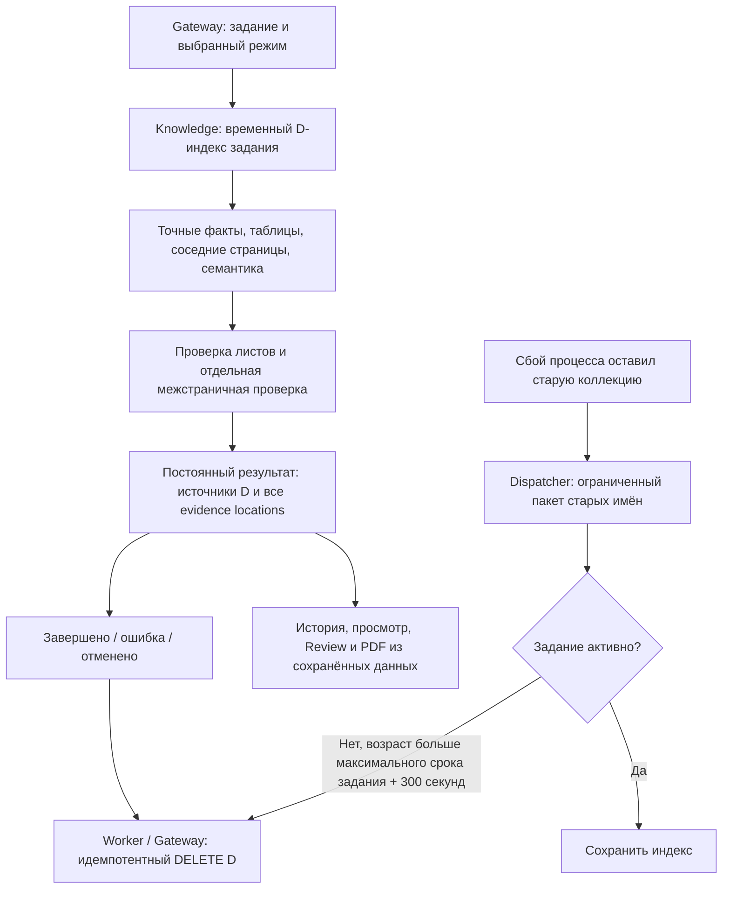

<!-- docs/document-context.md -->

# Контекст проверяемого PDF и межстраничные замечания

## Выбор режима

В блоке «Контекст проекта» под переключателем ПЗ находится отдельный чекбокс
«Учитывать контекст всего проекта (Увеличивает длительность анализа в ~2,5 раза)».
По умолчанию он выключен. Поле multipart `use_document_context` сохраняется в
заявке Gateway и передаётся PDF workflow. Контекст ПЗ включается независимо.

Режим доступен для PDF-only. Он сопоставляет проверяемые страницы одного
загруженного PDF: выбранный диапазон `pages` ограничивает состав анализа.
Для проверки всего PDF в пределах лимита 200 страниц оставьте диапазон пустым.
Другие файлы проекта в D автоматически не добавляются. В CAD и PDF + CAD
переключатель недоступен; Gateway отклоняет его явное включение.

Выключенный режим использует прежние лёгкие промпт и схему Understanding из
`main`, без инструкций и поля `document_facts` в запросе к модели. Общий HTTP-ответ
по-прежнему содержит пустой массив `document_facts`. Проверка N/T/U и финализация
также не получают пустые D-инструкции.

В workflow три переключателя (`Use Document Context`, `Retrieve Document Context`,
`Use Cross-Page Consistency`) обходят специализированные D HTTP-узлы и уведомления.
`Empty Page Document Context` создаёт пустые массивы источников для общего
контракта, сохраняя порядок страниц; N/T/U-проверки проходят прежним маршрутом.
Индекс, семантический D-поиск и межстраничная VLM-проверка не запускаются.
Оценка ~2,5 раза в подписи приблизительна: время зависит от PDF и нагрузки GPU.

## Источники N, T, U, D, E

| Тип | Роль | Что сохраняется |
| --- | --- | --- |
| N | Нормативное основание: ГОСТ, СП, ПУЭ | `basis_sources` |
| T | Самостоятельные требования ТЗ | `technical_assignment_basis_sources` |
| U | Пользовательские проектные документы | `user_package_basis_sources` |
| D | Факты проверяемого PDF, связанные страницы и внутренние противоречия | `document_context_basis_sources` |
| E | Инженерный опыт для оформления и рекомендации | `experience_sources` |

Только N подтверждает нарушение норматива. D помогает сопоставить объект,
свойство и условия; различие двух значений не устанавливает правильное значение.
D допускается вместе с N/T/U/E. `source_kinds` вычисляет сервер по сохранённым
массивам. Категория, текст, запрошенные ID и ответ VLM сами по себе не создают
тип источника. В полном текстовом отчёте показаны происхождение и объяснение
каждого сохранённого типа. Без N/T/U/D/E отчёт поясняет: инженерное замечание
основано на данных листа и требует проверки инженером. ПЗ описывается отдельно
как контекст проекта, не являющийся нормативным доказательством.

Карточка на чертеже содержит номер, конкретный текст (до трёх видимых строк),
кнопку полного текста и компактные ссылки на доступные N/T/U/D. Компоненты
открытия источников общие с отчётом; защищённое открытие ТЗ сохранено.
Для D ссылка ведёт к странице с подсветкой доказательства. Без идентификатора
документа либо корректной страницы ссылка не создаётся. У ПЗ нет отдельного
публичного маршрута к исходному PDF, поэтому ссылка на ПЗ не придумывается:
сохранённые сведения остаются в текстовом отчёте. Основной шрифт карточки
снижен с `0.68rem` до `0.453rem`; ссылки используют тот же размер. Цвета и управление Review сохранены.

## Типизированное происхождение D

`FindingDraft`, `FinalFinding` и HTTP-схемы содержат отдельные поля
`document_context_source_ids` и `document_context_basis_sources`.
Источник D хранит `source_id`, физическую `page`, `fact_id` либо `chunk_index`,
`evidence_text`, текст, оценку и способ совпадения, объект, свойство, условия,
а также типизированные `visual_regions` в координатах 0..1000.

ID детерминированы в пределах задания:
`D-p0007-f0001` — факт, `D-p0010-c0` — текстовый чанк,
`D-p0008-adj` — соседняя страница. Ранг поиска не влияет на ID.
В JSON-схеме CheckNorms разрешён только переданный набор D-ID; сервер повторно
фильтрует выбранные ID. Выдуманный источник не сохраняется.

CheckCrossPageConsistency строит происхождение непосредственно из фактов,
без зависимости от семантического поиска. При подтверждении сохраняет всю группу
в пределах серверной границы. Если page-local проверка уже дала
`document_consistency` с D-фактами той же группы, замечания объединяются до
обогащения. Нормативные и пользовательские основания сохраняются в своих массивах.

## Одна находка на нескольких страницах

Например, Б-012: на странице 7 — -37 °C, на странице 10 — -35 °C, при одинаковых
объекте, параметре и условиях. Результат содержит один `finding_id`, тип D,
два источника и две записи `evidence_locations`. Правильное значение не выбирается
без авторитетного основания. При наличии применимого норматива сохраняются D и N.

Полный список и Review содержат одну запись. Accept, Reject и Edit действуют
на её отображения на всех страницах. Заголовок: «№12 · Страницы 7, 10».
Ссылки D переходят к странице и подсвечивают сохранённые области.

Review хранит снимки D и области каждой страницы в JSONB. До четырёх основных рамок
допускают существующие операционные правки; дополнительные исходные D-рамки
и вторичные доказательства отображаются
со своей сохранённой геометрией. Подтверждение связано подписью с текстом и
всеми доказательствами. Принятие и утверждение подтверждают области одним
логическим действием; изменение текста требует повторного решения.
При отсутствии основной рамки можно подтвердить имеющиеся вторичные области.

Автоматический и Reviewed PDF создают отдельные отметки на страницах доказательств
с одним ID и одним номером, а текстовое приложение — одну строку замечания.
Отзыв или устаревание подтверждения исключает все его рамки из Reviewed PDF.
Нелокализованное доказательство остаётся текстовым; рамка не придумывается.

## Лимиты запроса и сохранения

`MAX_EVIDENCE_SOURCES_PER_FINDING=8` ограничивает доказательства в запросе VLM.
`MAX_SAVED_EVIDENCE_SOURCES_PER_FINDING=2400` — независимая серверная граница
сохранения; стандартные 200 страниц по 12 фактов полностью помещаются в неё.
Пакетная VLM-валидация, поиск и число групп также ограничены настройками
`ANALYSIS_SERVICE_DOCUMENT_CONTEXT__*`. Полный PDF не отправляется в каждый запрос.

## Жизненный цикл индекса

Knowledge создаёт физическую коллекцию
`<prefix>_job_<document_id>_<время создания в наносекундах>`.
`document_id` — уникальный идентификатор заявки Gateway. Одинаковый SHA256
в разных заданиях не разделяет индекс. Кэш ПЗ обслуживается прежним отдельным
сценарием. D не использует content-addressed кэш и не сохраняется для следующего анализа.

Worker очищает индекс в `finally`, включая ошибки, отмену coroutine и повторную
доставку. При разрешённом retry прежний индекс удаляется, новая попытка создаёт
его заново. Gateway дополнительно очищает при durable отмене. Ошибка удаления
журналируется, не скрывает готовый результат и не заменяет исходную ошибку задания.

Dispatcher проверяет старые кандидаты пакетами с курсором. Время есть в имени
даже у коллекции, оставшейся между create и upsert. Перед удалением Gateway
проверяет состояние задания под блокировкой строки; активные задания пропускает.
Отсутствующее задание также допускает удаление только после истечения возраста.

Закрытые маршруты `DELETE /internal/v1/document-contexts/{document_id}` и
`POST /internal/v1/document-contexts/stale` используют существующий
`X-PDRD-Retention-Key` (согласованный ключ Gateway/Knowledge длиной от 32 символов).
Удаление повторяемо. Результат, история, Review, визуализация и PDF не читают D-индекс.
Коллекции старого кэша без времени создания не входят в новый сборщик и не
переиспользуются. Их удаление требует отдельной проверки старых активных заданий.

## Передача страниц из n8n в API

`Build Page Document Context` отправляет Raw-тело с `Content-Type: application/json`.
Выражение копирует `pages` и `semantic` из входного элемента через `Object.assign`,
добавляет булевый `enabled` из `use_document_context` и сериализует весь объект.
ПЗ для этого запроса не требуется. В workflow запрос выполняется только при
включённом D. Само выражение и API сохраняют защитную поддержку `enabled=false`
для прямых вызовов; отсутствующий или выключенный чекбокс обходит этот узел.

В n8n 2.34.5 прямое разворачивание `...$json` внутри этого выражения возвращало
`undefined`: HTTP-узел отправлял запрос без тела и получал 422 `Field required`.
Совместимость исправленного выражения проверена с `n8n-workflow` 2.34.2,
который входит в эту версию n8n. Архитектурная регрессия запрещает такое
разворачивание во всех трёх workflow; HTTP-тесты проверяют тело и оба режима.

## Проверка перед вводом в эксплуатацию

Windows: `powershell -NoProfile -ExecutionPolicy Bypass -File .\ops\check-quality.ps1`.
Изолированные интеграционные runner Knowledge и Experience проверяют настоящий
Qdrant и PostgreSQL. Полный серверный quality gate и команды запуска — в README.
После обновления сервисов импортируйте `n8n/workflows/analysis-v2-pdf.json` и нажмите
Publish. Пересборка контейнеров сама по себе не обновляет опубликованный workflow.

## Проверка быстрого режима

Регрессии исполняют реальные условия, код и соединения workflow с обоими значениями
чекбокса, проверяют отсутствие D HTTP при выключении, порядок страниц, сохранение
N/T/U и остановку по отмене. Снимок лёгких промпта и схемы из
`main` (`994b098bb12e80dd651842fec44b7bb70ee211cb`) хранится в тестах Analysis.

После публикации workflow сравнивайте один PDF, одинаковые страницы и требования.
Первый запрос после загрузки модели измеряйте отдельно; затем выполните несколько
повторов каждого режима при одинаковой нагрузке. В отключённом режиме в исполнении
n8n не должны выполняться `Create Document Context`, `Search Document Context`,
`Build Page Document Context`, `Check Cross-Page Consistency` и оба D-уведомления.
Фиксированное время и коэффициент ускорения без замера настоящей VLM не гарантируются.
