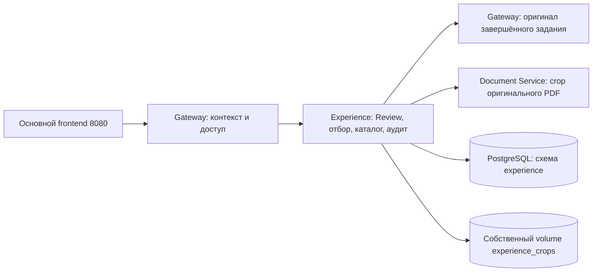

# docs/experience-catalog.md

# Постоянный каталог Experienced User Base

Векторизация и проверочный поиск этого каталога описаны отдельно:
[experience-index.md](experience-index.md). Индексация не включает рабочий E
и не меняет правила Review или назначения отрицательных примеров.

Каталог хранит инженерные решения отдельно от операционного Human Review.
Обучающая проекция отбирает примеры с пригодными областями: принятыми инженером
для положительных примеров и исходными областями VLM для Bad.
На основном frontend 8080 страница `/experience.html`
показывает реальные записи, PNG, серверные фильтры, правки и историю.
Серверный Review и каталог доступны на одном адресе приложения в управляемой сети.
Векторный поиск E и дообучение VLM этим этапом не включаются.

## Границы ответственности



Gateway создаёт серверный `ExperienceContext`: actor, операция, задание
и идентификатор примера. Политика доступа проверяется до операции;
для примера задание определяется из серверной записи и проверяется повторно.
Браузер не передаёт actor, секреты, источник или произвольные пути файлов.
Контекст и политика заменяемы при будущей авторизации. Регистрация,
роли, сессии и выдача токенов сейчас не реализуются.

Experience владеет доменом, отбором, метаданными, редакциями и своим volume.
Document Service владеет PDF: учитывает поворот и cropbox, вырезает область
из оригинала без аннотаций, возвращает PNG. В Experience не импортируются
PDF-библиотеки или пакеты других сервисов. Отбор кандидатов и окончательная
запись остаются отдельными сценариями.

## Когда сохраняются примеры

Утверждение текущего Review запускает `CaptureExperience` после фиксации
операционного решения при нажатии «Утвердить и скачать итоговый PDF после
Human Review». Отдельной кнопки сохранения опыта нет. Повторное скачивание
идемпотентно сохраняет ранее утверждённое задание или завершает перенос после сбоя.
Все решения должны быть сохранены, `approved_revision` должна совпадать
с текущей ревизией. При изменении данных требуется новое утверждение.

| Замечание | Условие сохранения | Назначение |
|---|---|---|
| Wise + Accepted | Текущая область принята зелёной галочкой вместе с замечанием | Положительный пример |
| Bad + Rejected | Исходная область VLM и PNG; без координат — текстовая запись | Отрицательный пример при пригодной исходной области |
| Edited + Accepted | Текущая область принята вместе с исправленным текстом | Положительный исправленный пример |
| Edited + Rejected | Сохраняется также без области | `needs_adjudication`; для обучения нужны область и уточнение |
| Gold + Accepted | Есть корректная геометрия на выбранном листе | Положительный ручной пример |
| Accepted без области, отклонённый Gold | Сохраняется в каталог | Не допускается к автоматическому обучению |
| Pending | Не сохраняется в итоговый каталог | Остаётся в операционном Review |

Принятие VLM одновременно принимает текущую сохранённую область: сервер записывает
решение и аудит координат в одной транзакции. `proposed_regions` и геометрия,
пришедшая от браузера, до этого решения сами по себе не являются подтверждением.
Изменение только области оставляет Wise; изменение текста или основания даёт Edited.
Отклонение не подтверждает новую область. Для Bad исходные `proposed_regions`
и соответствующий PNG сохраняются без отдельного подтверждения; `display_regions`
содержит правку инженера отдельно. Если VLM не определила пригодную область,
Bad остаётся текстовым и исключается из обучения. Отдельной кнопки подтверждения нет.
Для Gold источником является область, нарисованная пользователем;
после принятия она сохраняется как ручная, не как локализация модели.

Одно замечание может иметь несколько исходных областей. Например, при сравнении
экспликации с планом обе рамки относятся к одному замечанию на одном листе.
Прямой отказ сохраняет все его `proposed_regions` и отдельный PNG каждой области,
даже если инженер до этого не нажимал зелёную галочку. Карточка текста и линия
не вырезаются. Таблица показывает все миниатюры; каждая открывает своё изображение
в модальном окне. ZIP содержит все области и их координаты. В итоговом PDF
отклонённое замечание отсутствует и на листе, и в текстовом списке.

Сценарий со вторым замечанием на физическом листе 2 покрыт сквозной регрессией
`tests/functional/test_experience_catalog_provenance.py`: прямой отказ и отказ
после изменения обеих областей, точное сравнение PNG с вырезками оригинала,
экспорт всех изображений, повторное сохранение без дублей и исключение из PDF.
Отдельный интеграционный сценарий проверяет две области в настоящем PostgreSQL.

Сервер сверяет задание, документ, статус и SHA-256 оригинального PDF.
После вырезания повторно проверяет Review и версии подтверждений,
а PostgreSQL проверяет их под блокировкой строки Review перед вставкой.
Гонка правки или отзыва не создаёт ошибочно актуальный пример.
Идентификатор зависит от SHA-256 документа и содержимого кандидата, включая
текст, решение и области. Повторный прогон того же PDF сохраняет ноль дублей;
новое содержание создаёт новый пример. Происхождение каждого прогона хранится отдельно.
Повтор не затирает уже сделанную инженерную правку каталога.

Утверждение Review и перенос в Experience — две операции. Сбой crop/SQL
не отменяет уже сохранённое утверждение; ответ явно содержит
`experience_capture.status=error`, интерфейс предлагает повторить скачивание.
PDF утверждённой редакции остаётся доступным при сбое переноса опыта;
интерфейс явно сообщает, что Experience пока не сохранён.
При успехе возвращаются числа новых, сохранённых, локализованных и исключённых
примеров. Локализованная запись ещё может требовать уточнения отрицательной разметки.
Фонового outbox и автоматических повторов для переноса пока нет.

Аудит принятой области хранится в `experience.confirmed_areas` и
`experience.area_confirmation_events`: координаты, серверный actor, время,
ревизии, SHA-256 источника и подпись содержимого. Новые принятия используют
`mode=decision`; причина правки координат не запрашивается. Повторное принятие
той же актуальной области не создаёт дубль аудита. Сбой записи области откатывает
операционное принятие; это отличается от последующего сбоя переноса crop в каталог.

## Что хранится и что редактируется

`experience.catalog_examples` содержит источник, редакцию и метаданные crop;
`experience.catalog_events` — журнал первоначальной записи и каждой правки.
Первоначальная миграция каталога — `20260928_0003`. Миграция `20260929_0004`
добавляет нормативные разделы, логическое удаление, происхождение повторных прогонов
и [реестр версий](experience-versions.md). Миграция `20260929_0005` обновляет только
технические ключи дедупликации. Старые Review, аудит, UUID и фиксированные наборы
не переписываются. Пропущенные разделы/provenance/crop дополняются через
доверенный `CaptureExperience`, с новой редакцией и аудитом, без потери ручных правок.

Источник неизменяем: job/document/finding ID, файл, номер листа, SHA-256,
редакция утверждения, исходный и исправленный тексты Review, решение,
происхождение, проверенные координаты, автор и время подтверждения.
Каждой области соответствует отдельный PNG; целый лист и PDF в Experience
не сохраняются. PNG адресуется SHA-256 и проверяется перед выдачей.
Несколько примеров могут ссылаться на одинаковые bytes без дублирования.

Редактируемые поля: название документа, полный текст, нормативное основание,
ссылка на нормативку, идентификатор/название нормативного раздела, активность,
причина отклонения и объект отрицательной
разметки. Правка использует `expected_revision`; устаревшая вкладка получает
`409`, сохраняет свою форму и предлагает загрузить новую редакцию.
Исходные IDs, координаты, решение и время создания не редактируются.
Редакция каталога не меняет отчёт Review или утверждённый PDF.

Gold остаётся Gold после правок. Исправление VLM сохраняет Edited.
Сочетания Edited Accepted и Edited Rejected представлены фильтрами
по одному тегу `edited` и отдельному решению; новый источник Gold не возникает.

### Неоднозначное отклонение

Для Edited + Rejected задаются вместе:

- `rejection_reason`: почему пример отклонён;
- `negative_target`: `original`, `revised` или `both`.

До этого назначение — `needs_adjudication`, после явного уточнения — `negative`.
Оба текста и решение сохраняются. Если меняется уже оценённая исправленная
формулировка или её основание при `revised`/`both`, прежнее уточнение
сбрасывается, если инженер не подтвердил оба поля заново в той же правке.
Этот каталог ещё не является готовым форматом датасета fine-tuning.

### Активность и актуальность

`requested_active` — выбор инженера. `source_current` — серверная проверка
актуальности утверждения и, для принятых областей, их подтверждения. Эффективная активность
`active = requested_active && source_current`.
Правка Review или отзыв/смена подтверждения принятой области делает предыдущую
запись неактуальной. Исходная область Bad не зависит от инженерного подтверждения; PNG и история остаются доступными для аудита.
Повторное включение флага активности не обходит эту проверку.
`training_eligible` также исключает `needs_adjudication`.

Удаление реализовано деактивацией с аудитом. Физического удаления истории,
оригинальных источников или PNG через пользовательский API нет.

## HTTP-контракт через Gateway

Все маршруты доступны только в существующем закрытом канале Review:
nginx подставляет UI-ключ, Gateway проверяет его и Origin.
Experience внутренним HTTP-каналом принимает только доверенный серверный actor.

| Метод и путь | Назначение |
|---|---|
| `GET /api/v1/experience` | Серверные фильтры и страница записей |
| `POST /api/v1/experience/capture/{job_id}` | Сохранение утверждённой редакции; только `expected_revision` |
| `GET /api/v1/experience/{id}` | Запись и актуальность источника |
| `PATCH /api/v1/experience/{id}` | `expected_revision` и редактируемые `fields` |
| `DELETE /api/v1/experience/{id}?expected_revision=N` | Деактивация |
| `POST /api/v1/experience/delete-selection` | Атомарное логическое удаление выбранных ID/редакций |
| `GET /api/v1/experience/{id}/history` | Все редакции записи |
| `GET /api/v1/experience/{id}/crops/{index}` | Проверенный PNG своей области |
| `GET /api/v1/experience/export` | ZIP всего отфильтрованного набора |

Фильтры: `query`, `tag`, `decision`, `active`, `learning_use`, `job_id`, `section_id`.
Тег поддерживает `edited:accepted` и `edited:rejected`.
`limit` — 1–100, `offset` — от нуля; UI показывает по 50 строк.
Поиск литеральный, включая `%` и `_`. Ошибка сервера не заменяется
демонстрационными строками или сообщением об успешном сохранении.

ZIP включает `manifest.json` версии 1 с полными источниками и текущими
редакциями, `examples.csv` в UTF-8 с BOM и PNG в `crops/<id>/<index>.png`.
История доступна отдельным endpoint и не включается целиком в ZIP.
Экспорт ограничен 1000 примерами и 100 МБ суммарных PNG; при превышении
нужно уточнить фильтры. Пагинация UI не ограничивает набор экспорта.
После сборки набор проверяется повторно: изменения приводят к `409`.
CSV экранирует формулы, JSON сохраняет исходные строки без такого изменения.
Ответы crop/ZIP содержат `Cache-Control: no-store`.

## Хранение и развёртывание

Compose использует отдельный volume `experience_crops`:
`/data/experience/crops/<sha256-prefix>/<sha256>.png`.
Сервис не публикует свой порт наружу. Основной frontend 8080 передаёт
служебный nginx-ключ серверного Review; вспомогательный 8081 остаётся на loopback.
Настроенные ключи и actor из этапа 5
используются повторно; раскрывать `.env` или менять shared-сервисы не требуется.

Для восстановления каталога сохраняются совместно PostgreSQL и volume PNG.
При неуспешной материализации могут остаться неиспользуемые PNG: они безопасно
переиспользуются при повторе. Сборщик таких файлов пока не реализован;
volume не очищается скриптом развёртывания.

Windows: общий quality gate и просмотр diff. Коммит и push выполняет инженер
отдельными командами после проверки результата; скрипт Git не изменяет.

```powershell
powershell -NoProfile -ExecutionPolicy Bypass -File .\ops\check-quality.ps1
git diff --check
git status --short
```

Linux после синхронизации ветки:

```bash
cd ~/projects/PDRD-validation || exit 1
git switch feature/experience-base &&
git pull --ff-only &&
bash ops/deploy-experience-catalog.sh </dev/null
```

Скрипт останавливается при ошибке общего gate или изолированного PostgreSQL,
проверяет актуальную миграцию, затем обновляет только проектные сервисы Review.
Отдельный тестовый PostgreSQL выполняет все интеграционные проверки Experience,
включая миграцию существующего каталога, дедупликацию и реестр версий.
Старый `ops/deploy-reviewed-pdf.sh` использует тот же общий сценарий.
На сервере `origin`/upstream указывает на приватный репозиторий;
`git pull --ff-only` сохраняет этот источник и запрещает случайный merge.

Readiness сверяет все применённые версии с head поставленной цепочки Alembic
и наличие всех собственных ORM-таблиц, включая каталог и его аудит.
Версия миграции не дублируется литералом в проверке готовности.
Образ задаёт `EXPERIENCE_SERVICE_MIGRATION_DIRECTORY=/app/alembic`:
установленный Python wheel лежит в site-packages, а миграции поставляются
в `/app/alembic`. Composition Root явно передаёт путь адаптеру.
В checkout используется каталог миграций этого сервиса.

Регрессия подготовки SQL-тестов каталога: `adapters()` возвращает только
Review/Area repositories, сценарии `ConfirmArea`/`RevokeArea` создаются явно.
Изменение Review сохраняется существующим методом `update()` с CAS.
После исправления все 18 интеграционных проверок прошли на отдельном
временном PostgreSQL 16.15 под Windows. Linux-контур проверяется тем же
скриптом развёртывания; его остановка до прохождения SQL gate обязательна.

Для UI на Windows открыть `http://192.168.55.3:8080/?job_id=<UUID>` и рассмотреть замечания
в серверном режиме. Проверить итоговый PDF, сохранение опыта, перезагрузку,
каталог `/experience.html`, все PNG, правку, конфликт второй вкладки,
Edited Rejected с уточнением, деактивацию, фильтры и ZIP.
После подключения серверного режима решения сохраняются через Gateway
на том же адресе и восстанавливаются после перезагрузки. Предыдущий локальный
режим не записывал решения на сервер; для старого отчёта Review нужно завершить заново.
Workflows n8n этим этапом не изменяются; импорт и Publish не нужны.

## Объяснение отказа из Review

Новые отклонения сохраняют `source.reason_category` и `source.comment`.
Они отображаются в таблице, входят в ZIP/CSV и новые снимки обучающих версий.
Старые записи без причины остаются доступными. Эти поля не заменяют
инженерную разметку неоднозначного Edited через `rejection_reason` и `negative_target`.
[Категории, назначение удаления и приёмка](normative-access-rejection-feedback.md).
