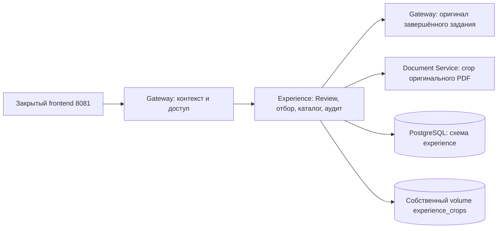

# docs/experience-catalog.md

# Постоянный каталог Experienced User Base

Этап 7 сохраняет проверенные инженерные примеры отдельно от операционного
Human Review. На закрытом frontend 8081 страница `/experience.html`
показывает реальные записи, PNG, серверные фильтры, правки и историю.
На публичном frontend 8080 остаётся явно обозначенная демонстрация.
Векторный поиск E и дообучение VLM этим этапом не включаются.

## Границы ответственности



Gateway создаёт серверный `ExperienceContext`: actor, операция, задание
и идентификатор примера. Политика доступа проверяется до операции;
для примера задание определяется из серверной записи и проверяется повторно.
Браузер не передаёт actor, секреты, источник или произвольные пути файлов.
Контекст и политика заменяемы при будущей авторизации. Регистрация,
роли, сессии и выдача токенов сейчас не реализуются.

Experience владеет доменом, отбором, метаданными, редакциями и своим volume.
Document Service владеет PDF: учитывает поворот и cropbox, вырезает область
из оригинала без аннотаций, возвращает PNG. В Experience не импортируются
PDF-библиотеки или пакеты других сервисов. Отбор кандидатов и окончательная
запись остаются отдельными сценариями.

## Когда сохраняются примеры

Утверждение текущего Review запускает `CaptureExperience` после фиксации
операционного решения. Кнопка «Сохранить в базу опыта» позволяет сохранить
ранее утверждённое задание или повторить перенос после сбоя.
Все решения должны быть сохранены, `approved_revision` должна совпадать
с текущей ревизией. При изменении данных требуется новое утверждение.

| Замечание | Условие сохранения | Назначение |
|---|---|---|
| Wise + Accepted | Область VLM явно подтверждена | Положительный пример |
| Bad + Rejected | Область VLM явно подтверждена | Отрицательный пример |
| Edited + Accepted | Область VLM явно подтверждена | Положительный исправленный пример |
| Edited + Rejected | Область VLM явно подтверждена | `needs_adjudication` до уточнения |
| Gold + Accepted | Есть корректная геометрия на выбранном листе | Положительный ручной пример |
| Pending, без области или отклонённый Gold | Не сохраняется в каталог | Остаётся в операционном Review |

Принятие VLM не подтверждает координаты. `proposed_regions` и геометрия,
пришедшая от браузера, сами по себе не являются подтверждением VLM.
Для Gold источником является область, нарисованная пользователем;
после принятия она сохраняется как ручная, не как локализация модели.

Сервер сверяет задание, документ, статус и SHA-256 оригинального PDF.
После вырезания повторно проверяет Review и версии подтверждений,
а PostgreSQL проверяет их под блокировкой строки Review перед вставкой.
Гонка правки или отзыва не создаёт ошибочно актуальный пример.
Идентификатор зависит от ключа кандидата и утверждённой редакции Review:
повтор сохраняет ноль дублей, новая утверждённая редакция создаёт новую версию.
Повтор не затирает уже сделанную инженерную правку каталога.

Утверждение Review и перенос в Experience — две операции. Сбой crop/SQL
не отменяет уже сохранённое утверждение; ответ явно содержит
`experience_capture.status=error`, интерфейс предлагает повтор.
При успехе возвращаются числа созданных, пригодных и исключённых примеров.
Фонового outbox и автоматических повторов для переноса пока нет.

## Что хранится и что редактируется

`experience.catalog_examples` содержит источник, редакцию и метаданные crop;
`experience.catalog_events` — журнал первоначальной записи и каждой правки.
Миграция `20260928_0003` добавляет только эти таблицы и их индексы
в собственной схеме. Старые Review и подтверждения не переписываются.

Источник неизменяем: job/document/finding ID, файл, номер листа, SHA-256,
редакция утверждения, исходный и исправленный тексты Review, решение,
происхождение, проверенные координаты, автор и время подтверждения.
Каждой области соответствует отдельный PNG; целый лист и PDF в Experience
не сохраняются. PNG адресуется SHA-256 и проверяется перед выдачей.
Несколько примеров могут ссылаться на одинаковые bytes без дублирования.

Редактируемые поля: название документа, полный текст, нормативное основание,
ссылка на нормативку, активность, причина отклонения и объект отрицательной
разметки. Правка использует `expected_revision`; устаревшая вкладка получает
`409`, сохраняет свою форму и предлагает загрузить новую редакцию.
Исходные IDs, координаты, решение и время создания не редактируются.
Редакция каталога не меняет отчёт Review или утверждённый PDF.

Gold остаётся Gold после правок. Исправление VLM сохраняет Edited.
Сочетания Edited Accepted и Edited Rejected представлены фильтрами
по одному тегу `edited` и отдельному решению; новый источник Gold не возникает.

### Неоднозначное отклонение

Для Edited + Rejected задаются вместе:

- `rejection_reason`: почему пример отклонён;
- `negative_target`: `original`, `revised` или `both`.

До этого назначение — `needs_adjudication`, после явного уточнения — `negative`.
Оба текста и решение сохраняются. Если меняется уже оценённая исправленная
формулировка или её основание при `revised`/`both`, прежнее уточнение
сбрасывается, если инженер не подтвердил оба поля заново в той же правке.
Этот каталог ещё не является готовым форматом датасета fine-tuning.

### Активность и актуальность

`requested_active` — выбор инженера. `source_current` — серверная проверка
актуальности утверждения и подтверждения области. Эффективная активность
`active = requested_active && source_current`.
Правка Review или отзыв/смена подтверждения сразу делает предыдущую запись
неактуальной; PNG и история остаются доступными для аудита.
Повторное включение флага активности не обходит эту проверку.
`training_eligible` также исключает `needs_adjudication`.

Удаление реализовано деактивацией с аудитом. Физического удаления истории,
оригинальных источников или PNG через пользовательский API нет.

## HTTP-контракт через Gateway

Все маршруты доступны только в существующем закрытом канале Review:
nginx подставляет UI-ключ, Gateway проверяет его и Origin.
Experience внутренним HTTP-каналом принимает только доверенный серверный actor.

| Метод и путь | Назначение |
|---|---|
| `GET /api/v1/experience` | Серверные фильтры и страница записей |
| `POST /api/v1/experience/capture/{job_id}` | Сохранение утверждённой редакции; только `expected_revision` |
| `GET /api/v1/experience/{id}` | Запись и актуальность источника |
| `PATCH /api/v1/experience/{id}` | `expected_revision` и редактируемые `fields` |
| `DELETE /api/v1/experience/{id}?expected_revision=N` | Деактивация |
| `GET /api/v1/experience/{id}/history` | Все редакции записи |
| `GET /api/v1/experience/{id}/crops/{index}` | Проверенный PNG своей области |
| `GET /api/v1/experience/export` | ZIP всего отфильтрованного набора |

Фильтры: `query`, `tag`, `decision`, `active`, `learning_use`, `job_id`.
Тег поддерживает `edited:accepted` и `edited:rejected`.
`limit` — 1–100, `offset` — от нуля; UI показывает по 50 строк.
Поиск литеральный, включая `%` и `_`. Ошибка сервера не заменяется
демонстрационными строками или сообщением об успешном сохранении.

ZIP включает `manifest.json` версии 1 с полными источниками и текущими
редакциями, `examples.csv` в UTF-8 с BOM и PNG в `crops/<id>/<index>.png`.
История доступна отдельным endpoint и не включается целиком в ZIP.
Экспорт ограничен 1000 примерами и 100 МБ суммарных PNG; при превышении
нужно уточнить фильтры. Пагинация UI не ограничивает набор экспорта.
После сборки набор проверяется повторно: изменения приводят к `409`.
CSV экранирует формулы, JSON сохраняет исходные строки без такого изменения.
Ответы crop/ZIP содержат `Cache-Control: no-store`.

## Хранение и развёртывание

Compose использует отдельный volume `experience_crops`:
`/data/experience/crops/<sha256-prefix>/<sha256>.png`.
Сервис не публикует свой порт наружу; публичный 8080 остаётся локальным,
закрытый 8081 привязан к loopback. Настроенные ключи и actor из этапа 5
используются повторно; раскрывать `.env` или менять shared-сервисы не требуется.

Для восстановления каталога сохраняются совместно PostgreSQL и volume PNG.
При неуспешной материализации могут остаться неиспользуемые PNG: они безопасно
переиспользуются при повторе. Сборщик таких файлов пока не реализован;
volume не очищается скриптом развёртывания.

Windows: общий quality gate, затем коммит и push при успешном результате.
`-Push` использует все настроенные push-адреса `origin`: публичный
`Amadu-A/PDRD-validation` и приватный `neo-term-it/PDRD-validation`.
Настройки Git скрипт не переписывает.

```powershell
powershell -NoProfile -ExecutionPolicy Bypass -File .\ops\check-quality.ps1 -CommitMessage "feat: persist verified Experience catalog" -Push
```

Linux после синхронизации ветки:

```bash
cd ~/projects/PDRD-validation || exit 1
git switch feature/experience-base &&
git pull --ff-only &&
bash ops/deploy-experience-catalog.sh </dev/null
```

Скрипт останавливается при ошибке общего gate или изолированного PostgreSQL,
проверяет актуальную миграцию, затем обновляет только проектные сервисы Review.
В отдельном тестовом PostgreSQL ожидаются 18 проверок с реальными транзакциями.
Старый `ops/deploy-reviewed-pdf.sh` использует тот же общий сценарий.
На сервере `origin`/upstream указывает на приватный репозиторий;
`git pull --ff-only` сохраняет этот источник и запрещает случайный merge.

Readiness сверяет все применённые версии с head поставленной цепочки Alembic
и наличие всех собственных ORM-таблиц, включая каталог и его аудит.
Версия миграции не дублируется литералом в проверке готовности.
Образ задаёт `EXPERIENCE_SERVICE_MIGRATION_DIRECTORY=/app/alembic`:
установленный Python wheel лежит в site-packages, а миграции поставляются
в `/app/alembic`. Composition Root явно передаёт путь адаптеру.
В checkout используется каталог миграций этого сервиса.

Для UI на Windows в отдельном терминале:

```powershell
ssh -N -L 8081:127.0.0.1:8081 main@192.168.55.3
```

Открыть `http://127.0.0.1:8081/?job_id=<UUID>` и рассмотреть замечания
в серверном режиме. Проверить итоговый PDF, сохранение опыта, перезагрузку,
каталог `/experience.html`, все PNG, правку, конфликт второй вкладки,
Edited Rejected с уточнением, деактивацию, фильтры и ZIP.
Решения, сделанные ранее на 8080, автоматически в 8081 не импортируются.
Workflows n8n этим этапом не изменяются; импорт и Publish не нужны.
