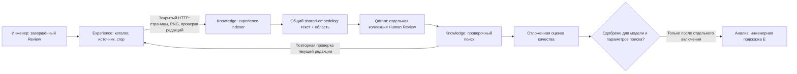

<!-- docs/experience-index.md -->

# Этап 8: индекс проверенного Experience и оценка качества

Дата: 29.09.2026. Ветка: `feature/experience-base`.

## Текущее состояние

Реализованы автоматическая индексация подтверждённых примеров, отдельный
проверочный поиск и инструмент оценки. Рабочий поиск E выключен:
`KNOWLEDGE_SERVICE_SEARCH__EXPERIENCE_ENABLED=false`.

Пользователь сообщил, что отдельных размеченных документов пока нет.
Поэтому улучшение качества VLM ещё не измерено. Полная приёмка этапа 8
требует развёртывания индекса на Linux, подготовки отложенного набора
и парного эксперимента анализа без E / с E. Fine-tuning относится к этапу 9.

## Ответственность сервисов



**Experience** владеет своей PostgreSQL-схемой, журналами, каталогом,
правилами актуальности и PNG. **Knowledge** владеет векторизацией, индексом
и поиском. Индексатор не читает чужую БД и чужие файлы напрямую.
**Document** остаётся владельцем рендеринга и вырезания PDF.

`experience-indexer` — отдельный процесс из образа Knowledge, запускаемый
профилем `experience-index`. Он использует существующую сеть `ai-shared`
и логический endpoint `shared-embedding`. Новая модель на GPU не загружается.
Для отчёта выделен volume `experience_index_quality`; каталог в образе
принадлежит пользователю `app`, под которым работает процесс.

## Отбор и назначение примеров

В индекс попадают только активные записи с актуальным утверждённым источником,
подтверждёнными областями, соответствующими PNG и однозначной разметкой.
Прямой Bad без ранее принятой области остаётся только в операционном Review.

| Сочетание | Индексируемый текст | Назначение |
|---|---|---|
| Wise + Accepted | Текущая полная формулировка | Положительный пример |
| Edited + Accepted | Исправленная полная формулировка | Положительный исправленный пример |
| Gold + Accepted | Полный текст инженера | Положительный ручной пример |
| Bad + Rejected | Исходная формулировка VLM | Отрицательный пример |
| Edited + Rejected, без уточнения | Не индексируется | `needs_adjudication`; история остаётся в каталоге |
| Edited + Rejected с причиной и `negative_target` | `original`, `revised` или обе отдельно | Отрицательный пример |
| Pending, неактивный или устаревший источник, нет области/crop | Не индексируется | Не используется автоматически |

Обе формулировки сохраняются в каталоге независимо от выбора текста для вектора.
Изменение оценённого исправленного текста сбрасывает прежнюю отрицательную
разметку по правилам каталога. Принятое замечание не означает исправленный проект:
для новых E-источников `verified_fixed=false`, поля AFTER отсутствуют.

## Закрытый канал чтения

В приватном `.env` хранится отдельный `PDRD_EXPERIENCE_INDEX_KEY`.
Compose передаёт его как `EXPERIENCE_SERVICE_INDEX_KEY` владельцу каталога
и `KNOWLEDGE_SERVICE_EXPERIENCE__KEY` читателю. Ключ отличается от ключа Review,
не передаётся frontend и не задаётся параметром браузерного запроса.
При пустом ключе маршруты не регистрируются.

Маршруты требуют `Authorization: Bearer …`:

| Метод и путь | Назначение |
|---|---|
| `GET /internal/v1/experience-index/feed?after=UUID&limit=50` | Страница проекций; курсор по UUID, предел 100 |
| `POST /internal/v1/experience-index/verify` | Проверка до 100 ссылок на редакции; содержимое задаёт сервер |
| `GET /internal/v1/experience-index/crops/{id}/{index}?fingerprint=…` | PNG только совпавшей пригодной редакции; `409` при изменении |

Проекция содержит ID и ревизию примера, происхождение документа, решение,
теги, тексты, основание инженера и SHA-256/размеры crop. Её отпечаток вычисляется
по каноническому JSON; это проверка целостности и версии, а не механизм авторизации.

Страницы обходят и исключённые строки каталога: пустая пригодная страница
не означает конец обхода. Перед выдачей PNG сервер проверяет актуальность
ещё раз после чтения файла. HTTP-клиент проверяет PNG-сигнатуру и SHA-256.
Набор ссылок `/verify` читается одним SQL-запросом с вычисленной актуальностью,
без отдельного обращения к БД для каждого кандидата.

## Коллекция, синхронизация и отзыв

Физическое имя: `embedding_index_plan.experience_target + "_human_review_v1"`.
В нём учитывается identity модели, размерности и схемы embedding.
Прежняя E-коллекция с BEFORE/AFTER не является источником нового поиска.

Вектор создаётся для каждой пары «выбранная формулировка × crop».
UUID5 зависит от ID примера, объекта разметки и номера crop: повтор обновляет
точку на месте. В payload хранятся ссылки, отпечаток, identity, объект разметки
и номер crop. Текст для ответа берётся заново из Experience.

Индексатор выполняет полный обход по умолчанию каждые 300 секунд.
Неизменённые точки пропускают embedding. Один пример создаёт ограниченный batch:
до четырёх областей × двух формулировок. После embedding редакция проверяется
перед записью. Число, размерность, конечность и ненулевой характер векторов
проверяются до обращения к Qdrant.

Удаление старых точек происходит только после полного успешного обхода.
Сбой feed, crop, embedding или Qdrant оставляет повторяемую операцию;
watch записывает ошибку и повторяет цикл. Неполный обход не очищает индекс.
Уже записанные части могут остаться до следующей синхронизации.

Поиск использует фильтры `kind=human_review_v1` и identity, порог похожести
и повторную серверную проверку всех кандидатов. Несколько crop/формулировок
одного примера дают один источник. Отозванный, изменённый или выключенный пример
не выдаётся даже до очистки векторов. Недоступность владельца означает `503`,
без подстановки старого текста из Qdrant. При выключенном рабочем E
обычный анализ возвращает пустые E-источники без вызова GPU и поиска в Qdrant.

## Развёртывание на Linux

После Windows quality gate, коммита и push в оба настроенных адреса `origin`:

```bash
cd ~/projects/PDRD-validation || exit 1
git pull --ff-only &&
bash ops/deploy-experience-index.sh </dev/null
```

Скрипт проверяет ветку и чистоту checkout через штатный deploy Review,
запускает общий набор тестов и собственный изолированный PostgreSQL,
обновляет Review, создаёт служебный ключ без вывода секрета, сохраняет
выключенный рабочий E, пересобирает Knowledge/Analysis, выполняет полный `sync`
и запускает watch. Новая DDL-миграция не требуется; вершина Experience —
`20260928_0003`.

Первый обход может занять время на crop/embedding. Healthcheck индексатора
проверяет время последнего успешного полного обхода. Пустой каталог является
успешным состоянием, но не подтверждением качества будущего поиска.

```bash
docker compose --profile review --profile experience-index logs --tail=80 experience-indexer
docker compose --profile review --profile experience-index exec -T experience-indexer \
  python -m pdrd_knowledge_service.experience_runtime preview "Проверка маркировки извещателей"
```

Preview показывает ID, тег, назначение, score и инженерный контекст.
Он не включает E в пользовательский анализ. Для проверки взять формулировку
из реального сохранённого каталога; число найденных примеров зависит от данных
и порога. Команда `sync` доступна в том же контейнере для немедленного повторного обхода.

## Отложенный набор и оценка

Формат: [experience-evaluation.template.json](examples/experience-evaluation.template.json).
Это шаблон структуры, а не готовый benchmark. UUID, SHA и результаты необходимо
заменить реальными. Каждый документ сравнения должен быть отдельным PDF.

Нужны два вида разметки:

1. `retrieval_cases`: документ и SHA-256 исходного PDF, запрос, релевантные
   ID примеров каталога и явно запрещённые ID.
2. `finding_cases`: документ и SHA-256 исходного PDF, согласованные инженером
   ID истинных замечаний (`expected`), результаты анализа без E (`baseline`)
   и с E (`with_experience`). Ложные замечания получают отдельные ID и
   отсутствуют в `expected`.

Инструмент **не запускает парный VLM-эксперимент сам**: для сравнения ему нужны
уже проверенные результаты. Проверочный эксперимент с E проводится отдельно
от рабочего анализа. Не включать рабочий флаг ради подготовки этих результатов.
При подготовке набора сохранять версии VLM, промптов и параметры эксперимента;
разметку результатов сопоставлять по смыслу, а не по автоматически выданным UUID.

Проверяется отсутствие документов оценки в E по document ID и SHA-256:
повторная загрузка того же PDF под другим ID не скрывает утечку. Повтор запроса
в одном документе и повтор PDF в парном сравнении запрещены.

Когда набор будет готов, скопировать его в индексатор и выполнить:

```bash
docker compose --profile review --profile experience-index cp ./experience-evaluation.json experience-indexer:/tmp/evaluation.json
docker compose --profile review --profile experience-index exec -T experience-indexer \
  python -m pdrd_knowledge_service.experience_runtime evaluate /tmp/evaluation.json
```

Отчёт записывается в `/data/experience-quality/report.json`. Предварительный
порог допуска: минимум 20 retrieval-запросов и 5 отдельных PDF в парном сравнении,
macro recall@k ≥ 0,8, ноль запрещённых примеров, precision/recall замечаний
не хуже baseline, число ложных замечаний не больше, хотя бы одна из precision/recall
строго лучше. Это первоначальные инженерные критерии, не статистическое
доказательство улучшения на любых проектах. Маленький smoke-набор допуска не даёт.

Отчёт связывается с SHA-256 датасета, identity embedding, коллекцией, top-k
и порогом поиска. Если затем включить рабочий флаг, composition root проверит
совместимость, конечные метрики и результат допуска при запуске Knowledge.
Отсутствующий, неуспешный или несовместимый отчёт блокирует запуск рабочего E.
Preview/evaluate сами флаг не меняют.
При включённом E readiness проверяет именно новую коллекцию Human Review,
а не наличие прежнего legacy-индекса.

Отчёт относится к измеренному эксперименту. Он не фиксирует неизменяемый снимок
всего каталога и не доказывает отсутствие деградации после его расширения.
Перед рабочим включением согласовать эксперимент и повторяемую оценку;
при существенном изменении корпуса или VLM оценивать заново.

## Роль E в анализе

Индекс ранжирует похожие инженерные примеры, не назначая нормативную ссылку.
Analysis получает ID/ревизию примера, тег, решение, назначение и объект
отрицательной разметки. E может подсказать повторную проверку фактов и формулировку.
Одна похожесть не является основанием создать, подтвердить или отклонить замечание.
Ссылку на норматив подтверждает N; T/U/E сохраняют своё назначение.

Сейчас подготовлены индексация и экспериментальный поиск. Вес E в рабочем
анализе и влияние на поиск ещё не обнаруженных VLM ошибок будут определены
после измерений. Обучение VLM не запускается этим сервисом.

## Проверки

Windows: `ops/check-quality.ps1` выполняет pip check, Ruff, весь pytest,
JavaScript-наборы и git diff check. Новые проверки воспроизводят отзыв между
embedding/записью/выдачей, деактивацию, повреждение crop/HTTP-проекции,
неоднозначную разметку, несовместимые векторы, повтор sync и обрыв обхода.
Функциональный контур проходит Review → Experience → Document → Knowledge
и проверяет транспорт в Analysis. Реальный PostgreSQL отдельно проверяет
keyset-обход и вычисленную актуальность через серверные JOIN.

Работа с настоящими shared-embedding и Qdrant проверяется первым Linux `sync`
и preview на сохранённых примерах. Unit/HTTP-тесты не заменяют этот runtime-прогон.
