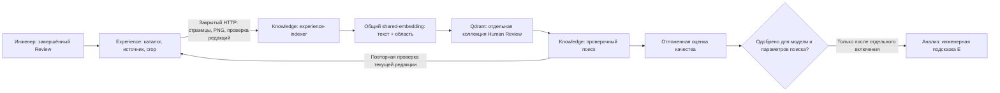

<!-- docs/experience-index.md -->

# Этап 8: индекс проверенного Experience и оценка качества

Дата: 29.09.2026. Ветка: `feature/experience-base`.

## Текущее состояние

Реализованы ручная индексация выбранных подтверждённых примеров, отдельный
проверочный поиск и инструмент оценки. В `b1ba688` добавлены приём и отзыв
отчёта качества, назначение проверенной версии по нормативному разделу и
чтение этого назначения рабочим поиском. Рабочий поиск E выключен:
`KNOWLEDGE_SERVICE_SEARCH__EXPERIENCE_ENABLED=false`.

Пользователь сообщил, что отдельных размеченных документов пока нет.
Поэтому улучшение качества VLM ещё не измерено. Полная приёмка этапа 8
требует проверки текущего кода и ручных версий на Linux, подготовки отложенного
набора и парного эксперимента анализа без E / с E. Fine-tuning относится к этапу 9.
Реестр, UI и фиксированные составы описаны в [experience-versions.md](experience-versions.md).
Старый автоматический индекс проверен логами `376308b`: 7 примеров, 10 векторов;
после обновления worker обрабатывает только вручную созданные версии.

## Ответственность сервисов



**Experience** владеет своей PostgreSQL-схемой, журналами, каталогом,
правилами актуальности и PNG. **Knowledge** владеет векторизацией, индексом
и поиском. Индексатор не читает чужую БД и чужие файлы напрямую.
**Document** остаётся владельцем рендеринга и вырезания PDF.

`experience-indexer` — отдельный процесс из образа Knowledge, запускаемый
профилем `experience-index`. Он использует существующую сеть `ai-shared`
и логический endpoint `shared-embedding`. Новая модель на GPU не загружается.
Для отчёта выделен volume `experience_index_quality`; каталог в образе
принадлежит пользователю `app`, под которым работает процесс.

## Отбор и назначение примеров

В индекс попадают только активные записи с актуальным утверждённым источником,
принятыми областями либо первоначальными областями VLM для Bad, соответствующими
PNG и однозначной разметкой. Bad без исходных координат виден в каталоге,
но исключён из индекса; отдельное подтверждение исходной области не требуется.
Все выбранные записи версии должны иметь один явный раздел нормативного документа.

| Сочетание | Индексируемый текст | Назначение |
|---|---|---|
| Wise + Accepted | Текущая полная формулировка | Положительный пример |
| Edited + Accepted | Исправленная полная формулировка | Положительный исправленный пример |
| Gold + Accepted | Полный текст инженера | Положительный ручной пример |
| Bad + Rejected | Исходная формулировка VLM | Отрицательный пример |
| Edited + Rejected, без уточнения | Не индексируется | `needs_adjudication`; история остаётся в каталоге |
| Edited + Rejected с причиной и `negative_target` | `original`, `revised` или обе отдельно | Отрицательный пример |
| Pending, неактивный или устаревший источник, нет области/crop | Не индексируется | Не используется автоматически |

Обе формулировки сохраняются в каталоге независимо от выбора текста для вектора.
Изменение оценённого исправленного текста сбрасывает прежнюю отрицательную
разметку по правилам каталога. Принятое замечание не означает исправленный проект:
для новых E-источников `verified_fixed=false`, поля AFTER отсутствуют.

## Закрытый индексный канал

В приватном `.env` хранится отдельный `PDRD_EXPERIENCE_INDEX_KEY`.
Compose передаёт его как `EXPERIENCE_SERVICE_INDEX_KEY` владельцу каталога
и `KNOWLEDGE_SERVICE_EXPERIENCE__KEY` читателю. Ключ отличается от ключа Review,
не передаётся frontend и не задаётся параметром браузерного запроса.
При пустом ключе маршруты не регистрируются.

Маршруты требуют `Authorization: Bearer …`:

| Метод и путь | Назначение |
|---|---|
| `GET /internal/v1/experience-index/feed?after=UUID&limit=50` | Страница проекций; курсор по UUID, предел 100 |
| `POST /internal/v1/experience-index/verify` | Проверка до 100 ссылок на редакции; содержимое задаёт сервер |
| `GET /internal/v1/experience-index/crops/{id}/{index}?fingerprint=…` | PNG только совпавшей пригодной редакции; `409` при изменении |
| `POST /internal/v1/experience-index/versions/claim` | Аренда одной ручной задачи совместимой модели |
| `GET /internal/v1/experience-index/versions/{id}` | Фиксированный состав для проверочного поиска |
| `GET /internal/v1/experience-index/applied?section_id=…` | Назначенная проверенная версия этого раздела для рабочего поиска |
| `POST /internal/v1/experience-index/versions/{id}/result` | Heartbeat и результат только собственной действующей аренды |

Индексный ключ также пишет состояние задания, но не меняет Review, каталог,
одобрение качества и применённые рабочие версии. Приём отчёта и назначение
версии проходят через отдельный закрытый канал Review с проверкой доступа ко
всем исходным заданиям состава.

Проекция содержит ID и ревизию примера, происхождение документа, решение,
теги, тексты, основание инженера и SHA-256/размеры crop. Её отпечаток вычисляется
по каноническому JSON; это проверка целостности и версии, а не механизм авторизации.

Страницы обходят и исключённые строки каталога: пустая пригодная страница
не означает конец обхода. Перед выдачей PNG сервер проверяет актуальность
ещё раз после чтения файла. HTTP-клиент проверяет PNG-сигнатуру и SHA-256.
Набор ссылок `/verify` читается одним SQL-запросом с вычисленной актуальностью,
без отдельного обращения к БД для каждого кандидата.

## Коллекция, синхронизация и отзыв

Каждая ручная версия получает собственную коллекцию
`pdrd_e_<identity>_<version_uuid_without_hyphens>` и фиксированный manifest.
Identity связывает модель, размерность и схему embedding. Прежняя автоматическая
коллекция `embedding_index_plan.experience_target + "_human_review_v1"` сохраняется,
но новые версии в неё не дописываются.
Прежняя E-коллекция с BEFORE/AFTER не является источником нового поиска.

Вектор создаётся для каждой пары «выбранная формулировка × crop».
UUID5 зависит от ID примера, объекта разметки и номера crop: повтор обновляет
точку на месте. В payload хранятся ссылки, отпечаток, identity, объект разметки
и номер crop. Текст для ответа берётся заново из Experience.

Индексатор опрашивает очередь ручных заданий каждые 30 секунд. Внутри одного
задания он обходит только фиксированный выбранный состав.
Неизменённые точки пропускают embedding. Один пример создаёт ограниченный batch:
до четырёх областей × двух формулировок. После embedding редакция проверяется
перед записью. Число, размерность, конечность и ненулевой характер векторов
проверяются до обращения к Qdrant.

Удаление старых точек происходит только после полного успешного обхода.
Сбой feed, crop, embedding или Qdrant оставляет повторяемую операцию;
watch записывает безопасную ошибку и продолжает обработку очереди.
Неполная версия получает `failed` и не применяется; после устранения причины
создаётся новая версия. Истёкшая аренда прерванного worker восстанавливается.
Неполный обход не очищает индекс; логическое удаление версии сохраняет коллекцию.

Поиск версии использует её коллекцию, фильтры `kind=human_review_v1`, identity
и нормативный `section_id`, порог похожести
и повторную серверную проверку всех кандидатов. Несколько crop/формулировок
одного примера дают один источник. Отозванный, изменённый или выключенный пример
не выдаётся даже до очистки векторов. Недоступность владельца означает `503`,
без подстановки старого текста из Qdrant. При выключенном рабочем E обычный
анализ возвращает пустые E-источники без вызова GPU и поиска в Qdrant.
При включённом флаге Knowledge читает назначение своего `section_id` и повторно
проверяет его после поиска; отзыв допуска, смена версии или состава во время
ожидания GPU убирают результат. Отсутствие раздела или назначения даёт пустые
E-источники без обращения к embedding и Qdrant. Отсутствие назначенной коллекции
в Qdrant даёт ошибку до обращения к embedding.

## Развёртывание на Linux

После Windows quality gate, коммита и push в `origin` и отдельный приватный
remote `neoterm`:

```bash
cd ~/projects/PDRD-validation || exit 1
git pull --ff-only &&
bash ops/deploy-experience-index.sh </dev/null
```

Скрипт проверяет ветку и чистоту checkout через штатный deploy Review,
запускает общий набор тестов и собственный изолированный PostgreSQL,
обновляет Review, создаёт служебный ключ без вывода секрета, сохраняет
выключенный рабочий E, пересобирает Knowledge/Analysis
и запускает watch ручной очереди. Полный автоматический `sync` больше не выполняется.
Применяются миграции Experience до `20260929_0005`; прежний worker останавливается
до gate, чтобы старый автоматический обход не продолжался во время обновления.

Первый обход может занять время на crop/embedding. Healthcheck индексатора
проверяет время успешного обращения к очереди. Пустая очередь является
успешным состоянием, но не подтверждением качества будущего поиска.

```bash
docker compose --profile review --profile experience-index logs --tail=80 experience-indexer
docker compose --profile review --profile experience-index exec -T experience-indexer \
  python -m pdrd_knowledge_service.experience_runtime preview --version VERSION_UUID "Проверка маркировки извещателей"
```

Preview показывает ID, тег, назначение, score и инженерный контекст.
Он не включает E в пользовательский анализ. Для проверки взять формулировку
из реального сохранённого каталога; число найденных примеров зависит от данных
и порога. `VERSION_UUID` — ID готовой версии. Команда `sync` обрабатывает одну
ранее созданную ручную задачу; сама задачу не создаёт и весь каталог не индексирует.

## Отложенный набор и оценка

Формат: [experience-evaluation.template.json](examples/experience-evaluation.template.json).
Это шаблон структуры, а не готовый benchmark. UUID, SHA и результаты необходимо
заменить реальными. Каждый документ сравнения должен быть отдельным PDF.

Нужны два вида разметки:

1. `retrieval_cases`: документ и SHA-256 исходного PDF, запрос, релевантные
   ID примеров каталога и явно запрещённые ID.
2. `finding_cases`: документ и SHA-256 исходного PDF, согласованные инженером
   ID истинных замечаний (`expected`), результаты анализа без E (`baseline`)
   и с E (`with_experience`). Ложные замечания получают отдельные ID и
   отсутствуют в `expected`.

Инструмент **не запускает парный VLM-эксперимент сам**: для сравнения ему нужны
уже проверенные результаты. Проверочный эксперимент с E проводится отдельно
от рабочего анализа. Не включать рабочий флаг ради подготовки этих результатов.
При подготовке набора сохранять версии VLM, промптов и параметры эксперимента;
разметку результатов сопоставлять по смыслу, а не по автоматически выданным UUID.

Проверяется отсутствие документов оценки в E по document ID и SHA-256:
повторная загрузка того же PDF под другим ID не скрывает утечку. Повтор запроса
в одном документе и повтор PDF в парном сравнении запрещены.

Когда набор будет готов, скопировать его в индексатор и выполнить:

```bash
docker compose --profile review --profile experience-index cp ./experience-evaluation.json experience-indexer:/tmp/evaluation.json
docker compose --profile review --profile experience-index exec -T experience-indexer \
  python -m pdrd_knowledge_service.experience_runtime evaluate --version VERSION_UUID /tmp/evaluation.json
```

Отчёт записывается в `/data/experience-quality/report.json`. Предварительный
порог допуска: минимум 20 retrieval-запросов и 5 отдельных PDF в парном сравнении,
macro recall@k ≥ 0,8, ноль запрещённых примеров, precision/recall замечаний
не хуже baseline, число ложных замечаний не больше, хотя бы одна из precision/recall
строго лучше. Это первоначальные инженерные критерии, не статистическое
доказательство улучшения на любых проектах. Маленький smoke-набор допуска не даёт.

Отчёт связывается с ID/manifest версии, нормативным разделом, SHA-256 датасета,
identity embedding, размерностью, коллекцией, top-k и порогом поиска. Готовый
JSON инженер загружает в блоке версии; Gateway проверяет доступ ко всем исходным
заданиям, Experience перепроверяет привязку, заявленное непересечение SHA
документов оценки с составом версии и метрики, а
Knowledge повторяет проверку совместимости при рабочем поиске. HTTP-контракт:
`POST /api/v1/experience-versions/{id}/quality` с `expected_revision` и
`report`; `DELETE` того же пути с `expected_revision` отзывает допуск.
Отчёт ограничен 64 КиБ на сервере. Неуспешный отчёт может храниться для аудита,
но не даёт `quality_approved`. Загрузка и отзыв отчёта удаляют прежнее рабочее
назначение этой версии; для одобренного отчёта применение выполняется отдельно.
Preview/evaluate, загрузка отчёта и применение сами не меняют конфигурационный
флаг `KNOWLEDGE_SERVICE_SEARCH__EXPERIENCE_ENABLED`.
Загрузка JSON не воспроизводит исходный парный эксперимент и не удостоверяет
подлинность его входных PDF или результатов: инженер должен проверить их при
подготовке отчёта.

Общий `/health/ready` Knowledge сейчас не перечисляет назначенные коллекции всех
нормативных разделов. Поэтому его успешный ответ не заменяет проверку выбранной
коллекции и настоящего рабочего поиска на Linux после допуска и включения E.

Отчёт относится к фиксированному составу выбранной версии. Правки, удаление и отзыв
источника после создания версии исключают старые ссылки из выдачи; это не означает
автоматическую переоценку качества. Новая версия или VLM требует нового эксперимента.
В текущем окружении отложенного набора нет, поэтому допуск качества для новых
версий не подтверждён, флаг E остаётся выключенным; `prepared` не является весами.

## Роль E в анализе

Индекс ранжирует похожие инженерные примеры, не назначая нормативную ссылку.
Analysis получает ID/ревизию примера, тег, решение, назначение и объект
отрицательной разметки. E может подсказать повторную проверку фактов и формулировку.
Одна похожесть не является основанием создать, подтвердить или отклонить замечание.
Ссылку на норматив подтверждает N; T/U/E сохраняют своё назначение.

Код рабочего поиска подключён, но его использование пока не принято. Вес E в рабочем
анализе и влияние на поиск ещё не обнаруженных VLM ошибок будут определены
после измерений. Обучение VLM не запускается этим сервисом.

## Проверки

Windows: `ops/check-quality.ps1` выполняет pip check, Ruff, весь pytest,
JavaScript-наборы и git diff check. Новые проверки воспроизводят отзыв между
embedding/записью/выдачей, деактивацию, повреждение crop/HTTP-проекции,
неоднозначную разметку, несовместимые векторы, повтор sync и обрыв обхода.
Функциональный контур проходит Review → Experience → Document → Knowledge
и проверяет транспорт в Analysis. Реальный PostgreSQL отдельно проверяет
keyset-обход и вычисленную актуальность через серверные JOIN.

Работа с настоящими shared-embedding и Qdrant проверяется на Linux ручным запуском
выбранных примеров и `preview --version`. Unit/HTTP-тесты не заменяют runtime-прогон.
Для применения дополнительно нужны независимый отчёт, ручной Publish трёх
изменённых workflows в n8n и проверка рабочего маршрута своего раздела после
осознанного включения E. В текущем сеансе доступа к серверу нет; эти действия
не считаются выполненными по наличию кода в репозитории.
