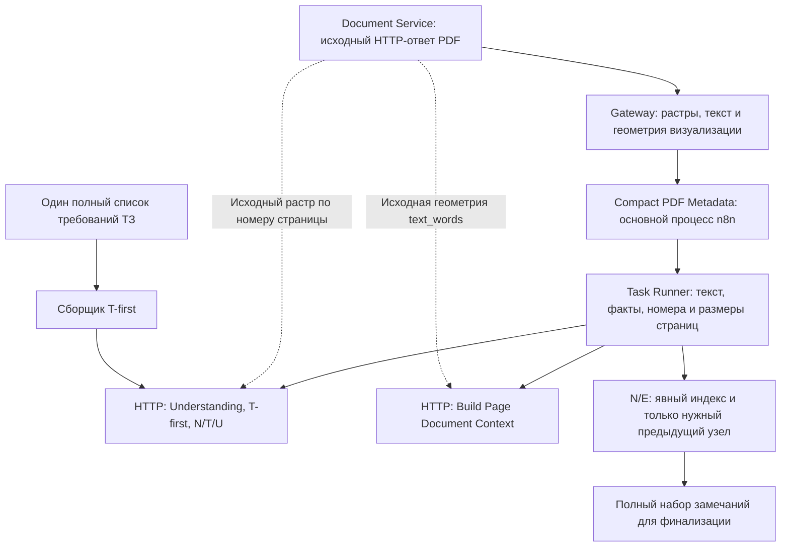

<!-- docs/workflow-payload.md -->

# Передача данных многостраничного PDF в n8n

## Причина сбоя Runner

В предоставленном логе execution #147 последним узлом был `Prepare Experience
Queries`. Ошибка `RangeError: Invalid string length` возникла в `JSON.stringify`
при отправке ответа Task Broker. Примерно через 300 секунд Runner был остановлен
по таймауту. `Search Experience` и `Finalize Findings` не запускались.

В [парсере n8n 2.34.5](https://github.com/n8n-io/n8n/blob/n8n%402.34.5/packages/%40n8n/task-runner/src/js-task-runner/built-ins-parser/built-ins-parser.ts)
обращение `$('Узел').item` включает запрос `dataOfNodes: 'all'`. Оно было в
`Prepare Experience Queries` и `Build Experience Map`. Runner получал всю историю,
включая повторные растры в `Expand PDF Pages`, сборщиках этапов и `Understand Page`.
Пять минут относятся к ожиданию Runner после сбоя сериализации. Лог не доказывает,
что модель пять минут обрабатывала контекст PDF.

Размер сохранённого execution и размер сообщения Broker различаются. Хранилище
n8n сериализует ссылки на общие объекты; обычный JSON сообщения повторяет их
содержимое. Сохранённые 113 027 440 байт сами по себе не определяют размер сообщения
и число страниц. Ошибка embedding-сервиса `503` в том же временном окне обозначает
отдельную временную недоступность; workflow уже предусматривает ограниченные повторы
поисковых HTTP-запросов.

## Контракт передачи данных



- `Compact PDF Metadata` — стандартный Set-узел версии 3.4. Он исключает
  `image_base64` и `text_words` до передачи в Code-узлы.
- Все Code-узлы PDF обращаются к конкретным узлам через `.first()` или `.all()`.
  Динамические селекторы, `.item`, `.pairedItem` и `.itemMatching` запрещены
  архитектурной проверкой: они расширяют запрос Runner до всей истории.
- Растры добавляются непосредственно в тела HTTP-запросов основным процессом.
  Сопоставление идёт по физическому `page_number`; порядок исходного массива
  изображений не определяет их привязку к страницам.
- Геометрия текста для D добавляется непосредственно в HTTP-запрос построения
  контекста. Исходные растры и геометрия визуализации сохраняются в Gateway.
- Метаданные страницы содержат состояние ТЗ и его идентификатор. Полный список
  требований передаётся один раз на T-first этап; нормализация сверяет все решения
  каждой страницы с этим полным списком.
- N/E-поиск сохраняет `page_index` и `page_number`. Неполный или переставленный
  ответ поиска отклоняется до привязки источников и финализации.
- Замечания, гипотезы, источники и доказательства проходят прежние этапы полностью.
  Уменьшается копирование транспортных данных.

Первичный HTTP-ответ с растрами остаётся в execution n8n. Размер execution зависит
от выбранных страниц, изображений, требований и замечаний; он не обязан стать
таким же, как у маленького PDF. Code-узлы больше не копируют растры между этапами.

## Как определить документы execution #147 и #148

Предоставленный лог содержит размер и состояние execution, но не имя PDF, SHA-256
или число страниц. Для сравнения выполните в каталоге shared infrastructure
следующий запрос. Он читает сохранённые данные и выводит только метаданные PDF.
Запрос рассчитан на формат ссылок `flatted`, используемый n8n 2.34.5.

```bash
cd /projects/shared-infrastructure &&
docker compose exec -T n8n-db sh -lc \
  'psql -X -v ON_ERROR_STOP=1 -U "$POSTGRES_USER" -d "$POSTGRES_DB" -P pager=off' <<'SQL'
WITH raw AS (
    SELECT e.id, e.status, d.data::jsonb AS parts
    FROM execution_entity e
    JOIN execution_data d ON d."executionId" = e.id
    WHERE e.id IN (144, 145, 146, 147, 148)
), result AS (
    SELECT *, parts -> ((parts -> 0 ->> 'resultData')::integer) AS result_data
    FROM raw
), runs AS (
    SELECT *, parts -> ((result_data ->> 'runData')::integer) AS run_data
    FROM result
), extraction AS (
    SELECT *, parts -> ((run_data ->> 'Document Extract PDF')::integer) AS node_runs
    FROM runs
    WHERE run_data ? 'Document Extract PDF'
), first_run AS (
    SELECT *, parts -> ((node_runs ->> 0)::integer) AS node_run
    FROM extraction
), output_data AS (
    SELECT *, parts -> ((node_run ->> 'data')::integer) AS node_data
    FROM first_run
), branches AS (
    SELECT *, parts -> ((node_data ->> 'main')::integer) AS main
    FROM output_data
), output_items AS (
    SELECT *, parts -> ((main ->> 0)::integer) AS items
    FROM branches
), first_item AS (
    SELECT *, parts -> ((items ->> 0)::integer) AS item
    FROM output_items
), payload AS (
    SELECT *, parts -> ((item ->> 'json')::integer) AS document
    FROM first_item
)
SELECT id, status,
       parts ->> ((document ->> 'file_name')::integer) AS file_name,
       parts ->> ((document ->> 'source_sha256')::integer) AS source_sha256,
       document ->> 'total_pages' AS total_pages,
       jsonb_array_length(parts -> ((document ->> 'pages')::integer)) AS extracted_pages,
       parts -> ((document ->> 'selected_pages')::integer) AS selected_pages
FROM payload
ORDER BY id;
SQL
```

Одинаковый SHA-256 означает одинаковое содержимое загруженного PDF. Сравните также
`selected_pages`: разные диапазоны одного файла дают разный объём обработки.
`total_pages` описывает исходный документ, `extracted_pages` — выбранные страницы.

## Проверки и ввод в эксплуатацию

`frontend/tests/workflow-payload.test.js` выполняет код и HTTP-выражения настоящего
workflow: 200 страниц с крупными синтетическими растрами, 1000 требований ТЗ,
перестановка исходных изображений, геометрия D, сохранение N/T/U/D и N/E-источников,
полный набор замечаний и отклонение ошибочных ответов. Code-копии в этом сценарии
не содержат растров или полного списка требований. Архитектурные проверки
запрещают возврат тяжёлых данных и запрос всей истории Runner.

При разработке селекторы дополнительно проверены настоящим парсером Runner
n8n 2.34.5: раньше оба N/E Code-узла запрашивали `all`, теперь — один указанный
предыдущий узел. HTTP-выражения проверены движком `n8n-workflow` соответствующей
версии. Это проверка передачи данных; длительность анализа на реальном GPU
измеряется отдельно.

После проверок и пересборки сервисов импортируйте обновлённый
`n8n/workflows/analysis-v2-pdf.json` в существующий PDF workflow и нажмите **Publish**.
Проверьте повторно тот же большой PDF с тем же диапазоном и состоянием D. Сохраните
execution ID, длительность и размер; сопоставьте с SHA-256 старого документа.
Убедитесь, что N/E-поиск и финализация завершились, страницы и замечания сохранены,
ссылки открываются, Review сохраняет решения, а D-подсветка ведёт к собственным
областям каждой страницы. Отдельно выполните маленький PDF с выключенным D:
специализированные D-узлы должны пропускаться.
